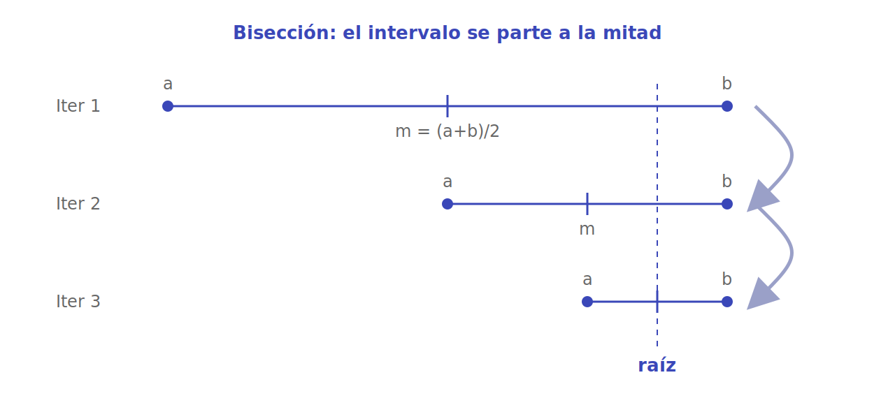
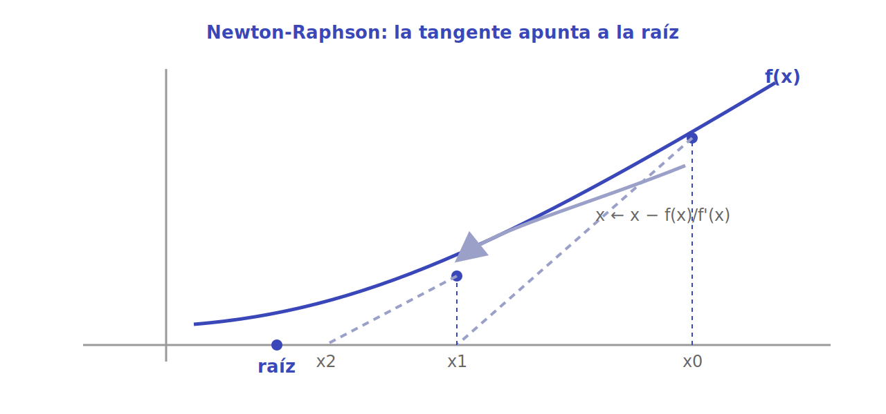

# Métodos numéricos

Cuando no hay (o no conviene buscar) una fórmula cerrada, se **aproxima**: se propone un candidato, se mide qué tan lejos está de cumplir la condición y se ajusta hasta quedar dentro de una tolerancia. Estos son los cuatro métodos clásicos para encontrar raíces (resolver `f(x) = 0`, por ejemplo una raíz cuadrada), ordenados de más ingenuo a más astuto.

> [!TIP]
> Casi todos comparten la misma estructura: una **conjetura**, un **criterio de aceptación** (`|error| < epsilon`) y una **regla de actualización**. Lo que cambia es qué tan inteligente es esa regla. 🎯

## Adivina y verifica (Guess and Check)

**Idea.** Probar conjeturas de forma incremental y verificar cada una contra la condición. Es fuerza bruta sobre los enteros: el ejemplo típico es ver si un número tiene raíz cuadrada exacta.

```python
def raiz_cuadrada(numero):
    conjetura = 0
    while conjetura * conjetura < numero:
        conjetura += 1
    if conjetura * conjetura != numero:
        return f"No existe raíz cuadrada exacta de {numero}"
    return conjetura


print(raiz_cuadrada(25))  # 5
print(raiz_cuadrada(20))  # No existe raíz cuadrada exacta de 20
```

**Complejidad.** `O(√n)` para la raíz cuadrada de `n` (sube `conjetura` hasta `√n`). En general, lineal en el tamaño del espacio de conjeturas.

**Cuándo usarlo.** Espacios de búsqueda pequeños y soluciones enteras, o como primer prototipo antes de optimizar. Pierde fuerza apenas el número crece o se necesitan decimales.

## Enumeración exhaustiva

**Idea.** Probar **todas** las opciones de forma sistemática, sin saltarse ninguna. A diferencia de una conjetura heurística, garantiza encontrar la solución si existe. Ejemplo: raíz cúbica entera.

```python
def encontrar_raiz_cubica(numero):
    conjetura = 0
    while conjetura ** 3 < abs(numero):
        conjetura += 1
    if conjetura ** 3 != abs(numero):
        return f"No existe raíz cúbica entera para {numero}"
    return conjetura if numero >= 0 else -conjetura


print(encontrar_raiz_cubica(27))  # 3
print(encontrar_raiz_cubica(28))  # No existe raíz cúbica entera para 28
```

**Complejidad.** Lineal en el tamaño del espacio: `O(n^{1/3})` para la raíz cúbica, pero `O(n)` o peor cuando el espacio crece con el problema. Es completa pero cara.

**Cuándo usarlo.** Cuando la exactitud es crítica, el espacio es manejable y prefieres claridad sobre velocidad. Para números grandes, conviene aproximar.

## Búsqueda por bisección

**Idea.** Si `f` es continua y cambia de signo entre `a` y `b`, hay una raíz en medio. Se evalúa el punto medio `m`, se descarta la mitad del intervalo que no contiene la raíz y se repite. Cada iteración **parte el intervalo a la mitad**, así que el error cae exponencialmente.



```python
def raiz_cuadrada_biseccion(numero, epsilon=1e-7):
    if numero < 0:
        raise ValueError("No hay raíz cuadrada real de un número negativo")
    bajo = 0.0
    alto = max(1.0, numero)
    conjetura = (bajo + alto) / 2

    while abs(conjetura ** 2 - numero) >= epsilon:
        if conjetura ** 2 < numero:
            bajo = conjetura
        else:
            alto = conjetura
        conjetura = (bajo + alto) / 2

    return conjetura


print(raiz_cuadrada_biseccion(25))  # ~5.0
print(raiz_cuadrada_biseccion(2))   # ~1.41421356
```

**Complejidad.** `O(log((alto − bajo) / epsilon))`: cada paso duplica la precisión. Para llegar a `epsilon` bastan unas pocas decenas de iteraciones.

**Cuándo usarlo.** Cuando conoces un intervalo donde `f` cambia de signo y `f` es continua. Es robusto y siempre converge, aunque más lento que Newton cerca de la raíz.

## Método de Newton-Raphson

**Idea.** Usa la **derivada** para acelerar. Desde una conjetura `x`, se traza la recta tangente a `f` y se salta al punto donde esa tangente corta el eje: `x ← x − f(x) / f'(x)`. Cuando funciona, la convergencia es cuadrática (los dígitos correctos se duplican por iteración).



```python
def raiz_cuadrada_newton(numero, epsilon=1e-7):
    if numero < 0:
        raise ValueError("No hay raíz cuadrada real de un número negativo")
    # Resolvemos f(x) = x^2 - numero = 0, con f'(x) = 2x
    conjetura = max(1.0, numero)

    while abs(conjetura ** 2 - numero) >= epsilon:
        conjetura = conjetura - (conjetura ** 2 - numero) / (2 * conjetura)

    return conjetura


print(raiz_cuadrada_newton(25))  # ~5.0
print(raiz_cuadrada_newton(2))   # ~1.41421356
```

**Complejidad.** Convergencia cuadrática cerca de la raíz: típicamente unas pocas iteraciones para `epsilon` muy pequeño. Cada iteración requiere evaluar `f` y `f'`.

**Cuándo usarlo.** Cuando `f` es derivable, conoces `f'` y tienes una conjetura inicial razonable. Es el más rápido de los cuatro, pero puede divergir si `f'` se acerca a cero o si la conjetura inicial es mala; en esos casos, bisección es la apuesta segura.

## Referencias

- MITx **6.00.1x — Introduction to Computer Science and Programming Using Python** (MIT / edX). Bloque de iteración, *guess and check*, enumeración exhaustiva, aproximación, bisección y Newton-Raphson.
- Material propio del curso basado en 6.00.1x (`Teaching/course1`, Clase 2.5 — Adivina y Verifica y sus anexos).
