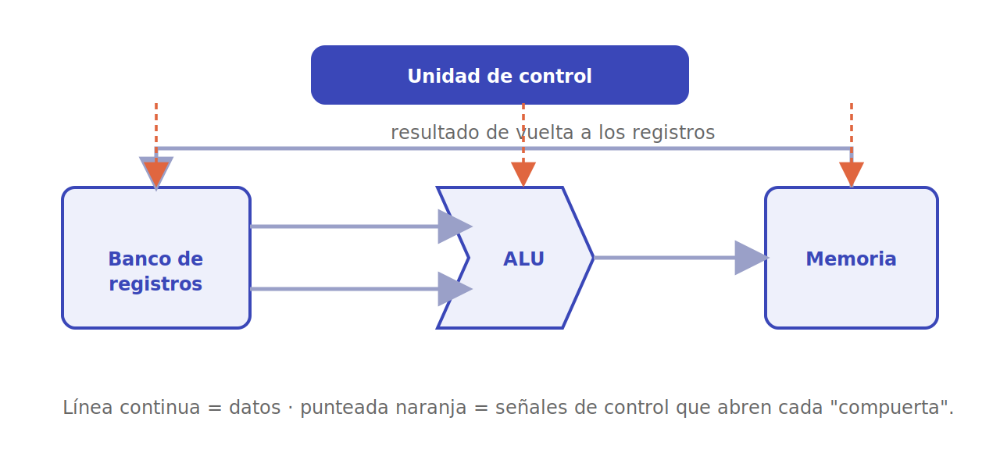

# La CPU

La unidad central de proceso es el cerebro de la máquina: donde el [ciclo de instrucción](von-neumann.md) cobra vida. Esta página desarma la CPU en sus piezas.

## La ALU

La **unidad aritmético-lógica** (ALU) es la calculadora del procesador: suma, resta, compara y hace las operaciones lógicas (AND, OR, XOR…). Recibe dos operandos y un código que indica qué operación realizar, y entrega un resultado más unos **indicadores** (*flags*): si hubo acarreo, si el resultado fue cero, si hubo desbordamiento. Esos flags son los que luego usan los saltos condicionales.

## El banco de registros

Los **registros** son un puñado de celdas de memoria ultrarrápidas dentro de la propia CPU, donde viven los datos con los que se está trabajando ahora mismo. Acceder a un registro es muchísimo más veloz que ir a la RAM, así que el compilador se esfuerza en mantener en ellos lo más caliente. Además de los de propósito general, hay registros especiales: el **PC**, el **IR** y el **registro de estado** (que guarda los flags).

## La unidad de control

La **unidad de control** es el director de orquesta: en cada ciclo genera las señales que dicen a cada parte qué hacer —qué registro leer, qué operación pide la ALU, dónde escribir el resultado—. Hay dos formas de construirla:

- **Cableada**: un circuito lógico fijo que produce las señales. Es muy **rápida** y típica de los diseños **RISC**, pero rígida: cambiarla implica rediseñar el hardware.
- **Microprogramada**: cada instrucción se traduce a una secuencia de **microinstrucciones** guardadas en una pequeña memoria interna (el *microcódigo*). Es más **flexible** —se pueden añadir o corregir instrucciones— y típica de los diseños **CISC**, a costa de algo de velocidad.

## El camino de datos en acción

Juntando las piezas: la unidad de control lee la instrucción del IR, ordena al banco de registros que entregue los operandos, dirige la ALU para que opere y encamina el resultado de vuelta a un registro o a la memoria. Ese flujo coordinado a través del **datapath**, repetido ciclo tras ciclo, es —literalmente— un programa ejecutándose.

---

➡️ Sigue en [Conjunto de instrucciones (ISA)](isa.md).
