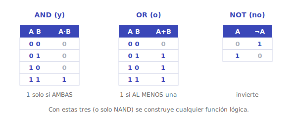
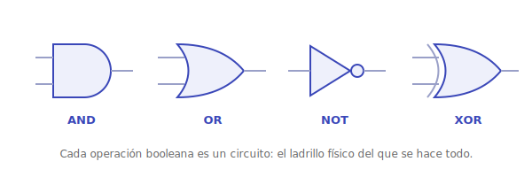
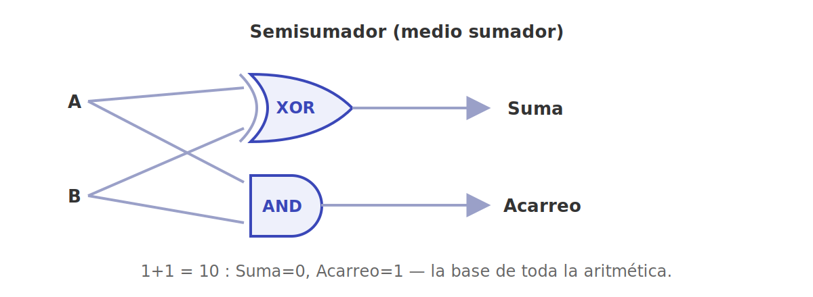
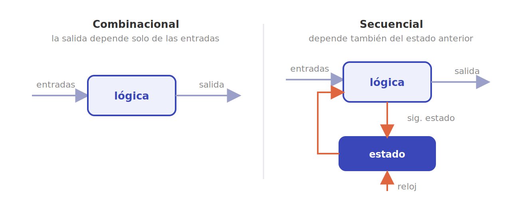

# Lógica digital

Aquí los bits dejan de ser una abstracción y se vuelven **hardware**. Con un puñado de operaciones lógicas y los circuitos que las realizan se construye, literalmente, todo lo que hace un computador.

## Álgebra de Boole

El **álgebra de Boole** opera sobre dos valores —`verdadero/falso`, `1/0`— con tres operaciones básicas: **AND** (y), **OR** (o) y **NOT** (no). De ellas derivan las demás —**NAND**, **NOR**, **XOR**—, y resulta que con una sola (NAND o NOR) se puede construir cualquier función lógica: son *funcionalmente completas*. El álgebra trae además leyes (asociativa, distributiva, De Morgan) que permiten **simplificar** expresiones, lo que en hardware significa menos puertas, menos coste y más velocidad. Herramientas como los **mapas de Karnaugh** sistematizan esa simplificación.

## Puertas lógicas

Cada operación booleana se implementa como una **puerta lógica**, un pequeño circuito de transistores con sus entradas y su salida. Las puertas son los ladrillos físicos: combinándolas se obtiene cualquier comportamiento que se pueda escribir como una función booleana.

## Circuitos combinacionales

En un **circuito combinacional** la salida depende **solo de las entradas actuales** (no hay memoria). Combinando puertas se obtienen bloques de altísima utilidad:

- **Sumador**: implementa la aritmética binaria —es el corazón de la ALU—.
- **Multiplexor (MUX)**: un selector que elige una entre varias entradas.
- **Decodificador**: activa una salida según un código de entrada (clave para direccionar memoria).

## Circuitos secuenciales

Un **circuito secuencial** sí tiene **memoria**: su salida depende también del estado anterior. El ladrillo es el **flip-flop**, que guarda un bit de forma estable hasta que se le indique cambiar. Apilando flip-flops se construyen los **registros** (que guardan una palabra completa) y los **contadores**. Un **reloj** marca el ritmo: en cada pulso, el estado avanza de forma ordenada, lo que evita el caos de que las señales lleguen a destiempo.

Con estas dos familias —lógica que **calcula** (combinacional) y lógica que **recuerda** (secuencial)— ya se tiene todo lo necesario para construir una CPU.

---

➡️ Sigue en [Modelo von Neumann y ciclo de instrucción](von-neumann.md).
