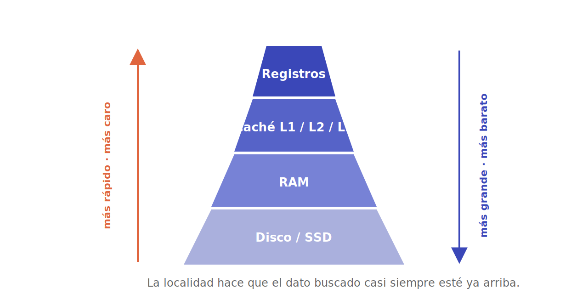

# Jerarquía de memoria

No existe una memoria que sea, a la vez, **rápida, grande y barata**: hay que elegir dos. La solución de la ingeniería no es elegir, sino **apilar** varios tipos de memoria en una pirámide y mover los datos entre niveles para fingir que tenemos las tres cosas.

## La pirámide

De arriba (rápida y pequeña) a abajo (lenta y enorme):

| Nivel | Velocidad | Tamaño típico |
|---|---|---|
| **Registros** | inmediata | decenas de palabras |
| **Caché L1 / L2 / L3** | ~1–40 ciclos | KB a decenas de MB |
| **RAM** | ~100+ ciclos | GB |
| **Disco / SSD** | millones de ciclos | TB |

Cuanto más arriba, más rápido y más caro por byte. La magia está en que el dato que necesitas *casi siempre* esté ya en un nivel alto.

## Por qué funciona: la localidad

Que la pirámide funcione se debe a un patrón empírico en cómo los programas acceden a la memoria, el **principio de localidad**:

- **Localidad temporal**: si usaste un dato, probablemente lo vuelvas a usar pronto (la variable de un bucle).
- **Localidad espacial**: si usaste una posición, probablemente uses las vecinas pronto (recorrer un arreglo).

Por eso, al traer un dato de la RAM, la caché trae también sus vecinos —una **línea de caché** entera—, apostando a que harán falta.

## La caché en detalle

Cuando la CPU pide un dato: si está en caché → **acierto** (*hit*), rapidísimo; si no → **fallo** (*miss*), hay que ir a la RAM (lento) y subir su línea. La **tasa de aciertos** es decisiva para el rendimiento real.

Para decidir *dónde* puede ir cada línea se usan esquemas de **mapeo**: **directo** (cada bloque tiene un único hueco posible, simple pero con colisiones), **totalmente asociativo** (puede ir a cualquier hueco, flexible pero caro) y **asociativo por conjuntos** (el equilibrio que se usa en la práctica). Cuando la caché se llena, una **política de reemplazo** (como **LRU**, *el menos usado recientemente*) decide a quién echar. Y al escribir hay dos estrategias: ***write-through*** (escribir a la vez en caché y RAM) o ***write-back*** (escribir en RAM solo al expulsar la línea, más rápido).

## Memoria virtual

La **memoria virtual** da a cada programa la ilusión de tener toda la memoria para sí, en un espacio continuo, aunque la RAM física sea menor y esté compartida. Funciona dividiendo la memoria en **páginas** de tamaño fijo; la **MMU** traduce las direcciones virtuales a físicas mediante una **tabla de páginas**, acelerada por una caché especial de traducciones, la **TLB**. Si una página no está en RAM, se trae del disco (*page fault*); si falta espacio, otra se manda al disco (*swap*). Como efecto secundario, **aísla** los programas entre sí, base de la seguridad del sistema.

---

➡️ Sigue en [Entrada/salida](entrada-salida.md).
