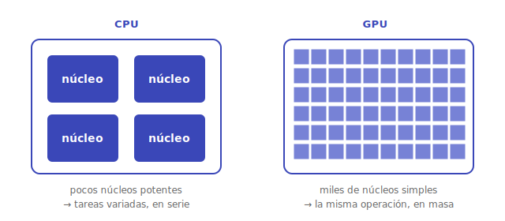

# Paralelismo

Cuando exprimir un solo núcleo ya no da más —y la [ley de Amdahl](rendimiento.md) recuerda que tiene límites—, el camino es **hacer varias cosas a la vez**. Hay varios niveles de paralelismo, de grano fino a grueso.

## SIMD: una instrucción, muchos datos

**SIMD** (*Single Instruction, Multiple Data*) aplica **la misma operación a un vector entero de valores de golpe**. En vez de sumar dos números, suma dos listas de ocho números en una sola instrucción. Es ideal para todo lo que tenga estructura regular: gráficos, audio, vídeo y, sobre todo, **álgebra lineal**. Los procesadores traen extensiones SIMD (SSE, AVX, NEON) justo para esto.

## Multinúcleo: paralelismo de hilos

Un chip **multinúcleo** mete varios procesadores completos en el mismo encapsulado, cada uno ejecutando su propio **hilo** de ejecución en paralelo (paralelismo a nivel de hilo, **TLP**). Técnicas como el **multihilo simultáneo** (*hyper-threading*) van más allá y dejan que un mismo núcleo ejecute dos hilos a la vez aprovechando sus huecos ociosos.

Esto traslada el problema al **software**: para sacarle partido hay que dividir el trabajo en tareas independientes, y ahí aparecen las dificultades clásicas de la **concurrencia** —sincronización, condiciones de carrera, bloqueos—. El hardware ofrece los núcleos; aprovecharlos es trabajo del programador.

## GPUs: paralelismo masivo

Una **GPU** lleva el SIMD al extremo: en lugar de unos pocos núcleos potentes, tiene **miles de núcleos simples** trabajando en paralelo. Nacieron para calcular millones de píxeles a la vez en los videojuegos, pero resultaron ser **máquinas de multiplicar matrices en masa** —justo lo que necesita el [cómputo de la IA](../matematicas/necesita-ia.md#4--cómputo-cloud-computing--el-músculo)—. Ese fue el giro que las llevó del entretenimiento al corazón del entrenamiento de los modelos más grandes de hoy.

> [!NOTE]
> El paralelismo es la respuesta de la organización al fin de la "comida gratis": durante décadas, cada generación de chips corría más rápido sola; cuando eso se frenó por límites físicos, la industria viró hacia **más núcleos** en vez de núcleos más veloces. Por eso saber pensar en paralelo es hoy una destreza central.

---

⬅️ Volver al [índice de la sección](index.md).
