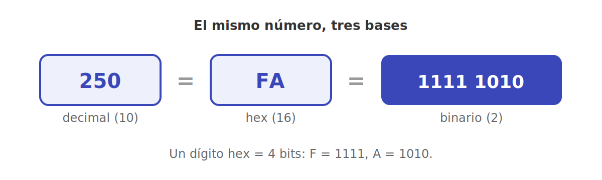
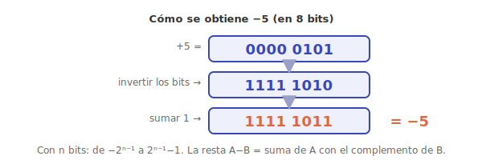
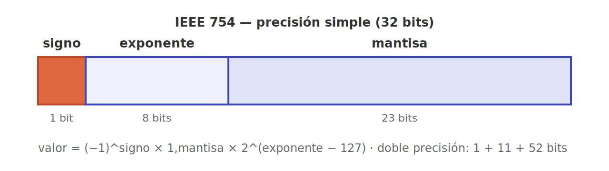
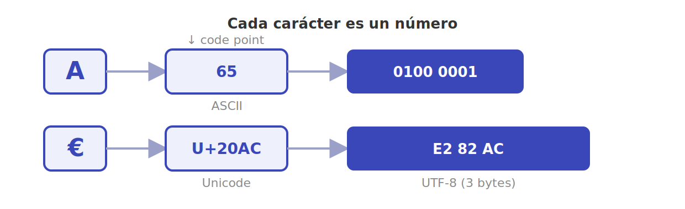

# Representación de la información

Todo lo que un computador almacena —números, texto, imágenes, instrucciones— es, en el fondo, **bits**: ceros y unos. Esta página cubre cómo se codifican esos datos; la otra cara, cómo los bits se vuelven circuitos, está en [Lógica digital](logica-digital.md).

## Sistemas de numeración

Usamos base 10 por tener diez dedos; la máquina usa **base 2** porque un transistor solo distingue dos estados (encendido/apagado). El **hexadecimal** (base 16) y el **octal** (base 8) son atajos para escribir binario de forma compacta: un dígito hex equivale a 4 bits, así que `1111 1010` se escribe `FA`. Convertir entre bases es una de las primeras destrezas del curso, porque las direcciones de memoria y los volcados se leen casi siempre en hex.

## Enteros: el complemento a dos

Representar números positivos en binario es directo. El problema es el signo. La solución que usan casi todos los computadores es el **complemento a dos**: el bit más significativo pesa en negativo. Su gran virtud es que **la resta se vuelve una suma**: `A − B` se calcula sumando `A` con el complemento a dos de `B`, así que el mismo circuito sumador sirve para ambas operaciones —un ahorro de hardware enorme—. Con *n* bits se cubre el rango de −2ⁿ⁻¹ a 2ⁿ⁻¹−1 (por eso un entero de 8 bits va de −128 a 127), y el **desbordamiento** (*overflow*) ocurre cuando el resultado se sale de ese rango. Frente a alternativas como "signo y magnitud", el complemento a dos tiene una sola representación del cero y aritmética uniforme, y por eso ganó.

## Punto flotante (IEEE 754)

Para los números reales se usa el estándar **IEEE 754**, que guarda tres piezas, como la notación científica: **signo**, **exponente** y **mantisa** (los dígitos significativos). La **precisión simple** usa 32 bits; la **doble**, 64. Esto explica una rareza famosa: `0.1 + 0.2` no da exactamente `0.3`, porque 0,1 no tiene representación binaria finita —igual que 1/3 no la tiene en decimal—. De ahí dos lecciones prácticas: nunca comparar flotantes con `==`, y cuidar el **error de redondeo** cuando se acumulan millones de operaciones.

## Caracteres

El texto también son números. **ASCII** asignaba 7 bits a cada carácter, suficiente para el inglés. Hoy reina **Unicode**, que da un número (*code point*) a cada símbolo de casi todos los idiomas y a los emojis, normalmente codificado en **UTF-8**, un esquema de longitud variable que es compatible hacia atrás con ASCII y se ha vuelto el estándar de facto en la web.

---

➡️ Sigue en [Lógica digital](logica-digital.md).
