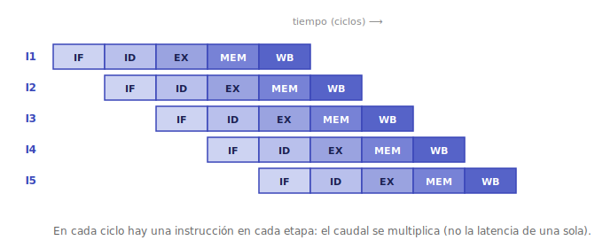
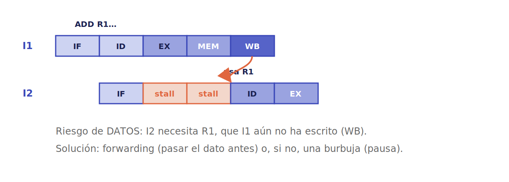
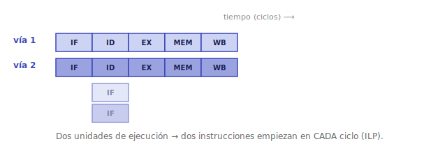

# Segmentación (pipelining)

¿Cómo se hace una CPU más rápida sin subir la frecuencia del reloj? El primer gran truco es **solapar** el trabajo: empezar una instrucción antes de terminar la anterior.

## La idea: una línea de montaje

En vez de ejecutar cada instrucción de principio a fin antes de empezar la siguiente, se divide el ciclo en **etapas** —buscar, decodificar, ejecutar, acceder a memoria, escribir— y, en cada momento, hay **una instrucción distinta en cada etapa**. Es exactamente una línea de montaje: mientras una instrucción se ejecuta, la siguiente se está decodificando y otra se está buscando.

La segmentación **no acelera una instrucción suelta** (sigue tardando lo mismo de inicio a fin), pero multiplica el **caudal** (*throughput*): instrucciones terminadas por unidad de tiempo. Con cinco etapas equilibradas, el rendimiento ideal es hasta **5×**.

## Los riesgos (*hazards*)

Ese ideal rara vez se alcanza, porque hay situaciones que rompen el flujo:

- **Riesgos estructurales**: dos instrucciones quieren el mismo recurso a la vez (p. ej. acceder a memoria en el mismo ciclo). Se resuelven duplicando recursos.
- **Riesgos de datos**: una instrucción necesita un resultado que la anterior **todavía no terminó** de calcular. Se mitigan con **adelantamiento** (*forwarding*: pasar el resultado directamente de una etapa a otra sin esperar a que se escriba) y, si no hay más remedio, insertando una **burbuja** (*stall*: una pausa).
- **Riesgos de control**: tras un **salto**, no se sabe qué instrucción viene hasta resolverlo, y la tubería ya empezó a llenarse. Se ataca con **predicción de saltos**: el procesador *apuesta* por el camino más probable y ejecuta de forma especulativa; si acierta, no pierde tiempo; si falla, descarta el trabajo especulado y vuelve atrás.

## Más allá: ILP

Llevar esto al extremo es explotar el **paralelismo a nivel de instrucción** (ILP): ejecutar **varias instrucciones por ciclo**. Un diseño **superescalar** tiene varias unidades de ejecución en paralelo; la ejecución **fuera de orden** (*out-of-order*) reordena las instrucciones para no quedarse parada esperando, manteniendo la apariencia de que todo ocurrió en orden. Son las técnicas que llevan décadas exprimiendo cada núcleo.

---

➡️ Sigue en [Jerarquía de memoria](memoria.md).
