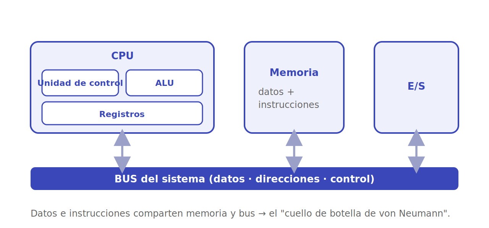
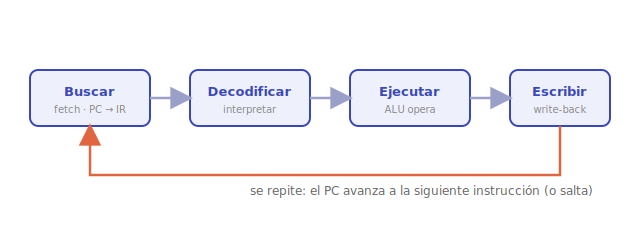

# Modelo von Neumann y ciclo de instrucción

Antes de mirar las piezas de la CPU conviene entender el **plano general** sobre el que se monta casi todo computador moderno, y el latido que repite sin descanso.

## El modelo von Neumann

La **arquitectura de von Neumann** se basa en una idea sencilla y revolucionaria: una **misma memoria** guarda tanto los **datos** como las **instrucciones** del programa (el concepto de *programa almacenado*). Es lo que hace al computador verdaderamente *programable* —cambiar de tarea es solo cargar otras instrucciones, no recablear la máquina—.

Sus componentes clásicos son cuatro: la **memoria**, la **unidad de control**, la **unidad aritmético-lógica** (que juntas forman la CPU) y los dispositivos de **entrada/salida**, todos conectados por buses.

Pero el modelo tiene un precio: como instrucciones y datos comparten el mismo canal hacia la memoria, este se satura. Es el famoso **cuello de botella de von Neumann**, y buena parte de la jerarquía de memoria, la caché y las cachés separadas para instrucciones y datos (la variante **Harvard**) existen para mitigarlo.

## El ciclo de instrucción

El motor de todo es un bucle simple que se repite miles de millones de veces por segundo:

1. **Buscar** (*fetch*): traer de memoria la instrucción a la que apunta el **PC** (*program counter*) y guardarla en el **IR** (*instruction register*).
2. **Decodificar** (*decode*): la unidad de control interpreta qué pide esa instrucción y prepara las señales necesarias.
3. **Ejecutar** (*execute*): la ALU (u otra unidad) realiza la operación —una suma, una comparación, un acceso a memoria—.
4. **Escribir** (*write-back*): guardar el resultado en un registro o en memoria, y avanzar el PC a la siguiente instrucción.

Entre paso y paso, el PC normalmente avanza solo; pero una instrucción de **salto** puede cambiarlo, y así nacen los `if`, los bucles y las llamadas a funciones.

## Camino de datos

Al recorrido físico que siguen los datos entre los registros, la ALU y la memoria durante este ciclo se le llama **camino de datos** (*datapath*). La unidad de control es quien abre y cierra las "compuertas" de ese camino en el orden correcto en cada ciclo de reloj. El detalle de esas piezas está en [La CPU](cpu.md).

---

➡️ Sigue en [La CPU](cpu.md).
