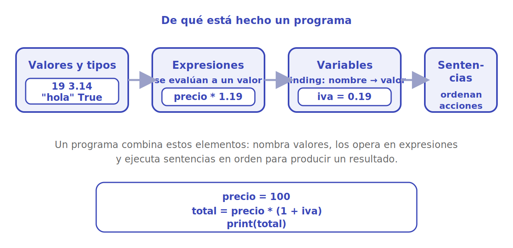

# Anatomía de un programa

Casi todos los lenguajes comparten los mismos ladrillos básicos. Si entiendes estos cuatro —**valores y tipos**, **expresiones**, **variables** y **sentencias**— y la diferencia entre la **shell** y un **script**, ya tienes el esqueleto mental para leer cualquier programa.

<p align="center"></p>

## Valores y tipos

Un **valor** es el dato más básico con el que trabaja un programa: el número `19`, el texto `"hola"`, el valor de verdad `True`. Cada valor tiene un **tipo**, que determina qué se puede hacer con él. Los más habituales en Python:

| Tipo | Ejemplo | Qué representa |
|------|---------|----------------|
| `int` | `19` | número entero |
| `float` | `3.14` | número con decimales |
| `str` | `"hola"` | texto (cadena de caracteres) |
| `bool` | `True`, `False` | verdadero / falso |

El tipo importa porque define las operaciones válidas: sumar dos `int` da otro número, pero "sumar" dos `str` los **concatena**.

```python
3 + 4            # 7   (suma de números)
"3" + "4"        # "34"  (unión de textos)
type(3.14)       # <class 'float'>
```

## Expresiones

Una **expresión** es cualquier combinación de valores y operadores que **se evalúa hasta producir un único valor**. Es la parte "calculadora" del lenguaje.

```python
2 + 3 * 4        # 14  (primero el *, luego el +)
(2 + 3) * 4      # 20  (los paréntesis cambian el orden)
precio = 1000
precio * 1.19    # 1190.0
```

La máquina reduce la expresión paso a paso hasta quedarse con un solo valor.

## Variables y binding

Una **variable** es un **nombre** que apunta a un valor, para poder reutilizarlo sin repetirlo. La operación de asociar un nombre a un valor se llama **binding** (ligadura), y en Python se hace con `=`.

```python
iva = 0.19          # binding: el nombre 'iva' queda ligado al valor 0.19
precio = 1000
total = precio * (1 + iva)
print(total)        # 1190.0
```

> [!TIP]
> El `=` de programación **no es** el "igual" de las matemáticas: es una **orden de asignación**, no una afirmación. Por eso esto, que en álgebra no tendría sentido, es perfectamente normal: significa "toma el valor actual de `x`, súmale 1 y vuelve a guardarlo en `x`".

```python
x = 5
x = x + 1     # rebinding: ahora 'x' apunta a 6
print(x)      # 6
```

A esto último, cambiar a qué valor apunta un nombre que ya existía, se le llama **rebinding**.

## Sentencias

Si las expresiones *calculan*, las **sentencias** *ordenan acciones*: asignar una variable, imprimir algo, decidir, repetir. Un programa es, en esencia, una **lista de sentencias que se ejecutan en orden**, de arriba hacia abajo.

```python
precio = 100              # sentencia de asignación
iva = 0.19                # sentencia de asignación
total = precio * (1 + iva)
print("Total:", total)    # sentencia de salida -> Total: 119.0
```

## La shell (REPL) frente a un script

Hay dos formas de ejecutar código, y conviene tener clara la diferencia.

- **Shell interactiva (REPL)**: abres el intérprete (escribiendo `python3` en la terminal), tecleas una instrucción y ves el resultado **al instante**. REPL son las siglas de *Read–Eval–Print Loop*: lee tu línea, la evalúa, imprime el resultado y vuelve a esperar. Ideal para **probar y aprender**.

```bash
$ python3
>>> 2 + 3
5
>>> print("Hola, mundo!")
Hola, mundo!
```

- **Script**: un archivo `.py` con muchas sentencias que se ejecutan **de una sola vez**, en orden. Ideal para programas largos que quieres guardar y volver a correr.

```python
# mi_script.py
print("Ejecutando un script de Python.")
total = 100 * 1.19
print("Total con IVA:", total)
```

```bash
$ python3 mi_script.py
Ejecutando un script de Python.
Total con IVA: 119.0
```

> [!NOTE]
> Regla práctica: usa la **shell** para experimentar y comprobar una idea suelta; pasa a un **script** cuando el código crece, se repite o quieres conservarlo. Las dos ejecutan el mismo lenguaje; solo cambia la comodidad según la tarea.

## Para seguir

Con estos ladrillos ya puedes leer y escribir tus primeros programas de verdad. El siguiente paso natural es practicarlos en Python.

- [Fundamentos de Python](../python/index.md): tipos, control de flujo, funciones y mucho más.

## Referencias

- MIT 6.00.1x — *Introduction to Computer Science and Programming Using Python*. [edX](https://www.edx.org/learn/computer-science/massachusetts-institute-of-technology-introduction-to-computer-science-and-programming-using-python). De ahí provienen los elementos básicos del programa y la distinción entre shell y script.
