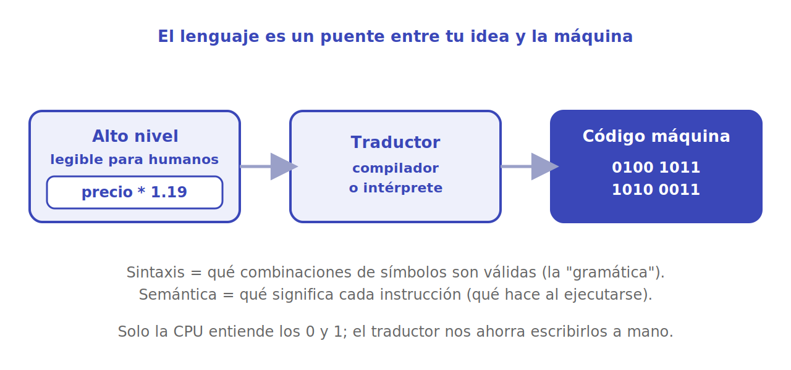

# El papel de los lenguajes

La CPU solo entiende **código máquina**: instrucciones elementales codificadas en ceros y unos. Escribir programas reales así sería inhumano. Un **lenguaje de programación** es el puente: un conjunto de palabras y reglas con las que expresamos nuestras ideas de forma legible, y que luego se **traduce** a esos ceros y unos.

<p align="center"></p>

## De alto nivel a código máquina

Llamamos **de alto nivel** a los lenguajes cercanos a cómo pensamos las personas (Python, Java, C++): escribes `precio * 1.19` y se entiende. Llamamos **de bajo nivel** a los cercanos al hardware. En el extremo está el código máquina, ilegible para la mayoría.

Entre uno y otro hay un **traductor**, que viene en dos sabores:

- **Compilador**: traduce **todo el programa de una vez** a código máquina y genera un archivo ejecutable, que luego corres. Suele dar programas más rápidos (C, C++, Rust).
- **Intérprete**: lee y ejecuta el programa **paso a paso**, sin un ejecutable previo. Es más flexible e ideal para probar y aprender. **Python** funciona así (con matices internos).

> [!NOTE]
> Por eso con Python puedes abrir una consola, escribir una línea y ver el resultado al instante: hay un intérprete leyéndote en vivo. Lo veremos en [anatomía de un programa](anatomia-de-un-programa.md) al hablar de la shell.

## Sintaxis y semántica

Todo lenguaje —natural o de programación— tiene dos dimensiones que conviene no confundir:

- **Sintaxis**: qué combinaciones de símbolos son **válidas**. Es la "gramática". Si la rompes, el programa ni siquiera arranca.
- **Semántica**: qué **significa** cada instrucción válida, qué hace al ejecutarse.

Un error de **sintaxis** es como escribir una frase sin verbo: el traductor la rechaza de entrada.

```python
print("hola"     # falta el paréntesis de cierre  -> SyntaxError
```

Un error de **semántica** es más traicionero: el programa corre, pero hace algo distinto de lo que querías. La frase es gramaticalmente correcta, solo que dice una mentira.

```python
# Quiero el promedio de dos notas, pero la semántica está mal:
nota1 = 4
nota2 = 6
promedio = nota1 + nota2 / 2     # divide solo nota2: da 7, no 5
print(promedio)
```

La sintaxis es perfecta; el resultado, equivocado. (La precedencia hace `nota2 / 2` primero; lo correcto es `(nota1 + nota2) / 2`.)

> [!WARNING]
> Los errores de sintaxis los caza el traductor por ti. Los de semántica no: el programa funciona "feliz" y entrega un resultado erróneo. Por eso gran parte de programar bien es **pensar la semántica** y comprobarla con ejemplos.

## Por qué tantos lenguajes

Cada lenguaje hace ciertos compromisos: velocidad, facilidad de lectura, seguridad, para qué dominio sirve. La buena noticia es que **las ideas se trasladan**: aprender a pensar algoritmos en uno te sirve en casi todos. Aquí usamos **Python** como primer lenguaje justamente por su sintaxis clara y su intérprete amable.

## Para seguir

- [Anatomía de un programa](anatomia-de-un-programa.md): los ladrillos comunes a casi todos los lenguajes.
- [Fundamentos de Python](../python/index.md): el lenguaje con el que practicamos todo esto.

## Referencias

- MIT 6.00.1x — *Introduction to Computer Science and Programming Using Python*. [edX](https://www.edx.org/learn/computer-science/massachusetts-institute-of-technology-introduction-to-computer-science-and-programming-using-python). De ahí provienen el enfoque de bajo/alto nivel y la distinción sintaxis/semántica.
