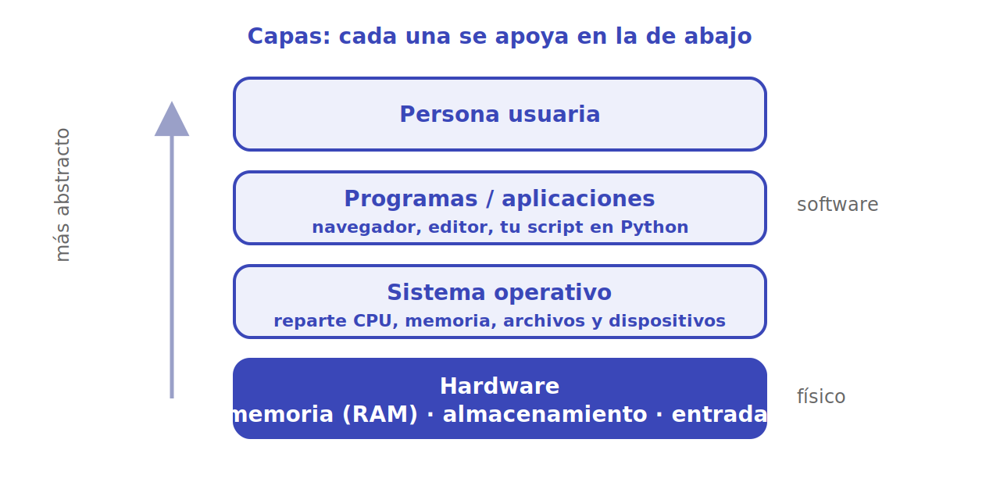

# Por qué usamos máquinas

Si un algoritmo es una receta, ¿por qué no la seguimos nosotros con lápiz y papel? Porque hay tareas en las que la máquina nos supera por varios órdenes de magnitud: hace operaciones simples **muchísimo más rápido**, **sin equivocarse** por cansancio y **sin aburrirse** al repetir lo mismo millones de veces. Un cálculo que a una persona le tomaría años, a un computador le toma milisegundos.

Pero un computador no es una sola cosa. Es una **pila de capas**, cada una apoyada sobre la de abajo, donde cada nivel esconde la complejidad del anterior.

<p align="center"></p>

## Las capas

- **Hardware**: lo físico. La **CPU** (el procesador, que ejecuta las instrucciones), la **memoria RAM** (rápida y temporal: se borra al apagar), el **almacenamiento** (disco/SSD: lento pero permanente) y los dispositivos de **entrada/salida** (teclado, pantalla, red). La CPU solo entiende instrucciones elementales codificadas en ceros y unos.

- **Sistema operativo**: el gran administrador (Linux, Windows, macOS, Android). Reparte la CPU entre los programas, gestiona la memoria, organiza los archivos y habla con los dispositivos. Gracias a él, un programa no necesita saber qué marca de disco tienes.

- **Programas / aplicaciones**: el software que hace algo útil —un navegador, un editor, o **el script en Python que escribes tú**—. Se apoya en el sistema operativo para todo lo de abajo.

- **Persona usuaria**: arriba del todo. Trabaja con ideas y botones, sin pensar en registros ni en voltajes.

> [!NOTE]
> Cada capa **abstrae** a la de abajo: le ofrece una interfaz simple y esconde los detalles. Por eso puedes programar sin saber electrónica, igual que puedes conducir sin saber de mecánica. Cuanto más arriba, más abstracto y más cómodo; cuanto más abajo, más control y más detalle.

## Máquina fija vs. máquina programable

La idea decisiva de la computación moderna es esta. Existen dos tipos de máquina de cómputo:

- **De cómputo fijo**: hace **una sola cosa**, la que trae cableada de fábrica. Una calculadora de bolsillo solo calcula; un horno microondas solo controla su temporizador. Para cambiar lo que hace, habría que cambiar el hardware.

- **Programable**: hace **cualquier cosa** que sepas describir como un programa. El mismo aparato te sirve hoy de procesador de texto y mañana de instrumento musical, sin tocar un cable; solo cambias el **software**.

Tu teléfono y tu computador son máquinas programables. Esa flexibilidad es exactamente lo que las hace tan poderosas: en lugar de construir una máquina nueva por cada problema, **escribimos un programa nuevo**.

```python
# El MISMO hardware ejecuta hoy esto...
print("Hola, mundo")

# ...y mañana esto, sin cambiar ni un cable:
def fibonacci(n):
    a, b = 0, 1
    for _ in range(n):
        a, b = b, a + b
    return a

print(fibonacci(10))   # 55
```

Cambiar de tarea es cambiar de programa, no de máquina. Esa es la razón profunda por la que aprender a programar vale tanto: aprendes a darle nuevas capacidades a una máquina que ya existe.

## Para seguir

- [El papel de los lenguajes](lenguajes.md): cómo le hablamos al hardware sin escribir ceros y unos.
- [Arquitectura y organización de computadores](../arquitectura/index.md): qué hay dentro del hardware, del bit a los núcleos.

## Referencias

- MIT 6.00.1x — *Introduction to Computer Science and Programming Using Python*. [edX](https://www.edx.org/learn/computer-science/massachusetts-institute-of-technology-introduction-to-computer-science-and-programming-using-python). De ahí proviene la distinción entre máquinas de cómputo fijo y programables.
