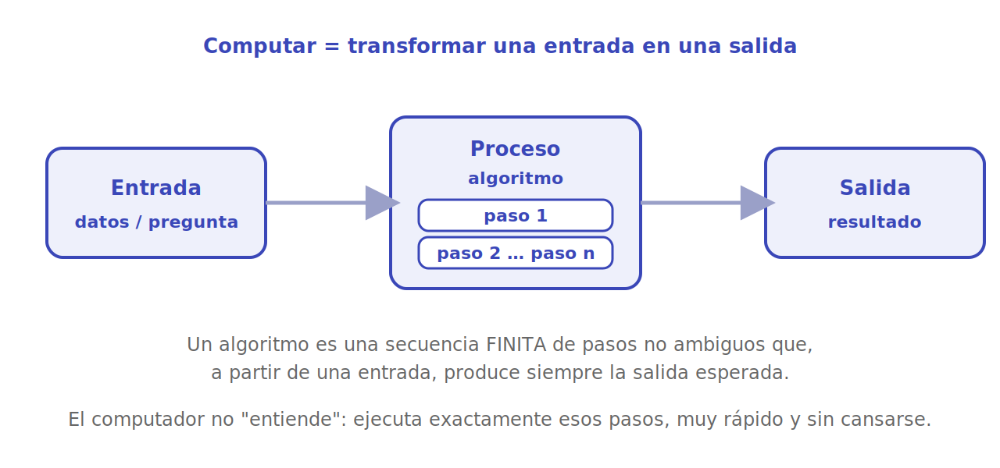

# Qué es computar

En el fondo, **computar es transformar una entrada en una salida siguiendo una receta**. Le damos a la máquina unos datos y una secuencia de pasos, y obtenemos un resultado. Nada de magia: el computador no "entiende" el problema, solo ejecuta los pasos que le dictamos, eso sí, a una velocidad y con una constancia que ningún humano alcanza.

<p align="center"></p>

## El algoritmo: la receta

Esa "receta" tiene un nombre: **algoritmo**. Un algoritmo es una secuencia **finita** de pasos **no ambiguos** que, a partir de una entrada, produce la salida esperada. Tres propiedades importan:

- **Finito**: termina; no se queda dando vueltas para siempre.
- **No ambiguo**: cada paso dice exactamente qué hacer, sin interpretación.
- **Determinado por la entrada**: con la misma entrada, produce la misma salida.

Una receta de cocina es una buena analogía: ingredientes (entrada), pasos numerados (proceso) y plato final (salida). La diferencia es que la máquina sigue los pasos **al pie de la letra**, sin sentido común que corrija un error nuestro.

```python
# Algoritmo para calcular el promedio de una lista de notas
def promedio(notas):
    total = 0
    for n in notas:        # paso repetido: ir sumando
        total = total + n
    return total / len(notas)   # salida

print(promedio([7, 4, 5, 6]))   # 5.5
```

La entrada es `[7, 4, 5, 6]`, el proceso es "sumar todo y dividir por la cantidad", y la salida es `5.5`.

## Conocimiento declarativo vs. imperativo

Aquí está una de las distinciones más útiles para entender la programación. Hay dos formas de "saber" algo:

- **Conocimiento declarativo**: una afirmación de hechos. Describe *qué* es cierto, pero no cómo llegar a ello.
- **Conocimiento imperativo**: una receta, un *cómo*. Una secuencia de pasos para obtener un resultado.

El ejemplo clásico de MITx es la **raíz cuadrada**.

Conocimiento **declarativo**:

> La raíz cuadrada de un número `x` es el número `y` tal que `y * y == x` y `y >= 0`.

Es verdad, pero no le sirve a la máquina: no le dice *cómo* encontrar ese `y`.

Conocimiento **imperativo** (un método para hallarla, atribuido a Herón de Alejandría):

> 1. Empieza con una conjetura `g`.
> 2. Si `g * g` está suficientemente cerca de `x`, listo.
> 3. Si no, mejora la conjetura: `g = (g + x/g) / 2`.
> 4. Vuelve al paso 2.

Eso último *sí* es un algoritmo: una receta que la máquina puede ejecutar.

```python
def raiz_cuadrada(x, tolerancia=1e-10):
    g = x / 2                       # conjetura inicial
    while abs(g * g - x) > tolerancia:
        g = (g + x / g) / 2         # mejorar la conjetura
    return g

print(raiz_cuadrada(16))   # 4.0 (aprox.)
```

> [!TIP]
> Programar es, casi siempre, convertir conocimiento **declarativo** ("qué quiero") en conocimiento **imperativo** ("qué pasos lo consiguen"). Si te cuesta escribir un programa, suele ser porque todavía no tienes claro el algoritmo, no porque te falte sintaxis.

## Lo que un computador hace bien (y lo que no)

Un computador es imbatible en operaciones simples repetidas millones de veces: sumar, comparar, mover datos. Pero tiene límites reales —espacio de memoria y tiempo de procesamiento— y por eso importa que el algoritmo sea **eficiente**, no solo correcto. Esa idea, la de cuántos recursos consume una receta según crece la entrada, es la puerta de entrada a la [complejidad algorítmica](../algoritmos/index.md).

## Para seguir

- [El papel de los lenguajes](lenguajes.md): cómo le escribimos la receta a la máquina.
- [Fundamentos de Python](../python/index.md): donde estos algoritmos se vuelven código que corre.

## Referencias

- MIT 6.00.1x — *Introduction to Computer Science and Programming Using Python*. [edX](https://www.edx.org/learn/computer-science/massachusetts-institute-of-technology-introduction-to-computer-science-and-programming-using-python). De ahí provienen la distinción declarativo/imperativo y el ejemplo de la raíz cuadrada.
