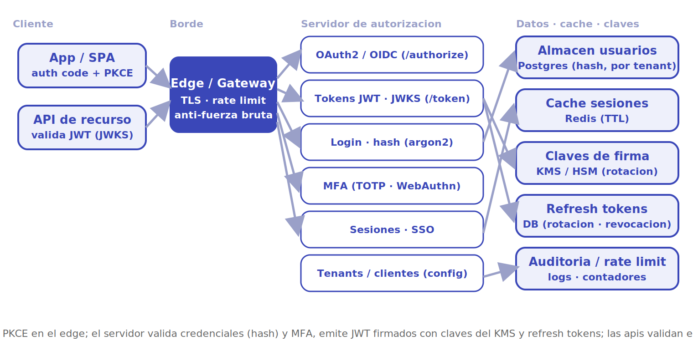
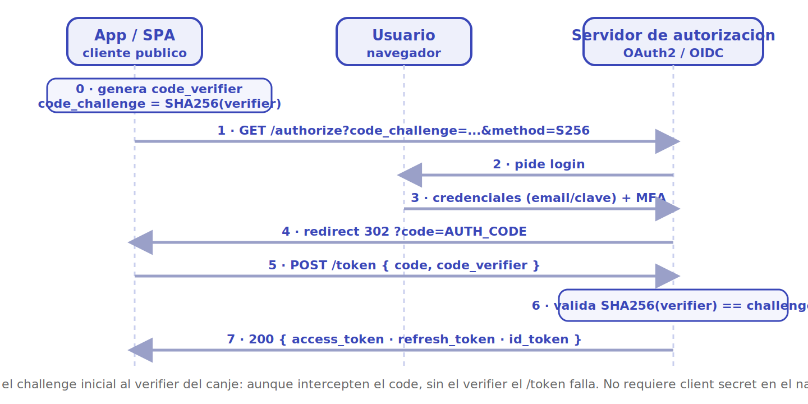

# Auth0

Diseñar un servicio de **identidad como servicio** (*IDaaS*) tipo Auth0: una plataforma multi-tenant que externaliza el *login* de miles de aplicaciones. El corazón del problema no es el volumen de datos sino la **seguridad y la corrección de los protocolos**: implementar OAuth2 y OpenID Connect, emitir y validar tokens firmados, almacenar credenciales sin poder filtrarlas, y resistir ataques (fuerza bruta, *credential stuffing*) sosteniendo una altísima tasa de verificación con latencia baja. La idea que ordena el diseño: el servidor de autorización emite **tokens autocontenidos** (JWT firmados) para que las aplicaciones cliente validen el acceso **sin volver a llamar** al servicio en cada petición.

## 1. Requisitos

### Funcionales

- Una aplicación delega su *login* en el servicio (OAuth2 / OIDC, flujo *authorization code* + PKCE).
- El usuario se autentica con credenciales (email/clave), federación social (Google, GitHub) o *enterprise* (SAML/OIDC).
- El servicio emite tokens: *access token* (JWT), *ID token* (OIDC) y *refresh token*.
- Las aplicaciones validan el *access token* sin llamar al servidor (firma + JWKS).
- Soporta **MFA** (TOTP, WebAuthn/passkeys, SMS) y políticas por aplicación.
- Gestión de sesión y **SSO**: un *login* sirve para varias apps del mismo tenant.
- Revocación de tokens y *logout* (incluido *single logout*).
- Administración multi-tenant: cada cliente configura sus apps, conexiones, reglas y usuarios de forma aislada.

### No funcionales

- **Seguridad por diseño**: credenciales hasheadas (argon2/bcrypt), claves de firma en KMS/HSM, defensa contra fuerza bruta y *enumeration*.
- **Baja latencia**: validar un token debe ser *local* (microsegundos); el *login* completo, en decenas de ms.
- **Alta disponibilidad**: si el *login* cae, miles de apps quedan sin acceso. Multi-región, sin punto único de fallo.
- **Aislamiento multi-tenant**: los datos y la configuración de un tenant nunca se mezclan con otro.
- **Cumplimiento**: trazabilidad/auditoría (GDPR, SOC2), residencia de datos por región.
- **Consistencia selectiva**: la validación de token tolera datos *eventually consistent* (claves replicadas); la revocación y los cambios de credencial exigen propagación rápida y fiable.

### Escala estimada (orden de magnitud)

- Decenas de miles de tenants; cientos de millones de identidades de usuario final.
- Miles de millones de **validaciones de token al día** (la operación dominante, pero local en el cliente).
- Picos de decenas de miles de *logins*/seg en horas punta globales.

> [!NOTE]
> Cifras de orden de magnitud para dimensionar, no datos oficiales. Lo decisivo aquí no es el *throughput* bruto sino que la **validación de tokens sea local** y que el camino sensible (verificar contraseña) sea costoso a propósito.

## 2. Estimaciones de capacidad

**Validación de tokens (lo más frecuente, pero barato).** Cada petición a una API protegida valida un JWT. Si el ecosistema sirve ~1.000.000 req/seg a APIs protegidas, eso son ~1.000.000 validaciones/seg. La clave de diseño: **no** golpean al servidor de autorización. La app verifica la firma con la clave pública (JWKS) cacheada localmente. El servicio solo expone el endpoint `/.well-known/jwks.json`, que se cachea agresivamente.

**Logins (caro a propósito).** El *hashing* de contraseñas se calibra para tardar ~100-300 ms (argon2id). Si hay ~20.000 *logins*/seg en pico:

```
20.000 logins/seg × ~0,2 s de CPU de hash  ≈  4.000 núcleos-seg/seg
```

Es decir, el *login* es **CPU-bound** por el hashing deliberadamente lento. Esto se dimensiona con muchos núcleos y se aísla en su propio pool para que un pico de *logins* no degrade la validación de tokens.

**Almacenamiento.**

- *Usuarios*: cada registro (id, email, hash, metadatos, MFA) ~2 KB. 500 M usuarios → ~1 TB. Cabe en una base relacional particionada por tenant.
- *Sesiones*: efímeras, en caché con TTL. ~1 KB cada una; decenas de millones activas → decenas de GB en Redis.
- *Refresh tokens*: persistentes y revocables; se guardan hasheados con su metadato de rotación.
- *Logs de auditoría*: alto volumen, *append-only*, a almacenamiento por columnas / data lake.

**Ancho de banda.** Bajo: tokens y respuestas JSON pequeñas (1-4 KB). El gasto no es la red sino la **CPU del hashing** y la **corrección criptográfica**.

## 3. API principal

Endpoints OAuth2/OIDC estándar (RFC 6749 + OIDC Core) más administración:

```
GET  /authorize?response_type=code&client_id&redirect_uri&scope
                &state&code_challenge&code_challenge_method=S256   → redirect con ?code (auth code + PKCE)
POST /oauth/token   body: {grant_type:"authorization_code", code,
                           code_verifier, client_id, redirect_uri}  → {access_token(JWT), id_token, refresh_token, expires_in}
POST /oauth/token   body: {grant_type:"refresh_token", refresh_token} → {access_token, refresh_token}  (rotación)
GET  /userinfo      (Authorization: Bearer <access_token>)            → claims del usuario (OIDC)
GET  /.well-known/openid-configuration                                → metadata del issuer (discovery)
GET  /.well-known/jwks.json                                           → claves públicas de firma (JWKS)
POST /oauth/revoke  body: {token}                                     → 200  (revocación, RFC 7009)
POST /mfa/challenge · POST /mfa/verify                                → flujo MFA
POST /dbconnections/signup  ·  /dbconnections/change_password         → gestión de credenciales
```

El par caliente es `/authorize` + `/oauth/token` (el *handshake* de *login*) y `/.well-known/jwks.json` (validación). El resto es administración de bajo volumen.

## 4. Modelo de datos

| Entidad | Campos clave | Dónde vive |
|---|---|---|
| **User** | id, tenantId, email, hash (argon2), metadatos, MFA enrolada | SQL particionado por tenant + caché |
| **Tenant / Client (app)** | tenantId, clientId, secret, redirectUris, conexiones, grant types | SQL + caché (config leída en cada login) |
| **Session** | sessionId, userId, tenantId, dispositivos, expiración | Caché en memoria (Redis, TTL) |
| **RefreshToken** | tokenHash, userId, clientId, familia/rotación, revocado | SQL (revocable, auditable) |
| **SigningKey (JWK)** | kid, par de claves, estado (activa/rotando) | KMS / HSM; pública vía JWKS |
| **AuditLog** | tenantId, evento, ip, ts, resultado | Almacenamiento append-only / data lake |

Distintos regímenes según el patrón de acceso, igual que en Uber o Netflix: **SQL particionado** para identidades y configuración, **caché en memoria** para sesiones efímeras, **KMS/HSM** para el material criptográfico, **append-only** para auditoría.

## 5. Arquitectura de alto nivel

<p align="center"></p>

El flujo se lee por capas, de izquierda a derecha:

1. **Cliente.** La *app/SPA* inicia el *login* con *authorization code* + PKCE; la *API de recurso* recibe el *access token* y lo **valida localmente** contra el JWKS, sin volver a llamar al servidor.
2. **Borde.** Edge/Gateway: terminación TLS, *rate limiting* y protección contra fuerza bruta antes de tocar el servidor de autorización.
3. **Servidor de autorización.** El núcleo: **OAuth2/OIDC** (`/authorize`), **emisión de tokens** (firma JWT + JWKS, `/token`), **login** (verificación de credenciales con hash), **MFA**, **sesiones/SSO** y **configuración multi-tenant**.
4. **Datos, caché y claves.** **Almacén de usuarios** (SQL particionado por tenant, contraseñas hasheadas); **caché de sesiones** (Redis, TTL); **claves de firma** en **KMS/HSM** con rotación; **refresh tokens** persistentes y revocables; **auditoría** y contadores de *rate limit*.

## 6. Componentes y decisiones clave

### OAuth2 / OIDC: authorization code + PKCE

El flujo recomendado para apps web y SPAs es **authorization code con PKCE** (RFC 7636). El cliente genera un `code_verifier` aleatorio y envía su hash (`code_challenge`) en `/authorize`; al canjear el `code` en `/token` presenta el `code_verifier` original. Esto evita la **interceptación del código** sin necesidad de un *client secret* en el navegador. El flujo *implicit* quedó **obsoleto** por exponer tokens en la URL; los *grants* `password` y `client_credentials` quedan para casos máquina-a-máquina.

<p align="center"></p>

El diagrama recorre el *handshake*: la app deriva `code_challenge = SHA256(code_verifier)` y solo el *challenge* viaja en `/authorize` (paso 1). Tras el login (pasos 2-3), el servidor devuelve un `code` de un solo uso por *redirect* (paso 4). Al canjearlo en `/token`, la app adjunta el `code_verifier` original (paso 5); el servidor recomputa el hash y lo compara con el *challenge* recibido al inicio (paso 6) antes de emitir `access_token`, `refresh_token` e `id_token` (paso 7). Así, un atacante que intercepte el `code` no puede canjearlo sin el `code_verifier`, que nunca salió del cliente.

> [!NOTE]
> El *access token* es para **autorización** (acceder a una API); el *ID token* es para **autenticación** (saber quién es el usuario, OIDC). Confundirlos es un error de diseño clásico: nunca se usa el *ID token* para llamar a una API ni el *access token* para identificar al usuario en el frontend.

### Tokens autocontenidos: JWT, firma y JWKS

El *access token* es un **JWT firmado** (RS256/ES256, firma asimétrica). La app valida la firma con la **clave pública** publicada en `/.well-known/jwks.json`, identificada por el `kid` del header. Como el token lleva sus *claims* (`sub`, `aud`, `exp`, `scope`), la validación es **local y sin estado**: ni un *round-trip* al servidor. El precio: un token emitido **no se puede revocar** antes de su `exp`. Por eso los *access tokens* son de **vida corta** (5-15 min) y se renuevan con el *refresh token*.

> [!TIP]
> Firma **asimétrica** (RS256/ES256), no simétrica (HS256): así las aplicaciones validan con la clave pública sin conocer ningún secreto. La clave privada nunca sale del KMS/HSM. Rotar claves es publicar la nueva en el JWKS y firmar con ella, manteniendo la anterior hasta que expiren los tokens emitidos con ella.

### Refresh tokens y rotación

El *refresh token* es de vida larga y **sí** vive en la base de datos (revocable). Para mitigar su robo se usa **rotación con detección de reutilización**: cada uso emite un *refresh* nuevo e invalida el anterior. Si llega a usarse uno ya consumido, se asume compromiso y se revoca toda la **familia** de tokens. Esto acota la ventana de un token filtrado.

### Almacenamiento seguro de credenciales

Las contraseñas **nunca** se guardan en claro ni con hash rápido. Se usa **argon2id** (o bcrypt) con *salt* por usuario y parámetros calibrados para tardar ~100-300 ms, lo que hace inviable el *cracking* masivo. El *hashing* lento es la razón de que el *login* sea CPU-bound y se aísle en su propio pool. Las comparaciones se hacen en **tiempo constante** para no filtrar información por *timing*.

### Multi-tenancy y aislamiento

Cada **tenant** tiene su configuración, conexiones, usuarios y, a menudo, su propio *issuer* (`https://tenant.auth0.com`). El aislamiento puede ser por *schema*/partición lógica (eficiente) o por base dedicada (máximo aislamiento, *enterprise*). El `tenantId` viaja en cada consulta y forma parte de la clave de particionado, evitando que un *bug* mezcle datos entre clientes.

### MFA y gestión de sesiones

Tras la primera credencial, el servidor puede exigir un **segundo factor**: TOTP (RFC 6238), **WebAuthn/passkeys** (lo más fuerte, resistente a *phishing*) o SMS (el más débil). La **sesión** se guarda en caché (cookie de sesión en el dominio del *authorization server*); con ella, un segundo *login* en otra app del mismo tenant se resuelve **sin pedir credenciales** otra vez: eso es **SSO**.

### Rate limiting y protección contra fuerza bruta

El endpoint de *login* es el blanco preferido de *credential stuffing*. Defensas en capas: **rate limit** por IP y por cuenta (contadores en Redis), *backoff* exponencial y bloqueo temporal tras N intentos, CAPTCHA adaptativo, detección de *breached passwords* (k-anonymity contra listas filtradas) y alertas de IP/dispositivo nuevo. El objetivo es encarecer el ataque sin penalizar al usuario legítimo.

## 7. Cuellos de botella y trade-offs

- **CPU del hashing.** El *login* es caro a propósito (argon2 ~100-300 ms). Se aísla en su propio pool y se autoescala; un pico de *logins* no debe degradar la validación de tokens.
- **Revocación vs tokens sin estado.** Los JWT autocontenidos no se pueden revocar antes de `exp`. *Trade-off*: validación local instantánea a cambio de tokens de vida corta + refresh revocable. Para revocación inmediata haría falta consultar una *denylist* (vuelve a introducir estado y latencia).
- **Disponibilidad crítica.** Si el *login* cae, miles de apps quedan bloqueadas. Multi-región activo-activo, claves replicadas y JWKS cacheado en el *edge* para que la validación sobreviva aunque el servidor esté degradado.
- **Rotación de claves.** Rotar la clave de firma sin invalidar tokens vivos exige solapar claves en el JWKS y propagar la nueva antes de usarla. Un error aquí tumba la validación globalmente.
- **Aislamiento multi-tenant.** Un *bug* que cruce datos entre tenants es catastrófico. Se mitiga con `tenantId` en cada clave/consulta y pruebas de aislamiento; el *trade-off* es entre densidad (compartir infra) y aislamiento (infra dedicada).
- **Consistencia de la revocación.** Revocar credenciales o sesiones debe propagarse rápido a todas las regiones; aquí se elige consistencia sobre latencia, al revés que en la validación.

## 8. Por dónde empezar

**MVP (un solo tenant, una región).** El objetivo es un *authorization server* OAuth2/OIDC correcto antes que escalable.

- **Construir primero**: el flujo *authorization code* + PKCE end-to-end (`/authorize` → `/token`), emisión de JWT firmados y el endpoint `/.well-known/jwks.json`. Con esto una app ya puede delegar su *login* y validar tokens localmente. Login con email/clave hasheada y sesión en cookie.
- **Stack concreto sugerido**: servidor en Node.js/Koa o Go; **no implementar el protocolo a mano** —apoyarse en una librería probada (`node-oidc-provider`, Keycloak como referencia, o Ory Hydra) para no equivocarse en los detalles de seguridad. Hashing con **argon2id** (librería nativa). Postgres para usuarios/clientes/refresh tokens. Redis para sesiones y contadores de *rate limit*. Claves de firma RS256/ES256 gestionadas por **KMS** (AWS KMS / GCP KMS) o, en MVP, un par de claves en un secreto cifrado con rotación manual.
- **Estructuras/algoritmos clave**: JWT (header con `kid` → JWKS), PKCE (`code_challenge = SHA256(code_verifier)`), *salt* + argon2id por usuario, comparación en tiempo constante, contadores con TTL para *rate limit*, rotación de *refresh* por **familia** (detección de reutilización).
- **Postergar**: MFA, federación social/enterprise (SAML/OIDC upstream), multi-región, *single logout*, detección de *breached passwords*, residencia de datos. Todo eso se añade sobre un núcleo OIDC correcto.

**Camino a escala.** Cuando crezca: (1) particionar usuarios por `tenantId` y cachear la config de tenant/cliente; (2) aislar el pool de *hashing* del de validación; (3) cachear el JWKS en el *edge* y desplegar multi-región activo-activo; (4) mover la auditoría a un *log* append-only / data lake; (5) introducir MFA (empezando por TOTP, luego WebAuthn) y federación; (6) endurecer rotación de claves automatizada y *rate limiting* adaptativo. La regla: **la corrección criptográfica y el aislamiento van primero**; el *throughput* se resuelve después con caché y réplicas, porque la operación dominante (validar token) ya es local.

## Referencias

- [RFC 6749 — The OAuth 2.0 Authorization Framework](https://www.rfc-editor.org/rfc/rfc6749)
- [RFC 7636 — Proof Key for Code Exchange (PKCE)](https://www.rfc-editor.org/rfc/rfc7636)
- [RFC 7519 — JSON Web Token (JWT)](https://www.rfc-editor.org/rfc/rfc7519)
- [OpenID Connect Core 1.0](https://openid.net/specs/openid-connect-core-1_0.html)
- [OAuth 2.0 Security Best Current Practice (RFC 9700)](https://www.rfc-editor.org/rfc/rfc9700)
- [Grokking the System Design Interview — DesignGurus](https://www.designgurus.io/course/grokking-the-system-design-interview)
- [system-design-primer — Donne Martin (GitHub)](https://github.com/donnemartin/system-design-primer)
- Martin Kleppmann, *Designing Data-Intensive Applications*, O'Reilly, 2017 (replicación, particionado, modelos de consistencia).
