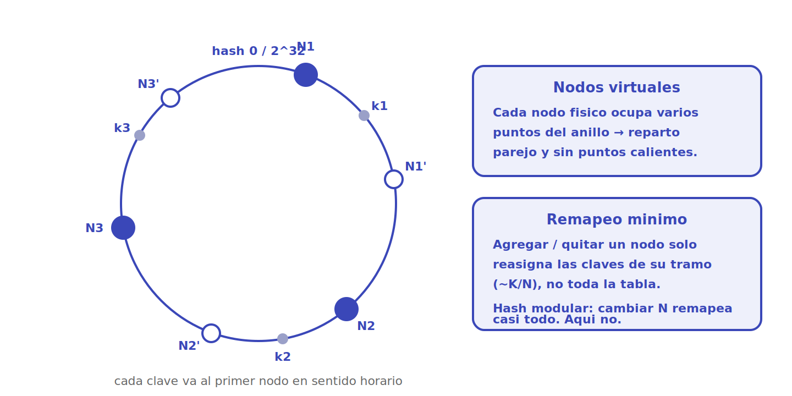
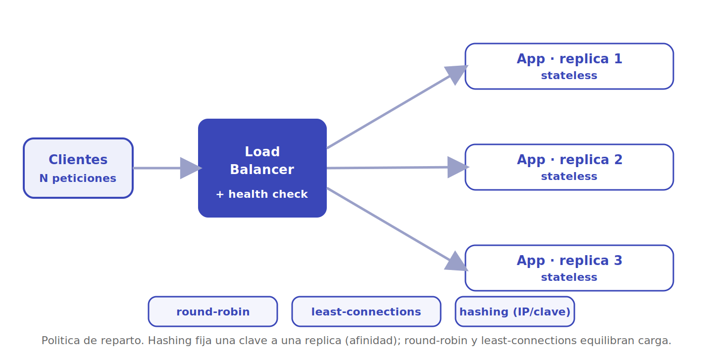
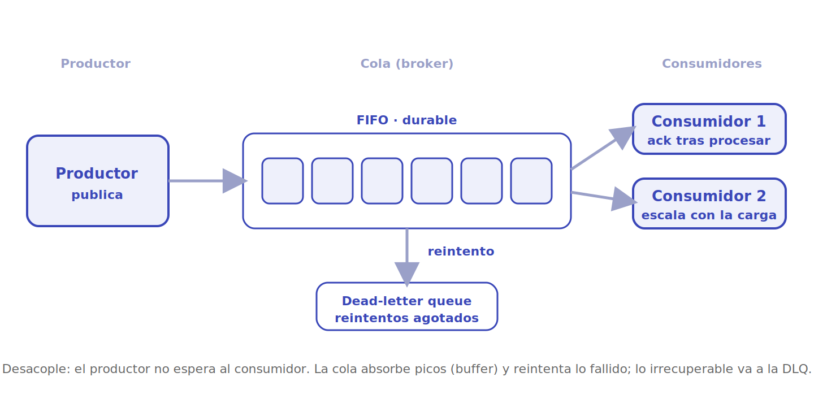
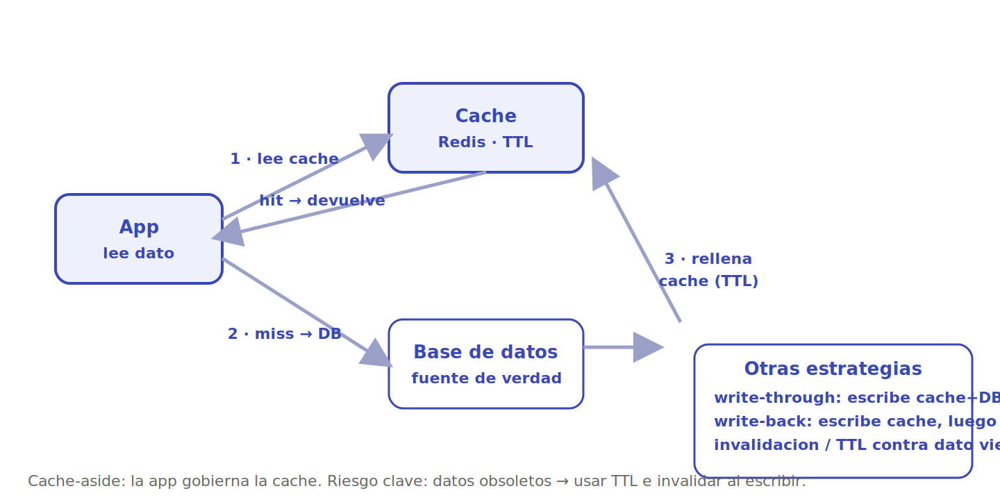
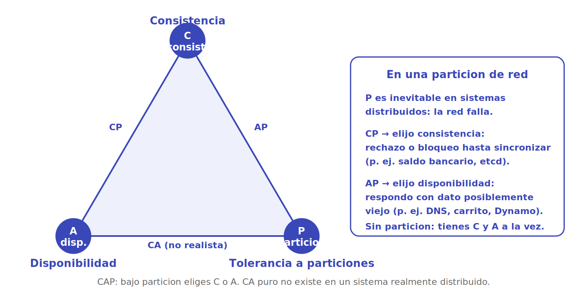

# Conceptos y building blocks

Los diseños de sistemas no se inventan de cero: se ensamblan a partir de un puñado de **piezas reutilizables** que reaparecen en casi todos los problemas (Uber, Netflix, WhatsApp, Auth0...). Esta página reúne esos *building blocks* transversales —qué son, cuándo se usan y qué *trade-off* traen— para no repetirlos en cada estudio de caso y poder enlazarlos desde ahí.

> [!NOTE]
> Son herramientas, no recetas. La habilidad de diseño está en elegir **cuál** aplicar según los requisitos (latencia, consistencia, disponibilidad) y en entender el precio que cada una cobra.

## Consistent hashing

**Qué es.** Una forma de repartir claves entre nodos colocando tanto los nodos como las claves en un **anillo de hash** (de `0` a `2^32`). Cada clave se asigna al **primer nodo que aparece en sentido horario**. Para evitar repartos desiguales, cada nodo físico se proyecta en muchos puntos del anillo: los **nodos virtuales**.

**Cuándo se usa.** Particionado de cachés distribuidas (Memcached), almacenes de clave-valor (DynamoDB, Cassandra) y *sharding* en general, donde los nodos entran y salen del clúster con frecuencia.

**Trade-off.** Frente al `hash(clave) % N` ingenuo —que al cambiar `N` remapea **casi todas** las claves y vacía las cachés—, el consistent hashing solo reasigna las claves del tramo afectado (~`K/N`). El precio es más complejidad y la necesidad de nodos virtuales para que el reparto sea parejo.

> [!TIP]
> La pregunta clave es: "si agrego o quito un nodo, ¿cuántas claves se mueven?". Con hash modular, casi todas; con consistent hashing, solo una fracción. Eso es lo que lo hace apto para clústeres elásticos.

## Balanceo de carga

**Qué es.** Un componente (el *load balancer*) que se sitúa delante de **N réplicas** idénticas de un servicio y reparte las peticiones entre ellas según una **política**. Suele incluir *health checks* para dejar de enviar tráfico a una réplica caída.

**Cuándo se usa.** Prácticamente en todo servicio que escala **horizontalmente**: detrás del *edge*, entre microservicios, frente a una base de datos con réplicas de lectura.

**Trade-off.** La política decide el comportamiento: **round-robin** es simple pero ignora la carga real; **least-connections** se adapta a peticiones de duración dispar; **hashing** (por IP o por clave) da **afinidad** —la misma clave cae siempre en la misma réplica, útil para cachés locales o sesiones *sticky*— a costa de un reparto menos uniforme. Las réplicas deben ser *stateless* (o externalizar el estado) para que cualquiera atienda cualquier petición.

## Colas de mensajes

**Qué es.** Un *broker* intermedio donde un **productor** publica mensajes y uno o varios **consumidores** los procesan a su ritmo. La cola almacena los mensajes de forma duradera y, normalmente, en orden.

**Cuándo se usa.** Trabajo asíncrono y diferido: enviar correos, procesar imágenes/documentos, propagar eventos entre servicios, suavizar picos de tráfico. (En esta plataforma, el *worker* AMQP consume justamente colas de análisis.)

**Trade-off.** Aporta **desacople** (el productor no espera al consumidor), absorbe **picos** (la cola actúa de *buffer*) y permite **reintentos**, derivando lo irrecuperable a una *dead-letter queue*. A cambio introduce latencia extra, complejidad operativa y la necesidad de diseñar consumidores **idempotentes**, porque la entrega suele ser *at-least-once* (un mensaje puede repetirse).

> [!NOTE]
> Cola (un consumidor saca cada mensaje, trabajo distribuido) vs. *pub/sub* (cada suscriptor recibe una copia, difusión de eventos) son patrones distintos sobre la misma idea de mensajería asíncrona.

## Estrategias de caché

**Qué es.** Guardar copias de datos costosos de obtener en un almacén rápido (memoria) para servir lecturas sin golpear la fuente. El patrón más común es **cache-aside**: la app consulta la caché; si hay *hit*, devuelve; si hay *miss*, lee la base de datos, **rellena** la caché con un TTL y devuelve.

**Cuándo se usa.** Cargas con **muchas más lecturas que escrituras** y datos que toleran cierta antigüedad: perfiles de usuario, catálogos, sesiones, configuración de tenant.

**Trade-off.** La caché cambia latencia por **frescura**: el riesgo central es servir datos **obsoletos**. Se acota con **TTL** (caducidad) e **invalidación** al escribir. Variantes de escritura: **write-through** (escribe caché y DB a la vez: consistente pero más lento) y **write-back** (escribe la caché y difiere la DB: rápido pero arriesga perder datos si la caché cae). La invalidación de caché es, célebremente, uno de los problemas difíciles de la informática.

## Teorema CAP

**Qué es.** En un sistema **distribuido** no puedes garantizar a la vez las tres propiedades —**C**onsistencia, **A**vailability/disponibilidad y **P**artition tolerance/tolerancia a particiones—. Como las particiones de red son **inevitables**, en la práctica eliges, **durante una partición**, entre consistencia (CP) o disponibilidad (AP).

**Cuándo se usa.** Es la lente para razonar sobre **bases de datos y almacenes replicados**: ¿qué hago si dos réplicas no se pueden comunicar?

**Trade-off.** Un sistema **CP** (etcd, ZooKeeper, un saldo bancario) prefiere **rechazar o bloquear** antes que devolver un dato incoherente. Un sistema **AP** (DNS, un carrito de compras, Dynamo/Cassandra) prefiere **responder siempre**, aun con datos posiblemente desactualizados, y reconciliar después (*eventual consistency*). Sin partición, tienes C y A simultáneamente; el dilema solo aparece cuando la red se rompe.

> [!TIP]
> "CA" no es una opción realista: en cuanto hay red entre nodos, habrá particiones tarde o temprano. La decisión real es **CP vs AP**. Una refinación útil es PACELC: además del caso de partición (PA/PC), considera la **latencia vs consistencia** en operación normal (EL/EC).

## Referencias

- [system-design-primer — Donne Martin (GitHub)](https://github.com/donnemartin/system-design-primer)
- Martin Kleppmann, *Designing Data-Intensive Applications*, O'Reilly, 2017 (replicación, particionado, modelos de consistencia, mensajería).
