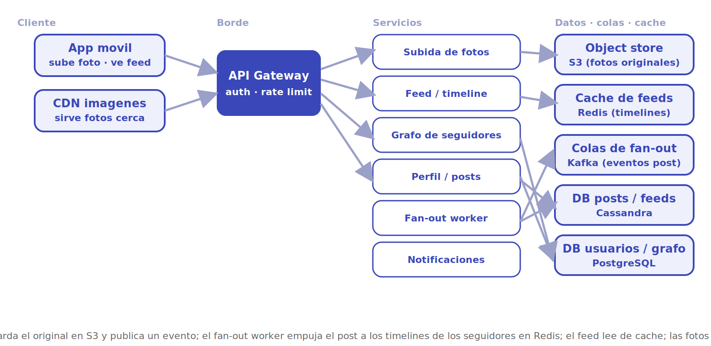
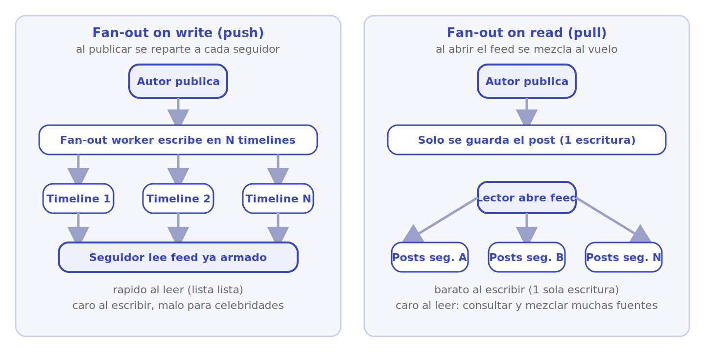

# Instagram

Diseñar una red social de fotos tipo Instagram. El corazón del problema es **distribuir contenido de lectura intensiva**: subir fotos a un almacén de objetos y servirlas por CDN, y sobre todo **generar el feed** de cada usuario combinando las publicaciones de quienes sigue, decidiendo cuándo conviene pre-calcularlo (*fan-out on write*) y cuándo armarlo al vuelo (*fan-out on read*).

## 1. Requisitos

### Funcionales

- Un usuario sube una foto con descripción; queda en su perfil.
- Un usuario sigue a otros y forma su grafo social.
- El usuario ve un **feed** (timeline) con las publicaciones recientes de quienes sigue.
- Se puede dar *like* y comentar publicaciones.
- Se puede ver el perfil de cualquier usuario con su cuadrícula de fotos.

### No funcionales

- **Lectura masiva**: el sistema es read-heavy; el feed se consulta muchísimo más de lo que se escribe.
- **Baja latencia**: el feed debe cargar en cientos de milisegundos.
- **Alta disponibilidad**: ver el feed y las fotos no puede caerse; tolera ser *eventually consistent* (una foto recién subida puede tardar segundos en aparecer en feeds ajenos).
- **Durabilidad**: las fotos originales no se pierden nunca.
- **Escalabilidad horizontal** del almacenamiento y del fan-out.

### Escala estimada (orden de magnitud)

- ~1.000 millones de usuarios; ~500 millones activos al día.
- ~100 millones de fotos subidas al día.
- Relación lectura/escritura del orden de ~100:1 (se mira mucho más de lo que se publica).

> [!NOTE]
> Las cifras son aproximaciones de orden de magnitud para dimensionar el diseño, no datos oficiales. En diseño de sistemas lo importante no es el número exacto sino la **potencia de diez** que decide la arquitectura.

## 2. Estimaciones de capacidad

**QPS de subida.** Con ~100 millones de fotos/día:

```
100.000.000 / 86.400 s  ≈ 1.200 subidas/seg  (picos ~3×  →  ~3.500/seg)
```

**QPS de lectura de feed.** Domina el sistema. Si 500 M de usuarios refrescan el feed varias veces al día:

```
500.000.000 × 10 / 86.400 s  ≈ 58.000 lecturas/seg  (picos ~2×  →  ~120.000/seg)
```

Decenas de miles de lecturas por segundo: el feed **no** se calcula desde cero en cada petición, sino que se sirve pre-armado desde caché.

**Almacenamiento.**

- *Fotos*: cada una ~1-2 MB tras compresión + varias miniaturas. 100 M/día × ~2 MB → ~200 TB/día de fotos nuevas. Van a **object store** (S3), no a la base.
- *Metadatos de post*: (postId, userId, caption, URL, ts) ~1 KB × 100 M/día → ~100 GB/día. A **Cassandra**.
- *Grafo de seguidores*: aristas (follower, followee). Con miles de millones de relaciones, decenas-cientos de GB indexados.

**Ancho de banda.** Lo dominante con diferencia: servir fotos. ~120.000 lecturas/seg × ~1 MB ≈ cientos de GB/s, **servidos por CDN** desde el *edge*, no desde el origen.

## 3. API principal

Endpoints clave (REST/gRPC sobre el gateway; la subida usa URLs pre-firmadas para ir directo al object store):

```
POST /media/upload-url             body: {tipo}                  → {uploadUrl, mediaKey}   (PUT directo a S3)
POST /posts                        body: {mediaKey, caption}     → {postId}
GET  /feed?cursor=...                                            → [{postId, autor, url, caption, ts}]
GET  /users/{id}/posts?cursor=...                                → [{postId, url, ts}]
POST /users/{id}/follow                                          → 204
POST /posts/{id}/like                                            → 204
```

`GET /feed` es la operación más caliente: se sirve desde la **caché de timelines** (Redis) con paginación por cursor.

## 4. Modelo de datos

| Entidad | Campos clave | Dónde vive |
|---|---|---|
| **Photo (binario)** | mediaKey, original + miniaturas | Object store (S3) + CDN |
| **Post** | postId, userId, mediaKey, caption, ts | Cassandra, partición por userId |
| **User** | userId, perfil, contadores | PostgreSQL *sharded* por userId |
| **Follow (grafo)** | followerId, followeeId, ts | DB del grafo / PostgreSQL, índices en ambos sentidos |
| **Timeline / Feed** | userId → lista ordenada de postId | Redis (caché por usuario) |
| **Like / Comment** | postId, userId, ts/text | Cassandra, partición por postId |

La clave de diseño: separar el **binario** (object store + CDN) del **metadato** (Cassandra) y del **feed materializado** (Redis), cada uno con su patrón de acceso.

## 5. Arquitectura de alto nivel

<p align="center"></p>

El flujo se lee por capas, de izquierda a derecha:

1. **Cliente.** La *app móvil* sube fotos (directo a S3 con URL pre-firmada), pide el feed y consulta perfiles. Las fotos se descargan desde la **CDN**, no desde el origen.
2. **API Gateway.** Punto único de entrada: autenticación, *rate limiting*, terminación TLS y enrutado.
3. **Servicios.** **Subida de fotos** (registra el post y publica el evento), **Feed/timeline** (sirve el feed cacheado), **Grafo de seguidores**, **Perfil/posts**, **Fan-out worker** (empuja el post a los seguidores) y **Notificaciones**.
4. **Datos, colas y caché.** El **object store** (S3) guarda los originales; la **CDN** los sirve cerca del usuario; las **colas** (Kafka) desacoplan el fan-out; **Cassandra** guarda posts, likes y comentarios; **Redis** materializa los timelines; **PostgreSQL** guarda usuarios y el grafo.

## 6. Componentes y decisiones clave

### Subida de fotos: object store + CDN

El binario nunca pasa por la base de datos ni se queda en el servidor de aplicación. El cliente pide una **URL pre-firmada** y sube la foto **directo a S3**; un servicio de procesamiento genera las miniaturas (varias resoluciones) y registra solo el `mediaKey` y los metadatos en Cassandra. Las descargas se sirven por **CDN**, que cachea las imágenes en el *edge* y absorbe el grueso del ancho de banda. Así la API mueve bytes de metadatos, no megabytes de fotos.

### Generación del feed: fan-out on write vs on read

El problema central. Dos estrategias:

- **Fan-out on write (push).** Al publicar, se **empuja** el postId a la lista (timeline) de cada seguidor en Redis. Leer el feed es entonces instantáneo (una lista ya armada). Coste: una publicación de alguien con muchos seguidores genera millones de escrituras.
- **Fan-out on read (pull).** El feed se **arma al vuelo** mezclando las publicaciones recientes de quienes sigue el usuario. Barato al escribir, caro al leer (hay que consultar y mezclar muchas fuentes).

<p align="center"></p>

El diagrama contrasta las dos estrategias. En **on write** el trabajo se adelanta al publicar: el post se copia al timeline de cada seguidor, por lo que leer el feed es leer una lista ya armada (rápido al leer, pero una cuenta masiva dispara millones de escrituras). En **on read** publicar es una sola escritura y el coste se paga al abrir el feed, consultando y mezclando las publicaciones de todos los seguidos (barato al escribir, caro al leer). De ahí que la solución real combine ambas: write para usuarios normales, read para celebridades.

> [!TIP]
> La solución real es **híbrida**: fan-out on write para la mayoría (usuarios normales), y fan-out on read para las **celebridades** (cuentas con millones de seguidores). El feed del lector se compone mezclando su timeline pre-armado con las publicaciones recientes de las pocas cuentas masivas que sigue. Así se evita la "tormenta de escritura" del fan-out puro.

### Grafo de seguidores

Las relaciones *follow* se guardan con índices en **ambos sentidos**: "a quién sigo" (para armar el feed) y "quién me sigue" (para el fan-out). Con miles de millones de aristas se *shardea* por usuario. El servicio de grafo expone la lista de seguidores que el fan-out worker consume al publicar. Las cuentas con seguidores desproporcionados (celebridades) se marcan para tratarse con la rama *pull*.

### Almacenamiento: Cassandra y PostgreSQL

- **Cassandra** para posts, feeds, likes y comentarios: escritura masiva, *append-friendly*, particionado por clave (userId o postId), *eventually consistent* y escalable horizontalmente sin un nodo maestro. Encaja con el patrón "muchas escrituras, lectura por clave".
- **PostgreSQL** *sharded* para usuarios y el grafo: datos relacionales con consultas más ricas y consistencia más fuerte donde importa (cuentas, autenticación).

### Caché de feeds (Redis)

El timeline de cada usuario activo vive **materializado en Redis** como una lista ordenada de postIds (con TTL/recorte para acotar memoria). Leer el feed = leer una lista y resolver los metadatos (también cacheados). Esto convierte las decenas de miles de lecturas/seg en operaciones de memoria y mantiene la base de datos fuera del camino caliente de lectura.

### Colas para el fan-out

La publicación entra por una **cola** (Kafka): el productor (subida) responde rápido y los **fan-out workers** consumen el evento y empujan el post a los timelines de forma asíncrona. La cola absorbe los picos, permite reintentos y aísla el coste del fan-out del tiempo de respuesta de la subida.

## 7. Cuellos de botella y trade-offs

- **Fan-out de celebridades.** Una cuenta con millones de seguidores haría inviable el fan-out on write. Se resuelve con el modelo **híbrido** (pull para esas cuentas).
- **Lectura del feed.** El punto más consultado; se sirve desde Redis pre-armado, nunca recalculando desde Cassandra en cada petición.
- **Ancho de banda de fotos.** Dominado por la CDN; el origen (S3) solo se toca en *cache miss*.
- **Consistencia vs disponibilidad.** Se elige **AP**: una foto recién publicada puede tardar segundos en aparecer en feeds ajenos. Aceptar esa frescura relajada es la decisión central.
- **Coste de memoria de los timelines.** Materializar feeds para cientos de millones de usuarios es caro; se acota recortando la longitud, expirando inactivos y armando bajo demanda el feed de usuarios poco activos.
- **Hot posts.** Una publicación viral concentra likes/lecturas; se mitiga con caché agresiva y contadores aproximados.

## 8. Por dónde empezar

Ruta incremental de un MVP a la escala real:

1. **MVP monolítico.** Un servicio + **PostgreSQL** (tablas `users`, `follows`, `posts`) y un bucket **S3 + CDN** para las fotos desde el día uno (esto no es negociable, ni siquiera en el MVP). El feed se arma **on read**: un `SELECT` de los posts recientes de los seguidos, ordenado por fecha, con paginación por cursor. Funciona perfectamente para las primeras decenas de miles de usuarios.
2. **Cachear el feed.** Cuando el `SELECT` del feed empiece a doler, materializar timelines en **Redis** y pasar a **fan-out on write**: al publicar, empujar el postId a la lista de cada seguidor. Estructura clave: por usuario, una lista ordenada (o *sorted set* por timestamp) recortada a N entradas.
3. **Desacoplar el fan-out.** Mover el empuje a **Kafka** + workers asíncronos para que publicar sea instantáneo y el fan-out ocurra en segundo plano.
4. **Modelo híbrido y NoSQL.** Marcar celebridades y armar su contribución al feed **on read**; migrar posts/likes/comentarios a **Cassandra** particionada por userId/postId cuando el volumen lo exija.

**Qué postergar:** ranking algorítmico del feed (orden cronológico inverso basta para empezar), Stories/Reels, mensajería directa, descubrimiento/explore, moderación con ML. El orden cronológico y el grafo básico ya dan un producto usable.

> [!TIP]
> El error clásico es empezar con fan-out on write y Cassandra "porque así lo hace Instagram". A baja escala, el fan-out on read sobre PostgreSQL es más simple y suficiente; la complejidad del push y del modelo híbrido solo se paga cuando la lectura del feed se vuelve el cuello de botella.

## Referencias

- [Grokking the System Design Interview — DesignGurus (caso *Designing Instagram*)](https://www.designgurus.io/course/grokking-the-system-design-interview)
- [system-design-primer — Donne Martin (GitHub)](https://github.com/donnemartin/system-design-primer)
- Martin Kleppmann, *Designing Data-Intensive Applications*, O'Reilly, 2017 (replicación, particionado y sistemas read-heavy).
- [Instagram Engineering Blog](https://instagram-engineering.com/)
- [Scaling Instagram Infrastructure — InfoQ](https://www.infoq.com/presentations/instagram-scale/)
