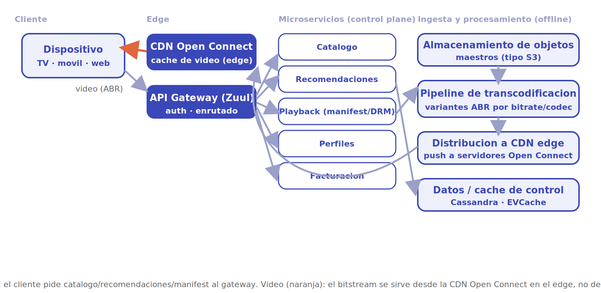
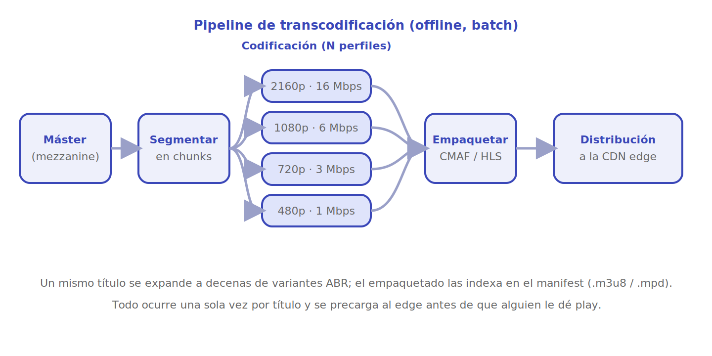

# Netflix

Diseñar una plataforma de *streaming* de video bajo demanda a escala global. El reto no es tanto la lógica de negocio (catálogo, perfiles, facturación) como **mover petabytes de video a cientos de millones de pantallas** con reproducción instantánea y sin cortes. La idea central que ordena todo el diseño: **separar el plano de control del plano de datos**. Los metadatos (qué hay, qué recomiendo, qué puedes reproducir) viven en microservicios en la nube; los *bytes de video* viajan por una CDN propia desplegada lo más cerca posible del usuario.

## 1. Requisitos

### Funcionales

- El usuario navega un catálogo personalizado y busca títulos.
- Recibe recomendaciones según su historial y perfil.
- Reproduce video bajo demanda con calidad adaptable a su conexión.
- Puede pausar y retomar desde cualquier dispositivo (continuar viendo).
- Gestiona perfiles, suscripción y facturación.

### No funcionales

- **Reproducción inmediata** (*time-to-first-frame* bajo) y **sin rebuffering** pese a redes variables.
- **Disponibilidad altísima**: el video debe seguir aunque fallen servicios secundarios.
- **Escala global** con calidad consistente en cualquier región.
- **Tolerancia a fallos** por diseño (la red, los discos y las instancias *van* a fallar).
- **Eficiencia de costos de ancho de banda**: el tráfico de video es el gasto dominante.

### Escala estimada (orden de magnitud)

- Cientos de millones de suscriptores; cientos de miles de títulos.
- El video representa una fracción enorme del tráfico de internet en horario *prime*.
- Catálogo en decenas de petabytes una vez transcodificado a todas sus variantes.

> [!NOTE]
> Cifras de orden de magnitud para dimensionar, no datos oficiales. Lo decisivo es la **escala del ancho de banda de video**, que es lo que justifica construir una CDN propia.

## 2. Estimaciones de capacidad

**Ancho de banda de reproducción (lo dominante).** Si en pico hay ~100 millones de *streams* concurrentes a un bitrate medio de ~5 Mbps:

```
100.000.000 × 5 Mbps  =  500 Tbps  (medio petabit por segundo)
```

Ese caudal es imposible —y carísimo— de servir desde unos pocos centros de datos. **Conclusión de diseño**: hay que cachear el video en el *edge*, dentro o muy cerca de la red del ISP del usuario. Eso es Open Connect.

**Almacenamiento del catálogo.** Cada título se transcodifica a **muchas** variantes: distintas resoluciones (de 240p a 4K), bitrates y codecs (H.264, HEVC, AV1), más audio y subtítulos por idioma. Una sola película puede generar cientos de archivos. Por eso el catálogo "fuente" (decenas de TB) se expande a decenas de PB tras la transcodificación.

**Carga del plano de control.** Las peticiones de catálogo, recomendaciones, búsqueda y *manifest* son altísimas en QPS pero ligeras en bytes; se sirven desde microservicios con fuerte caché (EVCache) y bases NoSQL (Cassandra). Es un par de órdenes de magnitud más barato que el video.

## 3. API principal

```
GET  /home?profileId               → filas personalizadas (catálogo + recomendaciones)
GET  /search?q                     → resultados de búsqueda
GET  /titles/{id}                  → metadatos del título
POST /playback/{titleId}/license   body: {deviceCaps}  → manifest ABR + licencia DRM
POST /playback/{titleId}/heartbeat body: {position, bitrate, profileId}  → 204  (continuar viendo + telemetría)
GET  /profiles  ·  POST /billing/...                  → perfiles y suscripción
```

El endpoint clave de reproducción devuelve un **manifest** (la lista de variantes ABR y las URLs de los segmentos en la CDN) y la **licencia DRM**; a partir de ahí el reproductor pide segmentos de video **directamente a la CDN**, no a los microservicios.

## 4. Modelo de datos

| Entidad | Campos clave | Dónde vive |
|---|---|---|
| **Title** | id, metadatos, géneros, artwork | Cassandra (NoSQL, multi-región) + caché |
| **Asset de video** | titleId, variantes ABR (res/bitrate/codec), URLs de segmentos | Almacenamiento de objetos (origen) + CDN edge |
| **Profile / ViewingHistory** | profileId, posición, *continue watching* | Cassandra (escritura intensiva, *eventually consistent*) |
| **Recommendations** | profileId → ranking de títulos | Precalculado offline + servido desde caché |
| **Billing** | accountId, plan, estado de pago | Almacén transaccional (consistencia fuerte) |

Igual que en Uber: distintos regímenes según el patrón de acceso. NoSQL distribuido para metadatos y historial de altísima escritura; almacenamiento de objetos + CDN para los bytes pesados; transaccional para el dinero.

> [!NOTE]
> Concreción: **Cassandra** particiona por `profileId` (historial) y por `titleId` (metadatos), claves que reparten la carga de escritura de forma uniforme. Los segmentos de video viven en **almacenamiento de objetos** (S3/GCS) como origen y se empaquetan en **CMAF/fMP4** servidos por HLS o DASH; el *manifest* (`.m3u8`/`.mpd`) lista las variantes ABR. Caché de metadatos en **EVCache** (memcached) delante de Cassandra; el *ranking* de recomendaciones se precalcula con *jobs* Spark y se materializa en una tabla servida desde caché.

## 5. Arquitectura de alto nivel

<p align="center"></p>

Dos planos conviven en el diagrama:

- **Plano de control (gris).** El dispositivo habla con el **API Gateway** (estilo Zuul), que enruta a los **microservicios**: catálogo, recomendaciones, *playback* (genera el manifest y la licencia DRM), perfiles y facturación. Detrás, datos en Cassandra y caché en EVCache.
- **Plano de datos / video (naranja).** El bitstream **no** sale de los microservicios: se sirve desde los servidores **Open Connect** en el *edge*, idealmente dentro de la red del ISP. El reproductor recibe el manifest y descarga los segmentos desde el servidor Open Connect más cercano.
- **Pipeline offline (derecha).** Los másteres se suben a **almacenamiento de objetos**; un **pipeline de transcodificación** masivo genera todas las variantes ABR; esas variantes se **distribuyen (push) a la CDN edge** *antes* de que la gente las vea (precarga predictiva en horas valle).

## 6. Componentes y decisiones clave

### CDN propia: Open Connect

Servir medio petabit por segundo desde la nube pública sería técnica y económicamente inviable. Netflix construyó **Open Connect**: appliances (servidores con mucho disco/SSD) instalados **dentro de las redes de los ISP** o en puntos de intercambio. El catálogo popular se **precarga** en ellos en horas de baja demanda, de modo que en *prime time* el video viaja la mínima distancia posible. Beneficios: latencia mínima, *time-to-first-frame* bajo, y se evita saturar los enlaces de tránsito.

> [!TIP]
> La regla de oro del *streaming*: el byte de video más barato y rápido es el que ya está en el *edge*, junto al usuario. Todo el pipeline existe para que el video esté ahí **antes** de que alguien le dé play.

### Streaming adaptativo (ABR)

Con **Adaptive Bitrate** el video se corta en segmentos cortos (2-10 s), cada uno disponible en varias calidades. El reproductor mide el ancho de banda y el llenado de su buffer y **elige la calidad segmento a segmento**: sube si la red aguanta, baja si se degrada, evitando el corte (*rebuffering*). Estándares: HLS y MPEG-DASH. Por eso un mismo título necesita decenas de variantes.

### Transcodificación masiva offline

Cuando llega un máster, un pipeline distribuido lo parte en trozos y los transcodifica **en paralelo** a todas las combinaciones de resolución, bitrate y codec, más audio y subtítulos. Es un trabajo *batch*, pesado y desacoplado de la reproducción: ocurre una vez por título, en la nube, y su salida se valida y empaqueta antes de distribuirse al *edge*. Separar esto del *playback* es clave: el camino caliente (ver video) nunca espera por la transcodificación.

<p align="center"></p>

El detalle del pipeline se lee de izquierda a derecha. El **máster** (mezzanine) se **segmenta en chunks**, que se **codifican en paralelo** a *N* perfiles ABR (cada uno con su resolución y bitrate); las variantes se **empaquetan** en CMAF/HLS —indexadas por el *manifest*— y se **distribuyen a la CDN edge**. Como las etapas están encadenadas pero desacopladas del *playback*, el camino caliente nunca espera por este proceso.

### Caché en el edge y en el control plane

Dos niveles de caché: **video** en Open Connect (el *edge*), y **metadatos** en EVCache (la caché distribuida en memoria de Netflix) delante de Cassandra para que el *home* y las recomendaciones se rendericen sin tocar la base en cada request.

### Sistema de recomendaciones

El *home* es casi por completo personalizado: filas de títulos ordenadas por modelos que combinan historial de visionado, similitud entre títulos y señales del perfil. El *ranking* pesado se **precalcula offline** y se sirve desde caché; en línea solo se hace el ensamblado final. Buenas recomendaciones reducen el tiempo de búsqueda y aumentan la retención.

### Tolerancia a fallos y Chaos Engineering

A esta escala los fallos son la norma, no la excepción. Netflix popularizó la **ingeniería del caos**: inyectar fallos a propósito en producción (el *Chaos Monkey* apagaba instancias al azar) para verificar que el sistema **degrada con gracia** en lugar de caer. Patrones asociados: *bulkheads* (aislar dominios), *circuit breakers* y *fallbacks* (si recomendaciones falla, mostrar una fila genérica) y redundancia multi-región. El principio: el video debe seguir aunque un servicio secundario se caiga.

## 7. Cuellos de botella y trade-offs

- **Ancho de banda de video.** El cuello físico y económico. Se resuelve con la CDN propia en el *edge* y la precarga predictiva; no con más microservicios.
- **Explosión de almacenamiento.** ABR multiplica cada título por decenas de variantes. *Trade-off*: más calidad/compatibilidad de dispositivos a cambio de más almacenamiento y más transcodificación. Codecs más eficientes (AV1) reducen bytes a costa de más CPU al transcodificar.
- **Frescura vs costo del catálogo en el edge.** No cabe *todo* el catálogo en cada appliance. Hay que decidir **qué** precargar y dónde según popularidad regional; el contenido de cola larga puede venir de un *edge* mayor o del origen.
- **Consistencia del historial.** "Continuar viendo" se escribe muchísimo y tolera ser *eventually consistent* (Cassandra). La facturación, en cambio, exige consistencia fuerte. Misma división AP/CP que en Uber.
- **Complejidad operacional.** Cientos de microservicios y una CDN global son difíciles de operar; el precio se paga en *tooling*, observabilidad y disciplina de resiliencia (de ahí el caos como práctica).

## 8. Por dónde empezar

**MVP (catálogo pequeño, una CDN comercial).** El objetivo es que un video se **reproduzca con ABR** de punta a punta antes de construir una CDN propia.

- **Construir primero**: el camino de *playback*. Subir un máster, transcodificarlo a unas pocas variantes, generar el *manifest* y servir los segmentos por una CDN. Con `GET /titles/{id}` y `POST /playback/{id}/license` (devuelve *manifest* + URLs) ya hay reproducción. Encima, perfiles y "continuar viendo".
- **Stack concreto sugerido**: API en Node.js o Java/Spring tras un gateway; **FFmpeg** para transcodificar a **H.264** (compatibilidad universal) en 3-4 resoluciones (480p/720p/1080p); empaquetado **HLS** (CMAF/fMP4); segmentos en **S3/GCS** servidos por una **CDN comercial** (CloudFront/Fastly) en el MVP —Open Connect viene después. PostgreSQL para facturación; Cassandra (o, en MVP, Postgres) para metadatos e historial; **memcached/Redis** como caché de catálogo.
- **Estructuras/algoritmos clave**: segmentación ABR (trozos de 2-6 s, cada uno en varias calidades); el *manifest* (`.m3u8`) como índice de variantes; el reproductor elige bitrate según **buffer + ancho de banda medido** (la lógica ABR vive en el cliente); transcodificación como *job* **batch idempotente** por título, paralelizable por trozos.
- **Postergar**: CDN propia (Open Connect), codecs avanzados (HEVC/AV1), DRM multiplataforma, recomendaciones con ML, precarga predictiva al *edge*, multi-región. El camino caliente (ver video) debe funcionar con lo mínimo primero.

**Camino a escala.** Cuando el ancho de banda domine el costo: (1) precalcular más variantes (HEVC/AV1 para ahorrar bytes a costa de CPU) con un pipeline de transcodificación distribuido; (2) **cachear el catálogo popular en el *edge*** —primero afinando TTL/popularidad en la CDN comercial, luego con *appliances* propios tipo Open Connect dentro de los ISP— y **precargar en horas valle**; (3) mover metadatos e historial a **Cassandra** multi-región con **EVCache** delante; (4) precalcular recomendaciones *offline* (Spark) y servirlas desde caché; (5) endurecer la resiliencia (circuit breakers, *fallbacks*, ingeniería del caos). La regla de oro: el byte de video más barato es el que **ya está en el *edge*** antes de que alguien le dé play.

## Referencias

- [Grokking the System Design Interview — DesignGurus (caso *Designing Netflix*)](https://www.designgurus.io/course/grokking-the-system-design-interview)
- [system-design-primer — Donne Martin (GitHub)](https://github.com/donnemartin/system-design-primer)
- Martin Kleppmann, *Designing Data-Intensive Applications*, O'Reilly, 2017 (replicación, *eventual consistency*, sistemas batch).
- [Netflix Tech Blog](https://netflixtechblog.com)
- [Open Connect — Netflix](https://openconnect.netflix.com)
