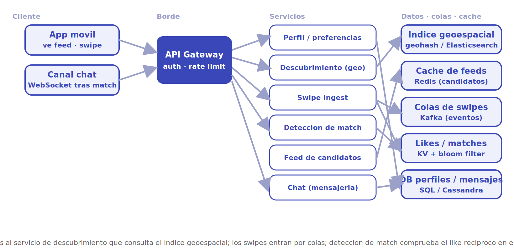
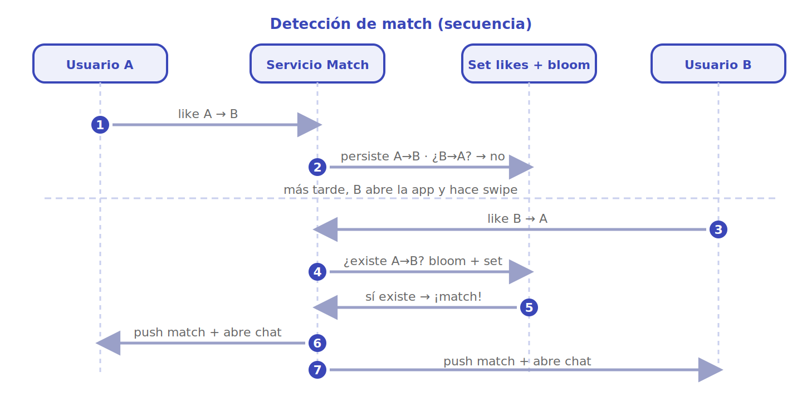

# Tinder

Diseñar una app de citas tipo Tinder. El corazón del problema es **descubrimiento geoespacial a gran escala**: mostrarle a cada usuario una baraja de candidatos cercanos que encajen con sus preferencias, registrar millones de *swipes* por segundo y detectar al instante cuando dos personas se gustan mutuamente (*match*) para abrir un chat.

## 1. Requisitos

### Funcionales

- Un usuario crea un perfil (fotos, edad, ubicación, preferencias de género/edad/distancia).
- El sistema le presenta una **baraja** de candidatos cercanos que cumplen sus filtros.
- El usuario hace *swipe*: derecha (like), izquierda (nope) o *super like*.
- Si dos usuarios se dan like mutuo, se produce un **match** y se les notifica.
- Tras el match se habilita un **chat** entre ambos.
- La ubicación del usuario se actualiza cuando abre la app o se mueve.

### No funcionales

- **Baja latencia**: la baraja de candidatos debe cargar en cientos de milisegundos.
- **Alta disponibilidad**: el descubrimiento y los swipes no pueden caerse en hora punta.
- **Consistencia selectiva**: los swipes y el conteo de candidatos toleran ser *eventually consistent*; la detección de **match** debe ser fiable (no perder un like recíproco).
- **Sin repetidos**: a un usuario no se le vuelve a mostrar a alguien que ya descartó.
- **Escalabilidad horizontal** por región: la densidad de usuarios es muy desigual geográficamente.

### Escala estimada (orden de magnitud)

- ~50-100 millones de usuarios; ~10 millones activos al día.
- Cada usuario activo hace decenas o cientos de swipes diarios.
- ~1.000-2.000 millones de swipes al día en total.

> [!NOTE]
> Las cifras son aproximaciones de orden de magnitud para dimensionar el diseño, no datos oficiales. En diseño de sistemas lo importante no es el número exacto sino la **potencia de diez** que decide la arquitectura.

## 2. Estimaciones de capacidad

**QPS de swipes.** El dominante en escritura. Con ~2.000 millones de swipes/día:

```
2.000.000.000 / 86.400 s  ≈ 23.000 swipes/seg  (picos ~3×  →  ~70.000/seg)
```

Decenas de miles de escrituras por segundo. No conviene tocar una base transaccional en cada una: los swipes entran por una **cola** y se persisten en lote en un almacén de alta escritura (Cassandra), mientras el match se resuelve en un *lookup* rápido.

**QPS de descubrimiento.** Cada vez que un usuario agota su baraja pide más candidatos. Si 10 M de usuarios piden barajas varias veces al día:

```
~10.000.000 × 5 peticiones / 86.400 s  ≈ 600 peticiones/seg
```

Cada petición devuelve decenas de candidatos servidos desde el **índice geoespacial** y la caché, no desde disco.

**Almacenamiento.**

- *Swipes*: cada uno (actor, objetivo, dirección, ts) ~30 B. 2.000 M/día → ~60 GB/día crudos; con índice por usuario crece, pero comprime bien y se puede expirar el histórico antiguo.
- *Perfiles*: ~5 KB de metadatos (sin fotos) × 100 M ≈ 500 GB. Las **fotos** van a object store + CDN, no a la base.
- *Matches y mensajes*: pequeños frente a los swipes; crecen con la actividad.

**Ancho de banda.** Dominado por las **fotos** de perfil servidas por CDN, no por la API de swipes (que mueve payloads de bytes).

## 3. API principal

Endpoints clave (REST/gRPC sobre el gateway; el chat usa un canal persistente —WebSocket— tras el match):

```
POST /profile                      body: {fotos, edad, prefs, género}     → {userId}
POST /location                     body: {lat, lon}                        → 204
GET  /discovery/cards?limit=20                                             → [{userId, fotos, edad, distancia}]
POST /swipe                        body: {targetId, dir:"like|nope|super"} → {match:true|false, matchId?}
GET  /matches                                                              → [{matchId, userId, ts}]
POST /matches/{id}/messages        body: {text}                            → {messageId, ts}
```

`POST /swipe` es la operación más caliente: se acepta rápido (encolar) y, en el caso *like*, dispara la comprobación de reciprocidad que puede devolver `match:true`.

## 4. Modelo de datos

| Entidad | Campos clave | Dónde vive |
|---|---|---|
| **User / Profile** | userId, fotos (URLs), edad, género, prefs, geohash | DB SQL/KV *sharded* por userId; fotos en object store + CDN |
| **Location** | userId, lat, lon, geohash, ts | Índice geoespacial (Elasticsearch/geohash) + caché |
| **Swipe** | actorId, targetId, dir, ts | Cassandra (alta escritura), partición por actorId |
| **Like (para match)** | targetId → set de quienes le dieron like | KV / set en memoria + bloom filter |
| **Match** | matchId, userA, userB, ts | DB SQL/KV *sharded* |
| **Message** | matchId, senderId, text, ts | Cassandra, partición por matchId |

La clave de diseño es separar **swipes** (escritura masiva, append-only) del **lookup de likes** (lectura puntual para detectar reciprocidad) y del **índice geoespacial** (consulta por cercanía).

## 5. Arquitectura de alto nivel

<p align="center"></p>

El flujo se lee por capas, de izquierda a derecha:

1. **Cliente.** La *app móvil* publica la ubicación al abrirse, pide barajas de candidatos y emite swipes. Mantiene un canal persistente para recibir el *push* del match y los mensajes de chat.
2. **API Gateway.** Punto único de entrada: autenticación, *rate limiting*, terminación TLS y enrutado.
3. **Servicios.** **Perfil** (datos y preferencias), **Descubrimiento** (consulta el geoíndice y filtra), **Swipe ingest** (acepta y encola), **Detección de match** (comprueba reciprocidad), **Feed de candidatos** (arma y cachea la baraja) y **Chat**.
4. **Datos, colas y caché.** El **índice geoespacial** responde "¿quién está cerca?"; la **caché** (Redis) guarda barajas pre-armadas; las **colas** (Kafka) absorben la avalancha de swipes; el **set de likes** (con bloom filter) resuelve el match; **SQL/Cassandra** persisten perfiles, swipes y mensajes.

## 6. Componentes y decisiones clave

### Descubrimiento geoespacial

La consulta "dame usuarios dentro de N km que cumplan estos filtros" sobre decenas de millones de perfiles no se resuelve con un índice SQL ordinario. Se codifica la posición con **geohash** (o se usa un índice geoespacial tipo Elasticsearch/Lucene): los prefijos comunes implican cercanía, lo que permite *shardear* por celda y limitar la búsqueda a la celda del usuario y sus vecinas. Sobre ese conjunto se aplican los filtros (edad, género, distancia exacta) y un ranking. La posición no necesita precisión de metros ni frescura de segundos: basta con actualizar al abrir la app, lo que reduce muchísimo la carga de escritura frente a un caso tipo Uber.

> [!TIP]
> Tinder no necesita rastreo en vivo: la ubicación es casi estática entre sesiones. Eso permite **pre-calcular** y cachear barajas, algo imposible cuando los puntos se mueven cada segundo.

### Ingesta masiva de swipes

Con decenas de miles de swipes por segundo, escribir directo a una base relacional sería un cuello de botella. Los swipes entran por una **cola** (Kafka) y se persisten en lote en **Cassandra**, particionada por `actorId` (todas las decisiones de un usuario juntas, escritura *append-only* sin contención). La cola desacopla el pico de la persistencia y alimenta de paso analítica y anti-spam.

### Detección de match

Un match es un **doble like**: A dio like a B y B dio like a A. Al procesar un *like* de A→B se consulta si ya existe B→A. Para no golpear la base en cada like se mantiene, por usuario objetivo, un **set de "quién me dio like"** en un KV en memoria. Un **bloom filter** delante descarta en O(1) el caso abrumadoramente mayoritario (no existe like previo) sin tocar el set; solo cuando el filtro da positivo se confirma contra el almacén. Si hay reciprocidad se crea el `Match` de forma atómica y se notifica a ambos por *push*.

> [!NOTE]
> El bloom filter puede dar falsos positivos pero nunca falsos negativos: jamás se pierde un match real, a lo sumo se hace una verificación extra de más. Es el trade-off correcto aquí.

<p align="center"></p>

La secuencia detalla el camino temporal. Primero **A da like a B** y se persiste; al consultar el recíproco aún no existe, así que no hay match. **Más tarde B da like a A**: ahora la comprobación de reciprocidad (bloom + set) encuentra el like previo de A, se crea el **match** de forma atómica y se notifica a ambos por *push* para abrir el chat. El orden importa: el match se resuelve en el segundo like, no en el primero.

### Feed de candidatos

La baraja se arma combinando el geoíndice (cercanía), los filtros del usuario, un ranking (actividad, popularidad, *elo*-like) y **excluyendo** a quienes ya se mostraron o descartó. Esa lista de exclusión se mantiene por usuario (set en Redis o columna en Cassandra). Las barajas se **pre-calculan** y cachean para que pedir "más cartas" sea una lectura instantánea.

### Chat tras match

El chat solo se habilita entre usuarios con un match confirmado. Los mensajes se guardan en **Cassandra** particionados por `matchId` (la conversación entera en una partición, ordenada por tiempo) y se entregan en vivo por **WebSocket**. Es un dominio independiente del descubrimiento y escala por separado.

### Sharding geográfico

La densidad de usuarios es intensamente local. Particionar el geoíndice y la caché por **región/celda** mantiene la latencia baja y contiene los fallos. El reto son los **bordes** entre celdas (candidatos justo al otro lado de la frontera), que se cubren consultando también las celdas vecinas.

## 7. Cuellos de botella y trade-offs

- **Escritura de swipes.** El punto más caliente. Se mitiga con colas, escritura *append-only* en Cassandra y particionado por actor; nunca con una base transaccional en el camino crítico.
- **Detección de match a escala.** El bloom filter evita lecturas inútiles en el 99% de los likes; el coste es alguna verificación extra por falso positivo.
- **Hot cells.** Una ciudad densa o un evento masivo satura una celda geográfica. Requiere celdas más finas en zonas densas y autoescalado del geoíndice.
- **Consistencia vs disponibilidad.** Para swipes y barajas se elige **AP** (datos *eventually consistent*); para el match se exige fiabilidad (no perder un like recíproco). Aceptar esa división es la decisión central.
- **Exclusión de repetidos.** Mantener el set de "ya vistos" por usuario crece sin límite; se acota con TTL o ventanas y se asume que reaparezca alguien muy antiguo.
- **Fotos.** El grueso del ancho de banda; se delega a object store + CDN, fuera del camino de la API.

## 8. Por dónde empezar

Ruta incremental de un MVP a la escala real:

1. **MVP monolítico.** Un servicio (Node/Koa o similar) + **PostgreSQL** con la extensión **PostGIS** para la consulta geoespacial (`ST_DWithin`). Tablas `users`, `swipes`, `matches`, `messages`. El descubrimiento es un `SELECT` con filtro geográfico y `NOT EXISTS` sobre swipes previos. El match se detecta con un *unique index* sobre `(least(a,b), greatest(a,b))` y una consulta del like recíproco dentro de la misma transacción. Fotos a un bucket (S3) detrás de un CDN desde el día uno.
2. **Sacar el geoíndice de la base.** Cuando el `SELECT` geoespacial empiece a doler, mover el descubrimiento a **geohash** (columna indexada) o a **Elasticsearch**, y cachear barajas en **Redis**. Estructura clave: por usuario, un set de "ya vistos" y una lista de candidatos pre-armada.
3. **Desacoplar la escritura.** Meter los swipes en **Kafka** y persistirlos en **Cassandra** particionada por `actorId`. Mover el lookup de likes a un KV en memoria con **bloom filter** por usuario objetivo.
4. **Separar dominios.** Extraer chat (WebSocket + Cassandra por `matchId`), descubrimiento y perfil en servicios independientes, *shardeados* por región.

**Qué postergar:** ranking sofisticado (*elo*, ML de afinidad), super-likes y boosts, anti-fraude avanzado, internacionalización de la baraja. Arrancar con cercanía + filtros básicos + exclusión de vistos ya da un producto funcional.

> [!TIP]
> PostGIS resuelve sorprendentemente bien las primeras decenas de miles de usuarios. No se construye un índice geoespacial distribuido hasta que el perfilado lo justifique: es la trampa clásica de optimizar antes de tiempo.

## Referencias

- [Grokking the System Design Interview — DesignGurus (caso *Designing Tinder / proximity service*)](https://www.designgurus.io/course/grokking-the-system-design-interview)
- [system-design-primer — Donne Martin (GitHub)](https://github.com/donnemartin/system-design-primer)
- Martin Kleppmann, *Designing Data-Intensive Applications*, O'Reilly, 2017 (particionado, índices y modelos de consistencia).
- [Geosharded Recommendations — Tinder Engineering](https://medium.com/tinder/geosharded-recommendations-part-1-sharding-approach-d5d54e0ec77a)
- [Bloom filters — explicación práctica](https://en.wikipedia.org/wiki/Bloom_filter)
