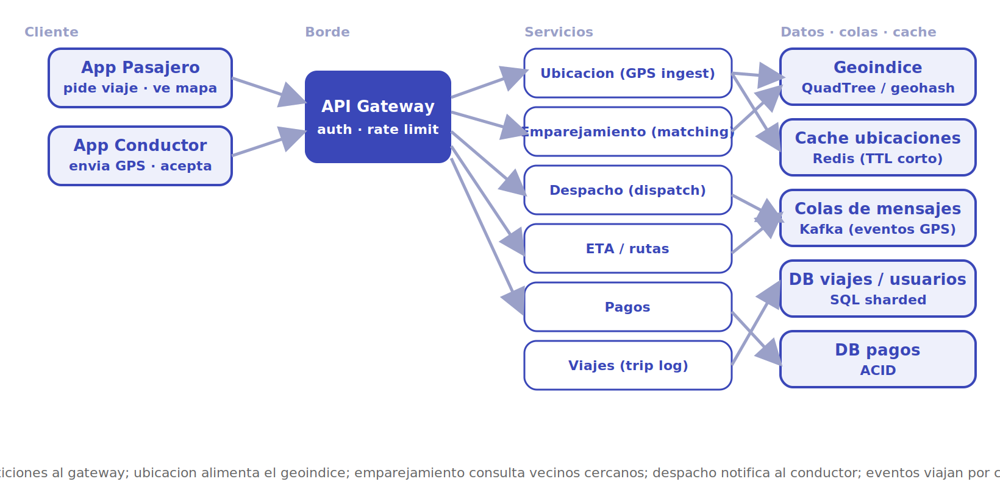
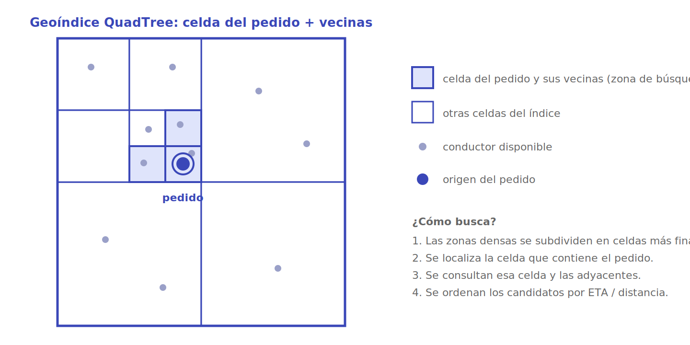

# Uber

Diseñar un sistema de transporte bajo demanda (*ride-hailing*) tipo Uber. El corazón del problema es **geoespacial y en tiempo real**: miles de conductores reportan su posición cada pocos segundos, y cuando un pasajero pide un viaje hay que encontrar al conductor adecuado entre los más cercanos y despacharlo, todo en menos de un par de segundos.

## 1. Requisitos

### Funcionales

- Un pasajero ve los conductores disponibles cerca de su ubicación en un mapa.
- El pasajero solicita un viaje desde un origen a un destino.
- El sistema empareja la solicitud con un conductor cercano y disponible, y se la ofrece.
- El conductor acepta o rechaza; si rechaza, se ofrece a otro candidato.
- Durante el viaje se rastrea la posición en vivo y se muestra el ETA.
- Al terminar, se calcula el precio (distancia, tiempo, tarifa dinámica) y se cobra.
- Se guarda un resumen del viaje (ruta, mapa, costo, calificación).

### No funcionales

- **Baja latencia**: emparejar y despachar en ~1-2 s; refrescar el mapa casi en vivo.
- **Alta disponibilidad**: un viaje en curso no puede perderse aunque falle un nodo.
- **Consistencia selectiva**: las ubicaciones toleran ser *eventually consistent*; los **pagos** exigen consistencia fuerte (ACID).
- **Escalabilidad horizontal** por región: el tráfico es muy desigual geográficamente.
- **Tolerancia a fallos** y degradación elegante (si cae ETA, el viaje sigue).

### Escala estimada (orden de magnitud)

- ~100 millones de usuarios activos mensuales; ~5 millones de conductores activos.
- Picos de ~1-3 millones de conductores conectados simultáneamente reportando GPS.
- Cientos de miles de viajes concurrentes en hora punta.

> [!NOTE]
> Las cifras son aproximaciones de orden de magnitud para dimensionar el diseño, no datos oficiales. En diseño de sistemas lo importante no es el número exacto sino la **potencia de diez** que decide la arquitectura.

## 2. Estimaciones de capacidad

**QPS de actualización de ubicación.** El dominante. Si ~2 millones de conductores envían su posición cada 4 segundos:

```
2.000.000 / 4 s  ≈ 500.000 updates/seg
```

Medio millón de escritas por segundo solo de GPS. Esto manda en el diseño: las ubicaciones **no** se guardan en una base de datos transaccional, sino en un índice en memoria con réplicas.

**QPS de viajes.** Mucho menor. Si hay 30 millones de viajes/día:

```
30.000.000 / 86.400 s  ≈ 350 viajes/seg  (picos ~10×  →  ~3.500/seg)
```

**Lecturas del mapa.** Cada pasajero con la app abierta consulta "conductores cerca" cada pocos segundos; es comparable o mayor que las escrituras, pero se sirve desde caché/geoíndice, no desde disco.

**Almacenamiento.**

- *Ubicaciones en vivo*: efímeras. Cada entrada (id, lat, lon, timestamp) ~50 B; 5 M conductores → ~250 MB en memoria. Cabe holgadamente en un clúster de caché.
- *Histórico de viajes*: persistente y creciente. Si cada viaje (ruta GPS comprimida, metadatos) ocupa ~50 KB y hay 30 M/día → ~1,5 TB/día. Va a almacenamiento por columnas / data lake para analítica, y un resumen ligero a la base operacional.

**Ancho de banda.** 500.000 updates/seg × ~50 B ≈ 25 MB/s de ingesta de GPS, distribuido entre los nodos de ingestión por región.

## 3. API principal

Endpoints clave (REST/gRPC sobre el gateway; las apps mantienen además un canal persistente —WebSocket— para *push* de ofertas y posiciones):

```
POST /drivers/{id}/location        body: {lat, lon, heading, ts}        → 204
GET  /riders/nearby?lat&lon&radius                                       → [{driverId, lat, lon, eta}]
POST /trips                        body: {riderId, origin, destination}  → {tripId, status:"matching"}
POST /trips/{id}/accept            body: {driverId}                      → {status:"accepted", eta}
POST /trips/{id}/decline           body: {driverId}                      → 204
GET  /trips/{id}                                                          → {status, driverLoc, eta, fare}
POST /trips/{id}/complete                                                 → {fare, distance, duration}
```

La actualización de ubicación es la operación más caliente: idempotente, sin respuesta de cuerpo, optimizada para *throughput*.

## 4. Modelo de datos

| Entidad | Campos clave | Dónde vive |
|---|---|---|
| **DriverLocation** | driverId, lat, lon, heading, ts, status | Geoíndice + caché en memoria (efímero, TTL) |
| **Trip** | tripId, riderId, driverId, origin, dest, status, route, fare, ts | DB SQL *sharded* (operacional) + data lake (histórico) |
| **Rider / Driver** | id, perfil, vehículo, rating | DB SQL *sharded* por id |
| **Payment** | tripId, monto, método, estado | DB de pagos con garantías ACID |

Tres regímenes de almacenamiento distintos según el patrón de acceso: **memoria** para lo efímero y altísima escritura (ubicaciones), **SQL** para entidades relacionales y viajes, **ACID estricto** para dinero.

> [!NOTE]
> Claves de partición concretas: las ubicaciones se *shardean* por **celda geográfica** (geohash/H3); los viajes por **regionId** (y `tripId` como clave dentro del *shard*); usuarios por `userId` (hash). Índices útiles: `(driverId)` y `(status, ts)` para limpiar entradas caducas, y un índice por `(riderId, ts)` sobre viajes para el historial del pasajero. Tecnologías típicas: PostgreSQL/MySQL con Vitess o CockroachDB para los viajes, Redis para la caché de posiciones, Kafka para el *log* de eventos.

## 5. Arquitectura de alto nivel

<p align="center"></p>

El flujo se lee por capas, de izquierda a derecha:

1. **Cliente.** La *app del conductor* publica su posición cada pocos segundos; la *app del pasajero* pide viajes y consulta el mapa. Ambas mantienen una conexión persistente para recibir *push*.
2. **API Gateway.** Punto único de entrada: autenticación, *rate limiting*, terminación TLS y enrutado al servicio correspondiente.
3. **Servicios.** Microservicios independientes y escalables por separado: **Ubicación** (ingesta de GPS), **Emparejamiento** (encontrar candidatos), **Despacho** (ofrecer y confirmar), **ETA/rutas**, **Pagos** y **Viajes** (registro).
4. **Datos, colas y caché.** El **geoíndice** (QuadTree/geohash) responde "¿quién está cerca?"; la **caché de ubicaciones** (Redis) guarda la última posición con TTL corto; las **colas** (Kafka) desacoplan la ingesta masiva de GPS del resto; las **bases SQL** persisten viajes y usuarios; una **DB de pagos** aislada garantiza ACID.

## 6. Componentes y decisiones clave

### Geoíndice: QuadTree vs geohash

La consulta "dame los conductores en este radio" sobre millones de puntos que se mueven cada segundo no se resuelve con índices de base de datos tradicionales. Dos enfoques:

- **QuadTree**: el plano se subdivide recursivamente en cuadrantes hasta que cada celda contiene pocos conductores. Las zonas densas (centro) quedan finamente divididas; las rurales, en celdas grandes. Buscar vecinos = bajar el árbol hasta la celda del pasajero y mirar las adyacentes. Se adapta a la densidad, pero hay que **rebalancearlo** al moverse los puntos.
- **Geohash**: codifica (lat, lon) en una cadena donde prefijos comunes implican cercanía. Es simple, indexable como string y fácil de *shardear*, pero las celdas son de tamaño fijo y hay casos de borde (puntos cercanos con prefijos distintos).

<p align="center"></p>

El detalle espacial muestra por qué esto es tan eficiente. El plano se subdivide en celdas, más finas donde se concentran los conductores. Cuando llega un pedido, no se recorre todo el mapa: se ubica la celda que contiene el origen y se consultan **esa celda y las adyacentes** (las resaltadas). El radio de búsqueda queda acotado a un puñado de celdas, y sobre ese conjunto reducido se ordenan los candidatos por ETA o distancia.

> [!TIP]
> En la práctica se combinan: geohash para *shardear* y enrutar, y una estructura tipo QuadTree/grid en memoria dentro de cada *shard* para la consulta fina de vecinos. Uber publicó **H3**, un índice hexagonal jerárquico, justamente para evitar las distorsiones de la rejilla cuadrada.

### Sharding geográfico

El tráfico es intensamente local: un viaje en Santiago no necesita datos de Tokio. Se particiona el sistema por **región geográfica**, de modo que cada *shard* maneja su propio geoíndice y su ingesta de GPS. Ventajas: la carga escala añadiendo regiones, la latencia baja (procesamiento cerca del usuario) y un fallo queda contenido. El reto son los **bordes** entre regiones (un viaje que cruza fronteras) y el rebalanceo cuando una ciudad crece.

### Caché de ubicaciones

La última posición de cada conductor vive en memoria (Redis) con **TTL corto**: si un conductor deja de reportar, su entrada caduca y desaparece del mapa sin necesidad de borrado explícito. Esto evita golpear disco en cada uno de los 500.000 updates/seg y hace que "conductores cerca" sea una lectura de microsegundos.

### Colas para desacoplar

La avalancha de eventos GPS entra por un *log* distribuido (Kafka). Esto **desacopla** al productor (apps) de los consumidores (geoíndice, analítica, detección de fraude, ETA en vivo): si un consumidor se ralentiza, la cola absorbe el pico y nadie pierde datos. También habilita reproducir eventos y alimentar varios consumidores del mismo flujo.

### Emparejamiento y despacho

Emparejamiento consulta el geoíndice por candidatos cercanos y los ordena por una función de costo (distancia/ETA, rating, dirección, *surge*). Despacho ofrece el viaje al mejor candidato vía *push*; si rechaza o expira el plazo, pasa al siguiente. La oferta se hace de a uno (o a un pequeño lote) para no asignar el mismo conductor dos veces —el estado del viaje se protege con una transición atómica `matching → accepted`.

### ETA y tarifa dinámica

ETA combina el grafo vial, el tráfico en tiempo real y modelos históricos; es un servicio que puede **degradarse** (si falla, se usa una estimación gruesa) sin tumbar el viaje. La **tarifa dinámica** (*surge*) sube el precio cuando la demanda supera la oferta en una zona, equilibrando el mercado en tiempo real.

## 7. Cuellos de botella y trade-offs

- **Escritura de ubicaciones.** Es el punto más caliente (500 K/seg). Se mitiga con ingesta por colas, caché en memoria y sharding regional; nunca tocando la base transaccional.
- **Hot shards.** Un evento masivo (concierto, fin de año) satura una región. Requiere *shards* más finos en zonas densas y autoescalado.
- **Consistencia vs disponibilidad.** Para ubicaciones se elige **AP** (disponibilidad + tolerancia a partición, datos *eventually consistent*); para pagos se elige **CP** (consistencia fuerte). Aceptar esta división es la decisión de diseño central.
- **Bordes geográficos.** Viajes que cruzan regiones obligan a coordinar *shards*; se resuelve con solapamiento de celdas en las fronteras.
- **Tolerancia a fallos.** Réplicas del geoíndice y de la caché; un viaje en curso se persiste pronto para sobrevivir a la caída de un nodo. Pruebas de resiliencia (inyección de fallos) validan que el sistema degrada en vez de colapsar.

## 8. Por dónde empezar

**MVP (una ciudad, un proceso).** El objetivo es cerrar el lazo "pedir viaje → emparejar → despachar" antes de pensar en escala global.

- **Construir primero**: la ingesta de ubicaciones y la consulta "conductores cerca". Con un solo servicio que reciba `POST /location` y responda `GET /nearby` ya se puede dibujar el mapa y emparejar. Encima, el flujo de viaje con su máquina de estados (`requested → matching → accepted → ongoing → completed`).
- **Stack concreto sugerido**: servicio en Node.js/Koa o Go; **Redis** para la última posición (con `GEOADD`/`GEOSEARCH`, que ya implementa un geoíndice por geohash) — esto evita construir un QuadTree propio en el MVP. PostgreSQL para viajes y usuarios; WebSocket (o Socket.IO) para el *push* de ofertas y posiciones.
- **Estructuras/algoritmos clave**: **geohash** para indexar y *shardear* posiciones; **QuadTree** o rejilla **H3** en memoria para la consulta fina de vecinos cuando Redis se quede corto; transición de estado **atómica** del viaje (`compare-and-set` sobre `status`) para no asignar el mismo conductor dos veces; función de costo de *matching* (distancia/ETA + rating + dirección).
- **Postergar**: tarifa dinámica (*surge*), sharding multi-región, ETA con grafo vial y tráfico en vivo, detección de fraude, *pool*/viajes compartidos. Todo eso se añade sobre el lazo básico funcionando.

**Camino a escala.** Cuando una ciudad sature un proceso: (1) sacar la ingesta de GPS a **Kafka** y consumirla hacia el geoíndice; (2) *shardear* por **región geográfica** (geohash/H3), cada *shard* con su propio geoíndice y caché; (3) separar microservicios (Ubicación, Emparejamiento, Despacho, ETA, Pagos, Viajes) para escalarlos por separado; (4) replicar geoíndice y caché para tolerar fallos; (5) aislar pagos en su propia DB ACID. La regla: la **escritura de ubicaciones** (lo más caliente) nunca toca la base transaccional; vive en memoria con réplicas.

## Referencias

- [Grokking the System Design Interview — DesignGurus (caso *Designing Uber*)](https://www.designgurus.io/course/grokking-the-system-design-interview)
- [system-design-primer — Donne Martin (GitHub)](https://github.com/donnemartin/system-design-primer)
- Martin Kleppmann, *Designing Data-Intensive Applications*, O'Reilly, 2017 (particionado, replicación y modelos de consistencia).
- [H3: Uber's Hexagonal Hierarchical Spatial Index](https://www.uber.com/blog/h3/)
