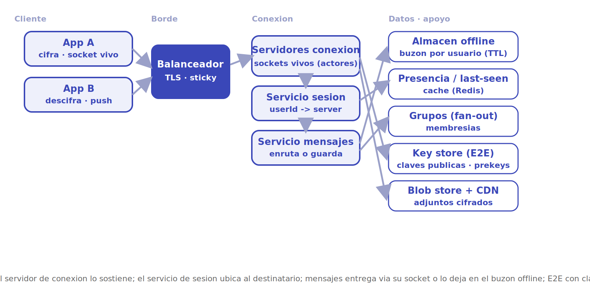
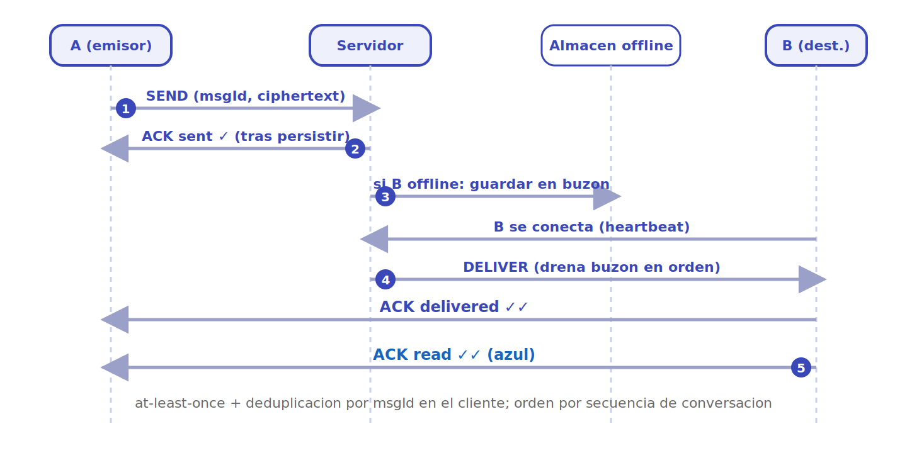

# WhatsApp

Diseñar un sistema de mensajería instantánea tipo WhatsApp. El corazón del problema es **mantener cientos de millones de conexiones persistentes abiertas a la vez** y entregar cada mensaje exactamente una vez, en orden y con baja latencia, incluso cuando el destinatario está desconectado. A esto se suma el cifrado extremo a extremo, que obliga a que el servidor enrute mensajes que no puede leer.

## 1. Requisitos

### Funcionales

- Un usuario envía un mensaje 1-a-1 a otro usuario y este lo recibe casi al instante.
- Si el destinatario está desconectado, el mensaje se guarda y se entrega cuando vuelve.
- Acuses de recibo: enviado (✓), entregado (✓✓) y leído (✓✓ azul).
- Mensajería de grupos: un mensaje se reparte (*fan-out*) a todos los miembros.
- Presencia: estado *en línea* y *última vez* (*last-seen*).
- Indicador de "escribiendo…".
- Envío de adjuntos (imágenes, audio, video, documentos).
- Cifrado **extremo a extremo** por defecto: el servidor no puede leer el contenido.

### No funcionales

- **Baja latencia**: entrega en cientos de milisegundos cuando ambos están conectados.
- **Entrega garantizada**: ningún mensaje se pierde; se entrega *al menos una vez* y se deduplica en el cliente.
- **Orden**: los mensajes de una conversación llegan en el orden en que se enviaron.
- **Alta disponibilidad**: la caída de un nodo no debe tirar las conexiones de toda una región.
- **Escala masiva**: miles de millones de usuarios, cientos de millones de conexiones simultáneas.
- **Privacidad**: cifrado E2E; el servidor solo ve metadatos de enrutamiento.

### Escala estimada (orden de magnitud)

- ~2.000 millones de usuarios; cientos de millones conectados a la vez.
- ~100.000 millones de mensajes al día.
- Una sola máquina de conexión debe sostener cientos de miles a millones de sockets abiertos.

> [!NOTE]
> Las cifras son aproximaciones de orden de magnitud para dimensionar el diseño, no datos oficiales. Lo decisivo no es el número exacto sino la **potencia de diez**: sostener millones de conexiones *idle* a la vez es un problema distinto a procesar millones de peticiones HTTP cortas.

## 2. Estimaciones de capacidad

**Mensajes por segundo.** Si hay 100.000 millones de mensajes/día:

```
100.000.000.000 / 86.400 s  ≈ 1,15 millones msg/seg  (picos ~3×  →  ~3,5 M/seg)
```

**Conexiones persistentes.** Lo dominante no es el QPS, sino el **número de sockets vivos**. Si 300 millones de usuarios están conectados y cada servidor de conexión sostiene ~1 millón de sockets:

```
300.000.000 / 1.000.000  ≈ 300 servidores de conexión
```

La mayoría de esas conexiones están casi siempre *en silencio* (sin tráfico), pero deben permanecer abiertas para recibir *push*. Esto exige un modelo de concurrencia barato por conexión (procesos ligeros tipo actor), no un *thread* del SO por socket.

**Almacenamiento.**

- *Mensajes en tránsito (offline)*: solo se guardan hasta entregarse. Si el 10 % de los mensajes espera a un destinatario offline y cada uno pesa ~200 B (cifrado + metadatos), el almacén pendiente es del orden de TB, pero **transitorio**: se borra al entregar.
- *Metadatos y libreta*: relaciones de contacto, claves públicas, membresías de grupo. Relativamente pequeño y muy leído.
- *Adjuntos*: no viajan por el canal de mensajes; se suben cifrados a un *blob store* (S3/GCS) y el mensaje solo lleva la URL + clave.

**Ancho de banda.** Dominado por los adjuntos, no por el texto. El texto cifrado son bytes; las fotos y videos son los que cargan el CDN y el *blob store*.

## 3. API principal

El grueso del tráfico viaja por un **canal persistente** (WebSocket / socket TCP propio), no por REST. Los verbos son mensajes dentro de ese canal:

```
# sobre el canal persistente (cliente <-> servidor de conexión)
SEND      {to, convId, msgId, ciphertext, ts}        → ACK {msgId, status:"sent"}
DELIVER   {from, convId, msgId, ciphertext, ts}      (push del servidor al cliente)
ACK       {msgId, status:"delivered"|"read"}
PRESENCE  {userId, status:"online"|"offline", lastSeen}
TYPING    {convId, userId}

# REST/gRPC auxiliar (fuera del canal)
POST /auth/register            {phone}                → {userId, token}
PUT  /keys                     {identityKey, preKeys} → 204    (sube claves para E2E)
GET  /keys/{userId}                                   → {identityKey, preKey}
POST /attachments              (binario cifrado)      → {blobUrl}
POST /groups                   {name, members}        → {groupId}
```

`SEND` es la operación caliente: idempotente por `msgId` (el cliente genera el id para deduplicar), y solo confirma cuando el servidor ha **persistido** el mensaje, no antes.

## 4. Modelo de datos

| Entidad | Campos clave | Dónde vive |
|---|---|---|
| **Sesión/Conexión** | userId, connServerId, lastPing | Tabla de enrutamiento en memoria (Redis), efímera |
| **Mensaje (en tránsito)** | msgId, convId, from, to, ciphertext, ts, status | Almacén offline (cola/KV), se borra al entregar |
| **Conversación** | convId, miembros, lastMsgId | KV *sharded* por convId |
| **Usuario / Claves** | userId, phone, identityKey, preKeys | DB + *key store* (claves públicas) |
| **Grupo** | groupId, miembros, metadatos | DB *sharded* por groupId |
| **Adjunto** | blobUrl, key (en el mensaje), tamaño | Blob store (S3/GCS) + CDN |

Dos regímenes: lo **efímero y altísimo en volumen** (sesiones, mensajes en tránsito) vive en memoria/KV con TTL; lo **relativamente estable** (usuarios, grupos, claves públicas) en bases *sharded*. El contenido siempre va **cifrado**: el servidor guarda *ciphertext* opaco.

## 5. Arquitectura de alto nivel

<p align="center"></p>

El flujo se lee por capas, de izquierda a derecha:

1. **Cliente.** Mantiene un **socket persistente** abierto para enviar y recibir *push* sin *polling*. Cifra y descifra localmente: el contenido nunca sale en claro.
2. **Balanceador / Borde.** Reparte las conexiones entrantes y termina TLS. Una vez establecida, la conexión queda "pegada" a un servidor de conexión concreto.
3. **Servidores de conexión.** Sostienen los millones de sockets vivos. Cada usuario conectado está atado a uno de estos nodos. Modelo de concurrencia tipo **actor** (un proceso ligero por conexión).
4. **Servicio de sesión / enrutamiento.** El "directorio": dado un `userId`, dice en qué servidor de conexión está. Es la pieza que permite entregar un mensaje al socket correcto.
5. **Servicio de mensajes.** Decide: si el destinatario está conectado, lo entrega vía su servidor de conexión; si no, lo guarda en el **almacén offline** y lo entregará al reconectar.
6. **Servicios de apoyo y datos.** **Presencia/last-seen**, **grupos** (fan-out), **key store** (claves públicas para E2E), **blob store + CDN** (adjuntos cifrados).

## 6. Componentes y decisiones clave

### Servidores de conexión persistente (modelo actor)

El reto no es el cómputo, es **mantener vivos millones de sockets casi inactivos**. Un *thread* del SO por conexión no escala (memoria y *context switching*). La solución es un modelo de **actores / procesos ligeros**: cada conexión es un proceso barato (estilo Erlang/BEAM, que WhatsApp usó históricamente, o *goroutines*/event-loop equivalentes). El planificador reparte millones de estos procesos sobre pocos núcleos, y un *heartbeat* (ping/pong) detecta conexiones muertas para liberar recursos.

> [!TIP]
> El secreto está en la economía por conexión: bytes de memoria y conmutación de microsegundos, no megabytes y milisegundos. Por eso WhatsApp pudo sostener ~2 millones de conexiones por servidor con un equipo pequeño.

### Servicio de sesión: ¿dónde está cada usuario?

Como cada usuario está atado a un servidor de conexión distinto, hace falta un **directorio**: `userId → connServerId`. Vive en una caché distribuida (Redis) con TTL, refrescada por *heartbeat*. Para entregar un mensaje, el servicio de mensajes consulta el directorio y empuja el mensaje al servidor que tiene el socket. Si el usuario no figura, está **offline**.

### Entrega garantizada: ACKs y almacén offline

La entrega se modela como una **máquina de estados** con acuses:

- El emisor manda `SEND`; el servidor **persiste** el mensaje antes de confirmar `sent` (✓). No se confirma sobre algo no guardado.
- Si el destinatario está online, se entrega y este responde `delivered` (✓✓).
- Al abrir el chat, responde `read` (✓✓ azul).
- Si está **offline**, el mensaje queda en el **almacén offline** (una cola por usuario); al reconectar, se le drena en orden y se borra tras el ACK.

La entrega es *al menos una vez*; la **deduplicación** se hace en el cliente con el `msgId` generado por el emisor. El orden se garantiza con un número de secuencia por conversación.

<p align="center"></p>

La secuencia muestra la máquina de estados de un mensaje. (1) A manda `SEND`; (2) el servidor **persiste antes de confirmar** y devuelve `sent` (✓). (3) Si B está offline, el mensaje queda en su buzón. (4) Al reconectar, el servidor drena el buzón en orden y B confirma `delivered` (✓✓). (5) Al abrir el chat, B confirma `read` (✓✓ azul). Cada paso solo avanza cuando el anterior se ha persistido o confirmado.

### Presencia y last-seen

La presencia es *eventually consistent* y de altísima frecuencia, así que no toca disco: vive en la caché de sesión. *Online/offline* se deriva del *heartbeat*; *last-seen* se actualiza al desconectar. Se propaga solo a quienes están suscritos (los chats abiertos del usuario), no a toda su libreta, para evitar una tormenta de *fan-out* de presencia.

### Fan-out de grupos

Un mensaje a un grupo de N miembros se convierte en N entregas. Para grupos normales se hace **fan-out en escritura**: el servicio de grupos expande la lista y encola una copia (referencia) por miembro hacia el servicio de mensajes, que entrega o guarda offline según cada uno. Con E2E, el emisor cifra una clave de mensaje por destinatario (*sender keys* optimiza esto para no recifrar todo el contenido N veces). Grupos enormes obligan a limitar el tamaño y a *batch* del fan-out.

### Cifrado extremo a extremo (protocolo Signal)

El contenido se cifra en el dispositivo y solo los participantes pueden leerlo; el servidor enruta *ciphertext* opaco. Se usa el **protocolo Signal**:

- **X3DH** (intercambio de claves) establece un secreto compartido inicial usando las **claves públicas pre-subidas** (*prekeys*) del destinatario, para poder iniciar sesión aunque esté offline.
- **Double Ratchet**: cada mensaje deriva una **clave nueva**, combinando una cadena simétrica (*ratchet* por mensaje) con un *ratchet* Diffie-Hellman que rota con cada respuesta. Esto da **forward secrecy** (comprometer una clave no descifra mensajes pasados) y **post-compromise security** (el sistema se "auto-cura" tras una filtración).
- El servidor solo aloja el **key store** de claves públicas y el buzón; nunca las claves privadas.

## 7. Cuellos de botella y trade-offs

- **Conexiones vivas, no QPS.** El recurso escaso es memoria y planificación por socket. Se mitiga con el modelo de actores y servidores horizontales; el límite es cuántos sockets sostiene un nodo.
- **Directorio de sesión caliente.** Cada entrega consulta `userId → server`. Se cachea agresivamente y se *shardea*; si cae, las entregas degradan a "guardar offline".
- **Fan-out de grupos grandes.** Un grupo enorme multiplica el trabajo por N. Se limita el tamaño, se hace *batch* y se usan *sender keys* para no recifrar N veces.
- **Entrega exactly-once.** Inalcanzable de forma pura en sistemas distribuidos; se elige *at-least-once* + deduplicación por `msgId` en el cliente (más barato y robusto).
- **E2E vs funciones del servidor.** Como el servidor no lee el contenido, funciones tipo búsqueda en la nube o moderación de contenido no son posibles sin romper el modelo. Es un trade-off deliberado a favor de la privacidad.
- **Presencia ruidosa.** *Online/typing/last-seen* puede generar más tráfico que los propios mensajes; se acota con suscripciones y *throttling*.

## 8. Por dónde empezar

Ruta de MVP a escala, para arrancar una implementación real sin sobre-construir:

1. **MVP — un solo nodo de conexión.** Un servicio con **WebSocket** (Node + `ws`, o Go con `gorilla/websocket`, o Elixir/Phoenix Channels si quieres el modelo actor desde el día uno). Mensajería 1-a-1, sin E2E todavía. Estado en memoria: un `Map<userId, socket>`. Esto valida el flujo `SEND → DELIVER → ACK`.
2. **Persistencia y entrega offline.** Añade una **cola/buzón por usuario** (Redis listas o una tabla `pending_messages` indexada por `to`). Regla de oro: **persistir antes de confirmar** `sent`. Al reconectar, drenar el buzón en orden y borrar tras ACK. Genera `msgId` en el cliente para deduplicar.
3. **Directorio de sesión.** Cuando metas un segundo nodo de conexión, externaliza el mapa de sockets a **Redis** (`userId → connServerId`, con TTL refrescado por *heartbeat*). El servicio de mensajes consulta el directorio para enrutar; los nodos de conexión se comunican entre sí (o vía un *pub/sub*) para empujar al socket correcto.
4. **Presencia y ACKs ricos.** Deriva *online/offline* del *heartbeat*; agrega `delivered`/`read`. Modela la conversación como **máquina de estados** con número de secuencia por `convId` para el orden.
5. **Grupos.** Empieza con **fan-out en escritura** simple (expandir la lista y reusar el camino 1-a-1 por miembro). Limita el tamaño de grupo desde el principio.
6. **Cifrado E2E.** Integra la **librería libsignal** (`libsignal-protocol`) en el cliente: sube *prekeys* a un **key store**, implementa X3DH para iniciar sesión y el **Double Ratchet** por mensaje. El servidor pasa a guardar *ciphertext* opaco. Para grupos, *sender keys*.
7. **Adjuntos y escala.** Saca los binarios del canal: súbelos cifrados a un **blob store** (S3/GCS) detrás de **CDN**; el mensaje solo lleva URL + clave. Luego *shardea* por `convId`/`userId` y reparte conexiones por región.

**Estructuras y algoritmos clave**: tabla de enrutamiento `userId → server` (KV con TTL); cola FIFO por usuario para el buzón offline; *heartbeat* ping/pong para liberar sockets muertos; secuencia monotónica por conversación para el orden; Double Ratchet para las claves por mensaje.

**Qué postergar**: E2E (déjalo para cuando el enrutamiento sea sólido), grupos enormes, llamadas de voz/video, sincronización multidispositivo y búsqueda — todos añaden complejidad ortogonal al núcleo de "sockets + entrega garantizada".

## Referencias

- [Grokking the System Design Interview — DesignGurus (caso *Designing a Chat / Messenger System*)](https://www.designgurus.io/course/grokking-the-system-design-interview)
- [system-design-primer — Donne Martin (GitHub)](https://github.com/donnemartin/system-design-primer)
- Martin Kleppmann, *Designing Data-Intensive Applications*, O'Reilly, 2017 (replicación, particionado, garantías de entrega y orden).
- [The Signal Protocol — Specifications (X3DH y Double Ratchet)](https://signal.org/docs/)
- [High Scalability — The WhatsApp Architecture Facebook Bought For \$19 Billion](http://highscalability.com/blog/2014/2/26/the-whatsapp-architecture-facebook-bought-for-19-billion.html)
