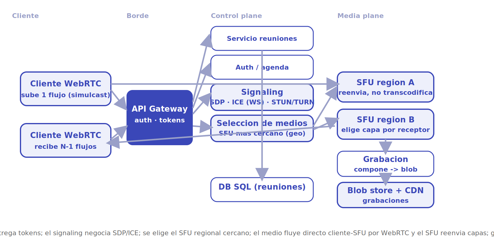
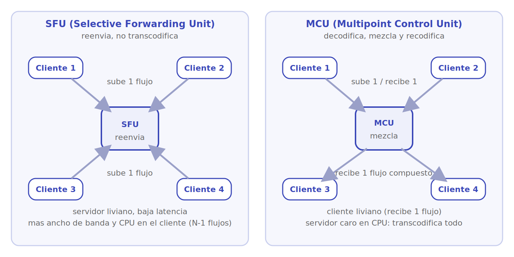

# Zoom

Diseñar un sistema de videoconferencia en tiempo real tipo Zoom. El corazón del problema es **distribuir flujos de audio y video en vivo entre muchos participantes con la mínima latencia posible**. La señal de video es continua, voluminosa y no tolera retrasos: a diferencia de un mensaje, un paquete que llega tarde es un paquete inútil. La pieza central es decidir cómo se reparten los medios entre participantes (SFU vs MCU) y cómo elegir un servidor de medios cercano.

## 1. Requisitos

### Funcionales

- Varios participantes se unen a una reunión y se ven/oyen entre sí en vivo.
- Cada participante publica su audio y video y recibe los de los demás.
- Compartir pantalla.
- Silenciar/activar micrófono y cámara.
- Chat de texto durante la reunión.
- Grabación de la reunión (en la nube).
- Programar reuniones, sala de espera, autenticación y control de anfitrión.

### No funcionales

- **Latencia muy baja**: el video interactivo necesita menos de ~150-200 ms de extremo a extremo; por encima, la conversación se siente rota.
- **Adaptación a la red**: el sistema debe degradar calidad (resolución/bitrate) antes que congelar o cortar.
- **Escalabilidad**: desde llamadas 1-a-1 hasta reuniones y webinars de cientos o miles de espectadores.
- **Alta disponibilidad** del *control plane* (auth, agenda) y resiliencia del *media plane*.
- **Eficiencia de ancho de banda y CPU**: el video es caro; hay que minimizar lo que cada cliente sube y recibe.

### Escala estimada (orden de magnitud)

- Cientos de millones de participantes-minuto al día; millones de reuniones concurrentes.
- Una reunión típica: 2-20 personas; webinars: hasta miles de espectadores.
- Cada flujo de video: ~1-3 Mbps según resolución; el audio, ~30-50 kbps.

> [!NOTE]
> Las cifras son aproximaciones de orden de magnitud para dimensionar el diseño. Lo decisivo es entender que el cuello de botella es el **ancho de banda de subida del cliente** y la **latencia de los servidores de medios**, no el QPS de una API.

## 2. Estimaciones de capacidad

**El problema del fan-out de medios.** En una reunión de N personas, cada participante debe recibir N-1 flujos. La gran pregunta es **quién hace el reparto**:

- **Malla P2P (sin servidor)**: cada cliente sube su flujo a los otros N-1. Subida ∝ (N-1). Para N=10 a 2 Mbps son ~18 Mbps de subida por cliente: insostenible más allá de 3-4 personas.
- **SFU (con servidor)**: cada cliente sube **un solo** flujo al servidor, que lo reenvía a los demás. Subida del cliente = constante (1 flujo). El servidor carga el fan-out.

```
Malla:  subida cliente = (N-1) flujos     →  no escala
SFU:    subida cliente = 1 flujo          →  escala; el servidor reenvia N(N-1)
```

**Carga del servidor de medios (SFU).** Una reunión de N personas implica que el SFU recibe N flujos y reenvía hasta N×(N-1). Para reuniones grandes esto se acota con **video activo** (solo los pocos que hablan en alta calidad) y **simulcast** (el cliente elige qué capa reenviar).

**Ancho de banda.** Dominante y caro. Un solo participante a 2 Mbps de video + audio, multiplicado por millones de participantes concurrentes, define el costo de la red. Por eso se prioriza **codecs eficientes** (VP8/VP9/H.264, Opus para audio) y degradación adaptativa.

**Almacenamiento.** Solo lo persistente: **grabaciones** (video compuesto a un blob store/CDN) y metadatos de reuniones. Los medios en vivo no se guardan, fluyen.

## 3. API principal

Hay dos planos muy distintos. El **control plane** es REST/gRPC clásico; el **media plane** usa **WebRTC** (SRTP sobre UDP) tras una negociación de señalización (*signaling*) que viaja por WebSocket:

```
# control plane (REST/gRPC)
POST /meetings                  {host, schedule}       → {meetingId, joinUrl}
POST /meetings/{id}/join        {userId, token}        → {mediaServer, iceServers, token}
POST /meetings/{id}/recording   {action:"start"}       → 204
GET  /meetings/{id}                                     → {participants, status}

# signaling (sobre WebSocket, previo a la conexión WebRTC)
JOIN     {meetingId, userId}
OFFER    {sdp}                  (descripción de medios del cliente)
ANSWER   {sdp}                  (respuesta del servidor de medios / par)
ICE      {candidate}           (candidatos de red para atravesar NAT)
LEAVE    {meetingId, userId}

# media plane: WebRTC (SRTP/UDP) cliente <-> SFU, ya sin pasar por la API
```

La clave conceptual: la **señalización** establece la sesión (qué codecs, qué IPs, qué claves), y luego el **medio fluye directo** por UDP, fuera de la API HTTP.

## 4. Modelo de datos

| Entidad | Campos clave | Dónde vive |
|---|---|---|
| **Reunión** | meetingId, hostId, schedule, status, settings | DB SQL (control plane) |
| **Participante (sesión)** | userId, meetingId, mediaServerId, capas activas | Estado en memoria del SFU + caché |
| **Flujo de medios** | streamId, codec, capas simulcast, bitrate | Efímero, en el servidor de medios |
| **Señalización** | sdp, candidatos ICE | Transitorio, durante el *handshake* |
| **Grabación** | meetingId, blobUrl, duración | Blob store (S3/GCS) + CDN |
| **Usuario** | userId, perfil, plan | DB SQL |

El **control plane** es transaccional y pequeño (reuniones, usuarios); el **media plane** es enorme, efímero y vive en memoria de los servidores de medios. Lo único que persiste de los medios son las **grabaciones**.

## 5. Arquitectura de alto nivel

<p align="center"></p>

El sistema se divide en **dos planos**:

1. **Cliente.** El navegador o la app capturan cámara/micrófono y usan **WebRTC**. Suben **un** flujo (con varias capas de calidad por *simulcast*) y reciben los flujos de los demás.
2. **Control plane.** **API Gateway** + servicios de **reuniones**, **auth** y **agenda**, sobre una **DB SQL**. Crea reuniones, valida tokens, gestiona anfitrión y sala de espera. Es clásico y no maneja medios.
3. **Signaling.** Antes de fluir el video, cliente y servidor **negocian** (intercambio de SDP y candidatos ICE por WebSocket) para acordar codecs, claves y rutas, atravesando NAT con ayuda de **STUN/TURN**.
4. **Selección de servidor de medios.** Un servicio elige el **SFU más cercano** (menor latencia de red) al conjunto de participantes, normalmente por región/geo.
5. **Media plane (SFU).** Los **SFUs** reciben cada flujo una vez y lo **reenvían** selectivamente a los demás, eligiendo qué capa de simulcast entregar a cada receptor según su red.
6. **Grabación.** Un servicio opcional **compone** los flujos en un video y lo sube al **blob store + CDN** para reproducción posterior.

## 6. Componentes y decisiones clave

### WebRTC y signaling

**WebRTC** es el estándar de medios en tiempo real del navegador: captura, codecs, SRTP (medios cifrados sobre UDP) y atravesar NAT. Pero WebRTC **no define la señalización**: el sistema debe aportar un canal (WebSocket) para que las partes intercambien **SDP** (qué codecs/resoluciones soporto) y **candidatos ICE** (por qué IPs/puertos puedo recibir). **STUN** descubre la IP pública detrás del NAT; **TURN** *retransmite* cuando la conexión directa es imposible (redes muy cerradas). El *signaling* solo monta la sesión; luego el medio fluye directo.

> [!NOTE]
> Separar *signaling* (control, fiable, TCP/WebSocket) de *media* (UDP, baja latencia, tolerante a pérdidas) es la decisión estructural de cualquier sistema RTC. El video prefiere perder un paquete a esperarlo.

### SFU vs MCU

Dos arquitecturas de servidor de medios:

- **MCU (Multipoint Control Unit)**: *decodifica* todos los flujos, los **mezcla** en una sola imagen/audio compuesto y envía **un** flujo a cada participante. Ventaja: el cliente recibe poco (1 flujo). Desventaja: **muy caro en CPU** (transcodifica todo) y añade latencia; poco flexible para layouts.
- **SFU (Selective Forwarding Unit)**: **no decodifica**, solo **reenvía** los paquetes de cada flujo a los demás. El cliente recibe N-1 flujos y compone el layout localmente. Ventaja: barato (no transcodifica), baja latencia, flexible. Desventaja: más ancho de banda de bajada y de CPU en el cliente.

<p align="center"></p>

El diagrama enfrenta ambos repartos. En el **SFU** cada cliente sube un único flujo y el servidor solo lo **reenvía** selectivamente: servidor liviano y baja latencia, pero el cliente recibe N-1 flujos (más bajada y CPU en el cliente). En el **MCU** el servidor **decodifica, mezcla y recodifica** todos los flujos en uno solo: el cliente recibe un único flujo (muy liviano), a costa de un servidor caro en CPU y algo más de latencia. Por eso el SFU domina hoy y el MCU sobrevive para clientes muy limitados.

> [!TIP]
> El SFU es la opción dominante moderna: escala mejor y da menor latencia porque evita la transcodificación. La MCU sobrevive para casos con clientes muy limitados (teléfonos, *gateways* legacy) que solo pueden recibir un flujo.

### Selección de servidor de medios cercano

La latencia manda. Se elige el SFU **geográficamente cercano** a los participantes (o un punto que minimice la latencia agregada del grupo) usando geolocalización por IP y medición de RTT. Si los participantes están dispersos, se pueden **encadenar SFUs entre regiones** (un SFU por región conectados por *backbone* dedicado) para que cada cliente hable con el suyo local.

### Simulcast y capas de calidad

Cada emisor sube **varias versiones** del mismo video (por ejemplo alta/media/baja resolución) en flujos separados: esto es **simulcast**. El SFU, que no transcodifica, elige para **cada receptor** qué capa reenviar según su ancho de banda y la importancia del flujo (el que habla en alta, el resto en baja). Variantes como **SVC** (codificación escalable) meten las capas dentro de un solo flujo. Así se degrada con elegancia sin cargar CPU del servidor.

### Control de congestión y adaptación

WebRTC mide pérdida de paquetes y RTT en vivo y ajusta el bitrate (*congestion control*, p. ej. GCC). Combinado con simulcast, el sistema **baja calidad antes de congelar**: prioriza audio (lo esencial) sobre video, y video activo (quien habla) sobre miniaturas.

### Grabación

Grabar exige **componer** los flujos en uno solo (un layout con todos los participantes), lo que sí requiere decodificar/recodificar en un servidor aparte para no cargar el SFU. El resultado se sube al **blob store** y se sirve por **CDN**, como video bajo demanda.

## 7. Cuellos de botella y trade-offs

- **Subida del cliente.** El recurso más escaso es el ancho de banda de subida. La malla P2P no escala; el SFU lo resuelve haciendo que el cliente suba un solo flujo.
- **Latencia vs CPU (SFU vs MCU).** El SFU minimiza latencia y costo de servidor a cambio de más bajada y CPU en el cliente; la MCU hace lo contrario. El video interactivo casi siempre prefiere SFU.
- **Carga del SFU en reuniones grandes.** El fan-out crece con N². Se acota con video activo (solo los que hablan), simulcast y límites de participantes en alta calidad.
- **Geografía y NAT.** Participantes dispersos suben la latencia; se mitiga con SFUs regionales encadenados. Redes cerradas obligan a relay TURN, que añade salto y costo.
- **Grabación cara.** Componer flujos consume CPU; se aísla del media plane en servidores de grabación dedicados.
- **Calidad vs continuidad.** Ante red mala, la decisión de diseño es degradar (bajar capa, priorizar audio) en lugar de cortar. La pérdida de paquetes se tolera; el retraso, no.

## 8. Por dónde empezar

Ruta de MVP a escala, para arrancar una implementación real:

1. **MVP — 1-a-1 con WebRTC puro.** Dos navegadores con la **API WebRTC** nativa y un **servidor de signaling** mínimo (Node + `ws`/Socket.IO) que reenvía OFFER/ANSWER/ICE entre los dos pares. Sin servidor de medios todavía: la conexión es directa (P2P). Añade un **TURN** (coturn) para las redes que no permiten conexión directa. Esto valida captura, codecs y atravesar NAT.
2. **Grupos pequeños con un SFU.** Cuando pases de 3-4 personas, mete un **SFU** en vez de malla. No reinventes: usa **mediasoup**, **Janus**, **Pion** (Go) o **LiveKit**. Cada cliente sube un flujo al SFU y este reenvía a los demás. El signaling ahora coordina cliente↔SFU.
3. **Control plane.** Añade una API REST (reuniones, auth con JWT, agenda, sala de espera) sobre **Postgres**. Sepáralo del media plane: la API crea la reunión y entrega `{mediaServer, iceServers, token}`; el medio nunca pasa por ella.
4. **Simulcast y adaptación.** Activa **simulcast** (el emisor sube varias capas) y deja que el SFU elija la capa por receptor según su ancho de banda. Prioriza audio sobre video y al hablante activo.
5. **Selección de servidor cercano.** Con varios SFUs, enruta a cada reunión al SFU regional de menor latencia (geo-IP). Para participantes dispersos, **encadena SFUs** entre regiones.
6. **Grabación y escala.** Servidor de grabación dedicado que **compone** y sube a **blob store + CDN**. Escala horizontal de SFUs por región y por reunión.

**Estructuras y algoritmos clave**: máquina de estados de la sesión WebRTC (signaling → ICE → conectado); enrutamiento de paquetes RTP en el SFU (mapa `streamId → receptores`); selección de capa simulcast por receptor según RTT/pérdida; control de congestión (GCC) para ajustar bitrate; selección de SFU por latencia geográfica.

**Qué postergar**: grabación, webinars de miles (que requieren un árbol de distribución tipo *broadcast*, no SFU plano), MCU/transcodificación, E2E de medios y layouts avanzados. El núcleo es **signaling + SFU + adaptación de calidad**.

## Referencias

- [Grokking the System Design Interview — DesignGurus (sistemas de streaming y tiempo real)](https://www.designgurus.io/course/grokking-the-system-design-interview)
- [system-design-primer — Donne Martin (GitHub)](https://github.com/donnemartin/system-design-primer)
- Martin Kleppmann, *Designing Data-Intensive Applications*, O'Reilly, 2017 (streaming, latencia y particionado).
- [WebRTC — documentación oficial (MDN)](https://developer.mozilla.org/en-US/docs/Web/API/WebRTC_API)
- [mediasoup — SFU para Node.js (documentación de diseño)](https://mediasoup.org/documentation/v3/mediasoup/design/)
