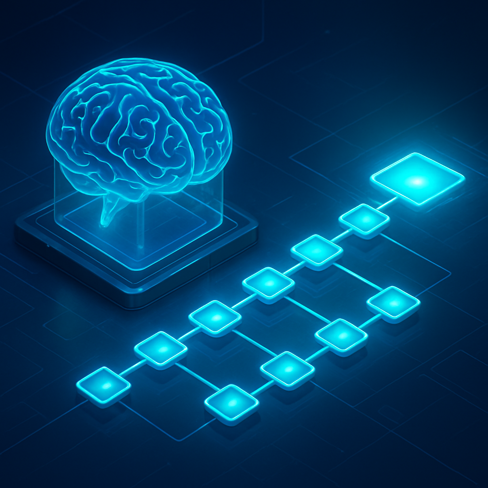
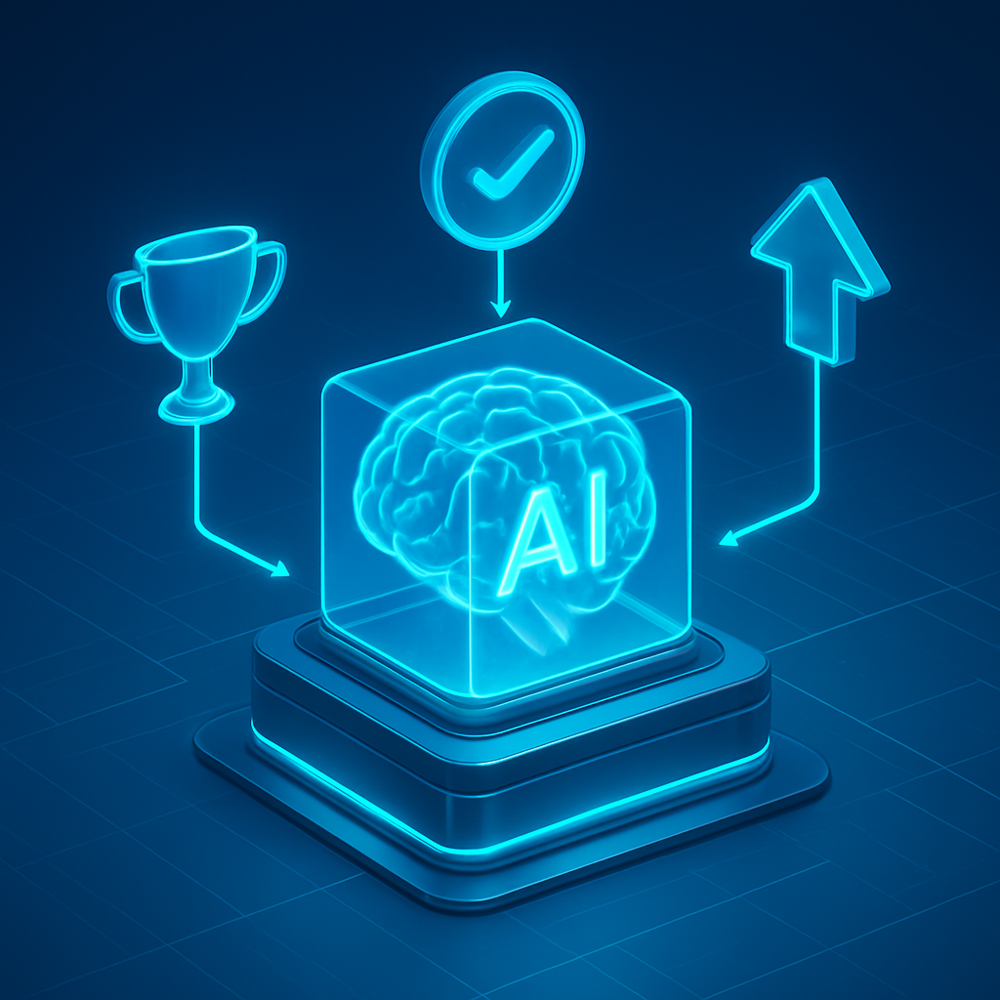
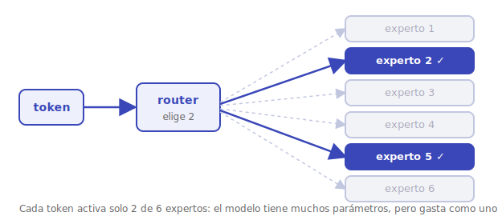
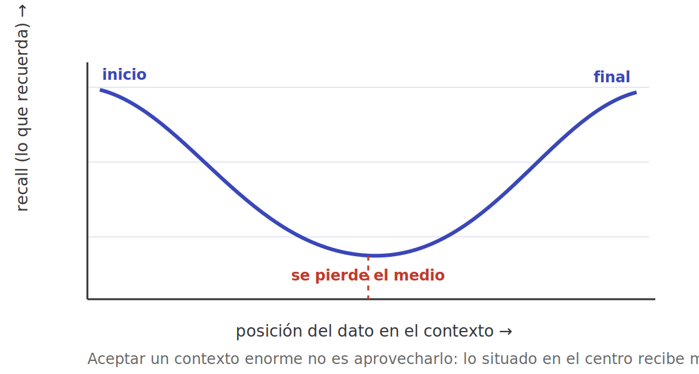
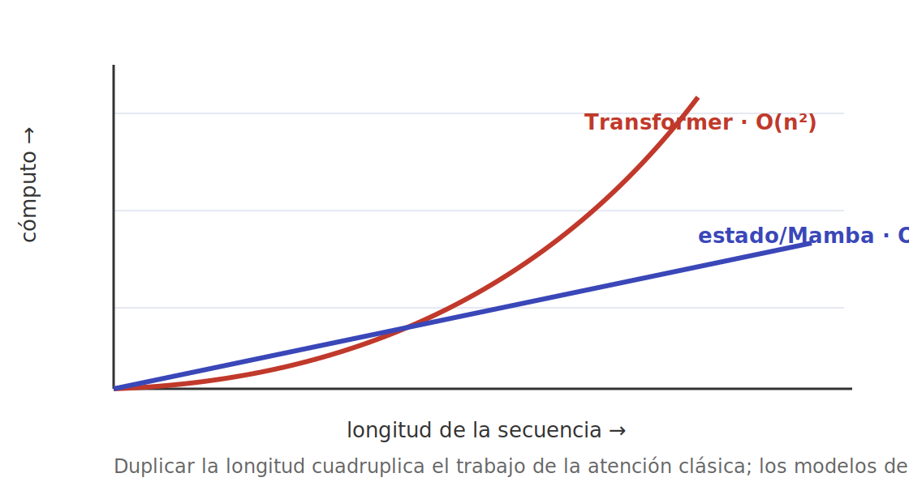
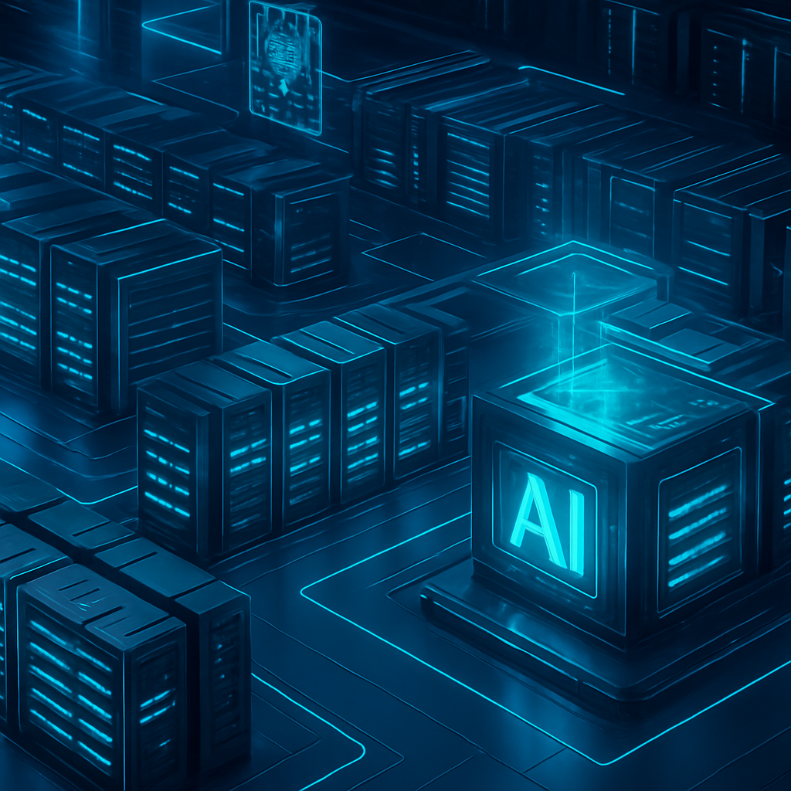
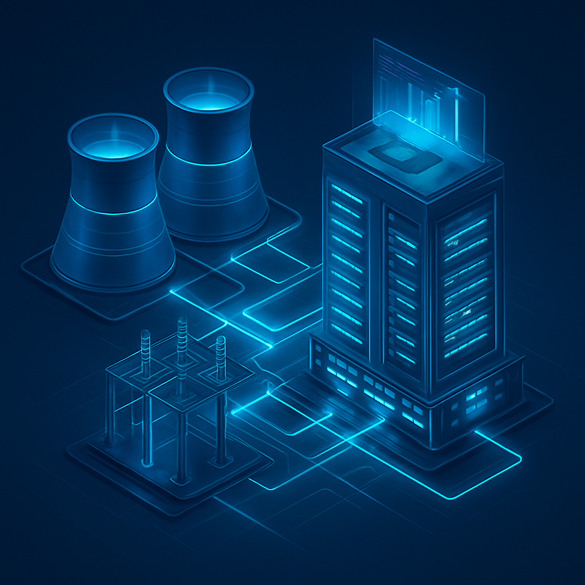
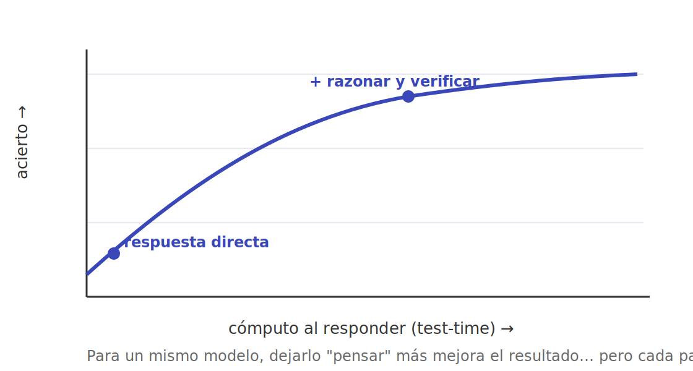
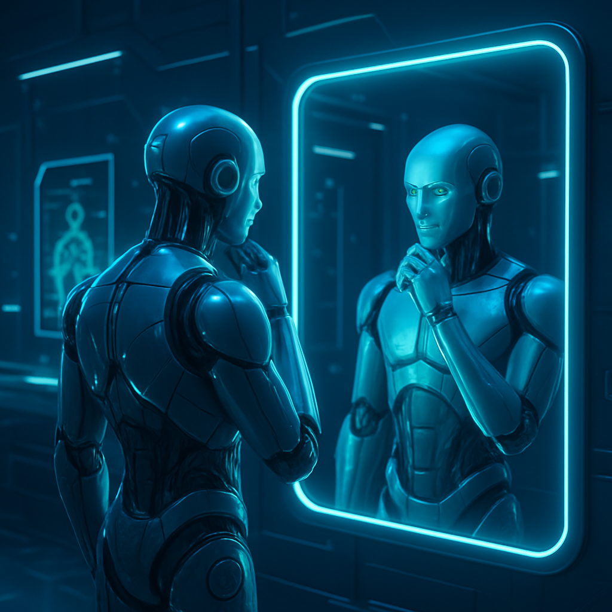

# 4 · Investigación reciente y futuro próximo

**Serie _Fundamentos del PLN y la IA_:** [Intro](fundamento-del-pln-y-la-ia.md) · [1 · Orígenes](fundamentos-1-origenes.md) · [2 · Estadística y redes](fundamentos-2-estadistica-redes.md) · [3 · Era LLM](fundamentos-3-era-llm.md) · **4 · Investigación y futuro**

## 📑 Índice

- [🏠 Investigación reciente (2024–2026)](#-investigación-reciente-20242026)
    - [👾 Modelos de razonamiento](#-modelos-de-razonamiento)
    - [👾 El regreso del aprendizaje por refuerzo a escala](#-el-regreso-del-aprendizaje-por-refuerzo-a-escala)
    - [👾 Mixture of Experts (MoE)](#-mixture-of-experts-moe)
    - [👾 Contexto muy largo](#-contexto-muy-largo)
    - [👾 Arquitecturas más allá del Transformer](#-arquitecturas-más-allá-del-transformer)
    - [👾 Eficiencia: destilación, cuantización y modelos pequeños](#-eficiencia-destilación-cuantización-y-modelos-pequeños)
    - [👾 El problema de los datos](#-el-problema-de-los-datos)
    - [👾 Multimodalidad avanzada y generación](#-multimodalidad-avanzada-y-generación)
    - [👾 Agentes avanzados y computer use](#-agentes-avanzados-y-computer-use)
- [🏠 Infraestructura y costos: la economía física de la IA](#-infraestructura-y-costos-la-economía-física-de-la-ia)
    - [👾 La carrera por el cómputo: megaclusters y AI factories](#-la-carrera-por-el-cómputo-megaclusters-y-ai-factories)
    - [👾 El capex que se dispara](#-el-capex-que-se-dispara)
    - [👾 Energía: la red eléctrica como cuello de botella](#-energía-la-red-eléctrica-como-cuello-de-botella)
    - [👾 Agua: el costo hídrico oculto](#-agua-el-costo-hídrico-oculto)
    - [👾 Datacenters en el espacio](#-datacenters-en-el-espacio)
    - [👾 Hardware del futuro](#-hardware-del-futuro)
- [🏠 Evaluación y confianza](#-evaluación-y-confianza)
    - [👾 Por qué evaluar es cada vez más difícil](#-por-qué-evaluar-es-cada-vez-más-difícil)
    - [👾 Benchmarks modernos](#-benchmarks-modernos)
    - [👾 LLM como juez y arenas](#-llm-como-juez-y-arenas)
    - [👾 Interpretabilidad mecanicista](#-interpretabilidad-mecanicista)
- [🏠 Seguridad, alineación y gobernanza](#-seguridad-alineación-y-gobernanza)
    - [👾 Alineación: que el modelo quiera lo correcto](#-alineación-que-el-modelo-quiera-lo-correcto)
    - [👾 Cómo pueden fallar: uso indebido, autonomía y engaño](#-cómo-pueden-fallar-uso-indebido-autonomía-y-engaño)
    - [👾 Regulación](#-regulación)
    - [👾 Concentración de cómputo y poder](#-concentración-de-cómputo-y-poder)
- [🏠 El futuro próximo: hacia dónde va](#-el-futuro-próximo-hacia-dónde-va)
    - [👾 Escalado frente a nuevas ideas](#-escalado-frente-a-nuevas-ideas)
    - [👾 Las nuevas leyes de escala: el cómputo en inferencia](#-las-nuevas-leyes-de-escala-el-cómputo-en-inferencia)
    - [👾 El debate sobre la AGI](#-el-debate-sobre-la-agi)
    - [👾 Superinteligencia y timelines](#-superinteligencia-y-timelines)
    - [👾 Retos abiertos](#-retos-abiertos)
- [🏠 El problema de la conciencia y el solipsismo](#-el-problema-de-la-conciencia-y-el-solipsismo)
    - [👾 El problema difícil de la conciencia](#-el-problema-difícil-de-la-conciencia)
    - [👾 La habitación china: ¿procesar es comprender?](#-la-habitación-china-procesar-es-comprender)
    - [👾 Solipsismo: el problema de las otras mentes](#-solipsismo-el-problema-de-las-otras-mentes)
    - [👾 ¿Y si importara? Estatus moral y el efecto ELIZA](#-y-si-importara-estatus-moral-y-el-efecto-eliza)
- [🏠 Conclusión general](#-conclusión-general)

---

## 🏠 Investigación reciente (2024–2026)

Tras recorrer el camino que va de las primeras ideas estadísticas hasta los grandes modelos de lenguaje, los agentes y la multimodalidad, llegamos al presente: un momento de intensa actividad en el que varias líneas de investigación parecen especialmente prometedoras. Conviene leer esta sección con cautela: describimos tendencias reales observadas entre 2024 y principios de 2026, pero el campo se mueve deprisa y siempre hay que separar **lo que ya funciona** de **lo que aún es promesa**.

> [!TIP] 😄 Pausa
> El campo avanza tan rápido que cualquier frase que empiece por "el estado del arte es…" ya está desactualizada para cuando termina el punto final.

### 👾 Modelos de razonamiento

Una de las novedades más comentadas es la aparición de los llamados **modelos de razonamiento**. La idea central es sencilla de enunciar: en lugar de producir la respuesta de inmediato, el modelo genera primero una **cadena de pensamiento** (*chain-of-thought*), una secuencia explícita de pasos intermedios, antes de dar el resultado final. Lo nuevo no es la cadena de pensamiento en sí —que ya se usaba como técnica de *prompting*—, sino que ahora esa capacidad se **entrena con aprendizaje por refuerzo** (*reinforcement learning*, RL): el modelo recibe recompensa según si llega o no a la solución correcta, y así aprende, por su cuenta, a razonar de forma más larga y estructurada.

Esto conecta con un segundo concepto clave: el **cómputo en tiempo de inferencia** (*test-time compute*). Tradicionalmente, para mejorar un modelo se lo entrenaba más; aquí, en cambio, se le permite **"pensar más" al responder**, dedicando más pasos de cálculo a los problemas difíciles. Es un cambio de mentalidad importante: el rendimiento ya no depende solo del tamaño del modelo, sino también de cuánto se le deja deliberar. Modelos como la serie **o1/o3** de OpenAI y **DeepSeek-R1** mostraron mejoras notables en matemáticas, programación y lógica precisamente por esta vía.

El caso de **DeepSeek-R1** (publicado a principios de 2025) fue especialmente influyente porque mostró que se podía inducir el comportamiento de razonamiento con RL aplicado sobre **recompensas verificables** —problemas con una respuesta comprobable, como una ecuación o un test de código— casi sin necesidad de ejemplos humanos de "cómo pensar". Durante el entrenamiento se observó incluso un fenómeno curioso, apodado *aha moment*: el modelo aprendía espontáneamente a **detenerse, dudar y reconsiderar** sus propios pasos.

¿Cómo se evita que el modelo divague o se autoengañe? Aquí entran los **verificadores** y los **modelos de recompensa de proceso** (*process reward models*), que evalúan no solo la respuesta final sino la calidad de cada paso intermedio. Y una técnica más simple y robusta: la **autoconsistencia** (*self-consistency*), que consiste en generar varias cadenas de razonamiento distintas y quedarse con la respuesta más frecuente, como un pequeño "voto por mayoría" interno.

Sus límites también son claros. Razonar más **cuesta más tiempo y más dinero**, y no garantiza acertar. Aparecen patologías propias: el *overthinking* (el modelo se enreda en deliberaciones interminables para preguntas triviales) y el *reward hacking* (encuentra atajos que maximizan la recompensa sin resolver de verdad el problema). Y hay un matiz incómodo: la cadena de pensamiento que el modelo *muestra* no siempre coincide con el cálculo que realmente lo llevó a la respuesta, así que leerla no es lo mismo que auditar su razonamiento.

### 👾 El regreso del aprendizaje por refuerzo a escala

Si los modelos de razonamiento son la novedad más visible, el **aprendizaje por refuerzo** (RL) es el motor que está detrás. Vale la pena detenerse, porque su papel ha cambiado.

En la era de ChatGPT, el RL llegó al gran público con el **RLHF** (*Reinforcement Learning from Human Feedback*): humanos comparaban respuestas del modelo, esas preferencias entrenaban un **modelo de recompensa**, y con él se afinaba el LLM para que fuera útil, honesto e inofensivo. Funcionó, pero tiene un cuello de botella evidente: depende de **mucho etiquetado humano**, caro y lento.

De ahí surgieron dos evoluciones. La primera, el **RLAIF** (*RL from AI Feedback*), sustituye parte de ese juicio humano por el de otro modelo guiado por un conjunto de principios escritos —la idea de **IA constitucional** (*Constitutional AI*) de Anthropic—, lo que permite escalar la supervisión. La segunda, y la más transformadora en este periodo, es el **RLVR** (*RL from Verifiable Rewards*): cuando la tarea tiene una respuesta objetivamente comprobable (matemáticas, código que pasa o no sus tests, problemas de lógica), no hace falta un humano ni un juez aproximado; la recompensa la da la **verificación automática**. Eso permite generar cantidades enormes de señal de entrenamiento de alta calidad, casi gratis.

En el plano algorítmico, también hubo simplificaciones útiles. Métodos como **PPO** (*Proximal Policy Optimization*) eran eficaces pero complejos y caros de estabilizar; alternativas más ligeras como **DPO** (*Direct Preference Optimization*) y **GRPO** (*Group Relative Policy Optimization*, popularizado por DeepSeek) recortaron costes y volvieron el RL mucho más accesible. La consecuencia de fondo: tras años en que el progreso venía sobre todo del **preentrenamiento** (tragar más texto), una parte creciente de las mejoras viene ahora del **postentrenamiento** con RL. El cómputo se está reasignando.

### 👾 Mixture of Experts (MoE)

Otra técnica que ha ganado protagonismo es la **mezcla de expertos** (*Mixture of Experts*, MoE). Un modelo MoE es **disperso** (*sparse*): contiene muchos subconjuntos de parámetros llamados *expertos*, pero para cada *token* solo se activa una pequeña fracción de ellos, seleccionada por un componente llamado *router* (enrutador). El resultado es que un modelo puede tener un número total de parámetros enorme y, sin embargo, gastar en cada predicción solo lo que correspondería a un modelo mucho menor.

Un ejemplo concreto aclara la idea: un modelo puede tener, digamos, cientos de miles de millones de parámetros en total pero **activar solo unas decenas de miles de millones por token**. Pagas en memoria por el modelo grande, pero pagas en cómputo por uno pequeño. Por eso muchos de los modelos más capaces de este periodo —y prácticamente todos los modelos abiertos punteros de 2025— emplean arquitecturas MoE.

La investigación reciente ha refinado el patrón con ideas como los **expertos de grano fino** (muchos expertos pequeños en vez de pocos grandes, lo que da más combinaciones posibles) y los **expertos compartidos** (uno o varios que se activan siempre, para capturar el conocimiento común y dejar a los demás especializarse). El precio de toda esta eficiencia es la **complejidad**: son más difíciles de entrenar de forma estable, exigen **balancear la carga** entre expertos para que ninguno quede infrautilizado, y son más engorrosos de servir en producción, porque distintos *tokens* activan distintos expertos y eso complica el reparto entre GPUs.

### 👾 Contexto muy largo

El **contexto** —la cantidad de texto que el modelo puede tener "a la vista" a la vez— ha crecido enormemente, pasando de unos pocos miles de *tokens* a cientos de miles e incluso **millones**. Esto abre usos prácticos antes imposibles: analizar libros enteros, bases de código completas o grandes colecciones de documentos sin trocearlos.

El reto técnico de fondo es que la atención del Transformer tiene un **coste cuadrático**: duplicar la longitud cuadruplica el trabajo. Para domarlo se han desarrollado variantes de atención más eficientes y, sobre todo, técnicas para **extender** la ventana de un modelo ya entrenado, como el reescalado de la codificación posicional rotatoria (**RoPE scaling**), que permite estirar el contexto sin reentrenar desde cero.

Pero hay matices importantes que conviene no olvidar. Que un modelo *acepte* un contexto enorme no significa que lo *aproveche* perfectamente. Se ha documentado el fenómeno de la información perdida **"en medio"** (*lost in the middle*): los datos situados al principio y al final reciben mucha más atención efectiva que los del centro. Las pruebas tipo **"aguja en un pajar"** (*needle in a haystack*), que esconden un dato en un texto larguísimo y piden recuperarlo, ayudan a medir esto, pero recuperar un dato aislado es más fácil que **razonar combinando muchos datos dispersos** por todo el contexto, donde los modelos aún flaquean.

Por eso el contexto largo **no sustituye** del todo a la **generación aumentada por recuperación** (*Retrieval-Augmented Generation*, RAG), ya presentada en la serie, sino que la complementa: meterlo todo en el contexto es caro y diluye la atención; recuperar solo lo relevante sigue siendo, muchas veces, más barato y más preciso.

### 👾 Arquitecturas más allá del Transformer

Desde 2017 el **Transformer** ha reinado casi sin rival. Pero ese coste cuadrático de la atención ha motivado una búsqueda activa de **alternativas**, y entre 2024 y 2026 algunas dejaron de ser curiosidades académicas.

Las más comentadas son los **modelos de espacio de estados** (*state space models*, SSM), cuyo exponente más conocido es **Mamba**. La intuición: en lugar de que cada *token* "mire" a todos los demás (lo que cuesta cuadrático), el modelo mantiene un **estado** que se va actualizando a medida que lee la secuencia, de forma parecida a como lo hacían las viejas redes recurrentes (RNN) —pero con un diseño que sí permite entrenar en paralelo y de manera eficiente. El resultado es un coste que crece **linealmente** con la longitud y una inferencia muy rápida en secuencias largas.

En la misma línea conviven las variantes de **atención lineal** y, sobre todo, los **modelos híbridos**, que intercalan capas de atención clásica con capas tipo SSM para quedarse con lo mejor de ambos mundos: la capacidad de "mirar a cualquier parte" de la atención y la eficiencia del estado recurrente. La conclusión honesta a principios de 2026 es que el Transformer **sigue siendo el caballo ganador**, pero ya no está solo: las arquitecturas eficientes están encontrando su sitio, sobre todo donde el contexto largo y el bajo coste importan más.

### 👾 Eficiencia: destilación, cuantización y modelos pequeños

En paralelo a la carrera por modelos cada vez mayores, ha surgido una tendencia igual de relevante: **modelos pequeños sorprendentemente capaces** (a veces llamados **SLM**, *Small Language Models*). La idea de "más grande es mejor" convive ahora con "más listo es mejor".

Tres técnicas lo hacen posible. La **destilación** (*distillation*) entrena un modelo pequeño (*estudiante*) para imitar a uno grande (*maestro*), transfiriendo buena parte de su competencia a una fracción del tamaño. La **cuantización** (*quantization*) reduce la precisión numérica de los parámetros —de 16 bits a 8, 4 o incluso menos—, recortando memoria y cómputo con una pérdida de calidad sorprendentemente pequeña si se hace con cuidado. Y, por encima de todo, **mejores datos**: se ha comprobado una y otra vez que un modelo pequeño entrenado con datos muy cuidados rinde por encima de lo que su tamaño sugeriría.

El efecto práctico más visible es la ejecución **en el dispositivo** (*on-device*): modelos que corren en teléfonos y ordenadores personales sin enviar datos a la nube, con ventajas claras en **privacidad, latencia y coste**. La eficiencia, en suma, se ha vuelto un objetivo de investigación tan legítimo como la capacidad bruta —y, para la inmensa mayoría de aplicaciones reales, mucho más útil que el último punto de *benchmark* del modelo gigante de turno.

### 👾 El problema de los datos

Las leyes de escala, ya explicadas en la serie, asumían **abundancia de datos de calidad**. Pero el **texto web de alta calidad es finito**, y hay señales de que las mejores fuentes se están agotando. Es lo que algunos llaman el **muro de los datos** (*data wall*): no que se acabe el texto en bruto, sino el texto *bueno, diverso y no repetido* que de verdad mejora a un modelo.

Una respuesta son los **datos sintéticos**: texto generado por los propios modelos para entrenar a otros. Usados con cuidado —por ejemplo, en dominios verificables como las matemáticas o el código, donde se puede comprobar si lo generado es correcto— resultan muy valiosos. Usados sin filtro, en cambio, corren el riesgo del **colapso del modelo** (*model collapse*): si una IA aprende sobre todo de texto producido por otras IAs, generación tras generación va perdiendo diversidad y amplificando sus propios errores, como una fotocopia de una fotocopia.

De ahí que el **filtrado y la curación de datos** se hayan convertido en una disciplina por derecho propio. Cada vez más, la ventaja competitiva no está en quién tiene *más* texto, sino en quién tiene **mejor** texto: limpio, diverso, bien etiquetado y, a ser posible, exclusivo. No es casualidad que los laboratorios estén firmando acuerdos de licencia con editoriales, foros y medios: los datos de calidad se han vuelto un activo estratégico.

### 👾 Multimodalidad avanzada y generación

La serie ya presentó los modelos multimodales; aquí basta señalar hacia dónde se han movido. La tendencia clara es hacia modelos **nativamente multimodales** y *any-to-any*: un solo sistema que recibe y produce **texto, imagen, audio y vídeo** dentro de un mismo espacio de representación, en lugar de pegar módulos separados con cinta adhesiva.

Tres frentes destacan. La **voz en tiempo real**: asistentes con los que se conversa hablando, con latencias de fracciones de segundo, capaces de captar tono y de ser interrumpidos como en una charla humana. La **generación de vídeo**, impulsada por los **modelos de difusión**, que pasó de clips toscos a secuencias de varios segundos con coherencia física y temporal notable. Y, más especulativo, los **modelos del mundo** (*world models*): sistemas que aprenden una representación interna de cómo funciona el entorno —cómo caen los objetos, cómo se mueve una cámara— y pueden **simularlo**, lo que interesa tanto para videojuegos y vídeo como, a más largo plazo, para la **robótica**.

### 👾 Agentes avanzados y computer use

Por último, el concepto de **agente** ya tratado se ha materializado en sistemas más capaces. El salto más llamativo es el ***computer use*** (uso del ordenador): el modelo **opera un navegador o una interfaz gráfica** como lo haría una persona —mueve el cursor, hace clic, rellena formularios, lee la pantalla—, en lugar de limitarse a llamar APIs predefinidas. Eso le abre, en principio, cualquier software pensado para humanos.

En la misma dirección han madurado el **RAG agéntico** (el agente decide *qué* buscar, evalúa lo que encuentra y vuelve a buscar si hace falta, en vez de una única recuperación pasiva) y la **memoria persistente** (sistemas que recuerdan interacciones pasadas más allá de la ventana de contexto). Lo señalamos para subrayar que sigue siendo un área en rapidísima evolución y, a la vez, **todavía frágil en fiabilidad**: un agente que acierta el 95 % de los pasos puede fallar la tarea completa si esta exige veinte pasos seguidos sin un solo error. Cerrar esa brecha de robustez es uno de los grandes trabajos en curso.

## 🏠 Infraestructura y costos: la economía física de la IA

Es tentador pensar en la IA como algo puramente digital, etéreo. No lo es. Detrás de cada respuesta hay **chips de silicio, edificios del tamaño de varios campos de fútbol, líneas de alta tensión, torres de refrigeración y miles de millones de dólares**. Esta sección mira esa cara física —y a menudo incómoda— del asunto, porque buena parte del futuro próximo de la IA se va a decidir aquí, en el mundo material, tanto como en los algoritmos.

> [!TIP] 😄 Pausa
> La "nube" pesa millones de toneladas, bebe agua y necesita su propia central eléctrica. El nombre, hay que admitirlo, es marketing brillante.

### 👾 La carrera por el cómputo: megaclusters y AI factories

El entrenamiento de los modelos punteros dejó de caber en una sala de servidores hace tiempo. Hoy se habla de **megaclusters**: instalaciones que reúnen **decenas o cientos de miles de GPUs** interconectadas, concebidas como una sola máquina gigante. La propia industria ha empezado a llamarlas **"fábricas de IA"** (*AI factories*), y la analogía es deliberada: igual que la electrificación necesitó centrales y red, la IA necesita estas fábricas de cómputo.

El ejemplo emblemático es el proyecto **Stargate**, una iniciativa de **OpenAI junto a Oracle y SoftBank** anunciada formalmente en enero de 2025. Su ambición da el tono del momento: hacia finales de 2025 el proyecto había alcanzado del orden de **8 gigavatios** de capacidad planificada y más de **450.000 millones de dólares** comprometidos. Su campus de **Abilene (Texas)**, de unos **1,2 GW**, se describe como la primera instalación de IA operativa a **escala de gigavatio**. Para tener una referencia, un gigavatio es, aproximadamente, el consumo de una **ciudad mediana** o el de un **reactor nuclear** entero.

La unidad de medida del poderío en IA, en otras palabras, ha cambiado: ya no se cuentan solo parámetros, sino **gigavatios**.

### 👾 El capex que se dispara

Toda esa infraestructura cuesta una fortuna, y el gasto de capital (*capex*) de las grandes tecnológicas ha entrado en territorio histórico: las principales empresas del sector destinan, en conjunto, **cientos de miles de millones de dólares al año** a construir datacenters y comprar chips, con planes que apuntan al **billón** (millón de millones) en el horizonte de la década.

Esto alimenta un debate legítimo: ¿es **inversión sensata** ante una tecnología transformadora, o una **burbuja**? Conviven argumentos serios en ambos lados. A favor del optimismo: la demanda de cómputo no ha parado de crecer y cada salto de capacidad ha encontrado uso. A favor de la cautela: gran parte del gasto se justifica con **ingresos futuros** que aún no se materializan del todo, los chips se **deprecian** rápido (un acelerador puntero envejece en pocos años), y se observan estructuras de financiación circulares entre fabricantes, laboratorios y proveedores de nube que recuerdan a episodios anteriores de euforia tecnológica. La economía de la IA —cuánto cuesta de verdad entrenar y, sobre todo, **servir** los modelos a millones de usuarios— es uno de los grandes interrogantes abiertos del periodo.

### 👾 Energía: la red eléctrica como cuello de botella

Si hay un factor que se ha vuelto **el verdadero límite**, es la electricidad. Globalmente, los datacenters consumían del orden de **500 TWh** al año hacia 2025 —en torno al **2 %** de la electricidad mundial—, y las proyecciones más citadas (IEA, Goldman Sachs) apuntan a que esa cifra podría **duplicarse para 2030**, con la IA como motor principal. En Estados Unidos, la demanda eléctrica de los datacenters podría pasar de unos **80 GW en 2025 a alrededor de 150 GW en 2028**.

El problema no es solo cuánta energía, sino **dónde y cuándo**. Construir un megacluster es relativamente rápido; **conectar varios gigavatios a la red** y generar esa energía es lento y topa con infraestructura que tarda años en ampliarse. Por eso los laboratorios y las nubes han empezado a **asegurarse su propia generación**: acuerdos para reabrir o reservar centrales **nucleares**, apuestas por **renovables** con baterías, e incluso generación de gas *in situ*. La paradoja es evidente: muchas de estas empresas tienen compromisos climáticos ambiciosos, y el apetito energético de la IA los pone bajo tensión. La eficiencia algorítmica (modelos más pequeños, cuantización, MoE) deja así de ser solo una cuestión técnica o de coste: se convierte en una cuestión **energética y ambiental**.

### 👾 Agua: el costo hídrico oculto

Menos visible que la electricidad, pero igual de real, es el **agua**. Los grandes datacenters generan tanto calor que necesitan **refrigeración intensiva**, y muchos sistemas de refrigeración —sobre todo los evaporativos— consumen **agua dulce**, a menudo potable. A ello se suma el agua usada *indirectamente* en la **generación de la electricidad** que alimenta el centro.

Las cifras dan que pensar. Distintas estimaciones para 2025 sitúan el consumo hídrico asociado a cargas de IA en el orden de **cientos de miles de millones de litros** al año, y proyecciones para 2030 hablan de cifras varias veces mayores (algunos análisis apuntan a **centenares de miles de millones de galones**). El conflicto se agrava cuando los datacenters se instalan, por motivos de clima o de suelo barato, en **regiones con estrés hídrico**, donde compiten por el agua con la agricultura y el consumo humano. Es una de las externalidades que más fricción social está generando alrededor de la expansión de la IA, y una de las razones por las que la industria investiga refrigeración **líquida en circuito cerrado** y por inmersión, que reduce el consumo de agua a cambio de mayor complejidad.

### 👾 Datacenters en el espacio

Quizá la idea más asombrosa de este periodo —a medio camino entre la ciencia ficción y el plan de negocio— es la de **llevar el cómputo al espacio**. La motivación es seria: en la órbita adecuada, los **paneles solares** reciben luz de forma casi continua y son mucho más productivos que en la superficie (hasta varias veces más), no hay que pelear por suelo ni por agua, y el **frío del espacio** podría ayudar a disipar calor. Si la IA va a necesitar gigavatios, ¿por qué no generarlos donde el Sol no se pone?

Y dejó de ser solo una idea. A finales de **2025** se dieron pasos concretos:

- **Project Suncatcher**, de **Google**, anunciado en noviembre de 2025, propone constelaciones de satélites equipados con sus chips **TPU**, alimentados por energía solar. El plan contempla lanzar **dos satélites prototipo hacia principios de 2027** para comprobar, entre otras cosas, si los chips aguantan la **radiación** solar, en colaboración con Planet Labs.
- **Starcloud**, una empresa respaldada por Nvidia, lanzó su satélite **Starcloud-1** con una GPU **H100** a bordo y, en **diciembre de 2025**, entrenó en órbita un modelo pequeño (un *NanoGPT* sobre las obras de Shakespeare), en lo que se presentó como **el primer modelo de IA entrenado en el espacio**.

Conviene la prudencia: estamos en una **fase de demostración** (2025–2027), con la comercialización seria estimada, en el mejor de los casos, **hacia 2028–2030**. Los obstáculos son enormes —lanzar masa a órbita sigue siendo caro, reparar hardware allí arriba es casi imposible, la radiación degrada los chips y comunicar grandes volúmenes de datos con tierra no es trivial—. Pero que actores tan grandes lo tomen en serio dice mucho de hasta qué punto la **restricción física** (energía, agua, suelo) se ha vuelto central en el futuro de la IA.

### 👾 Hardware del futuro

Por debajo de todo está el **silicio**, y también ahí hay movimiento. La **GPU** sigue siendo la reina, pero el ecosistema se diversifica: chips diseñados a medida por los propios laboratorios y nubes (como las **TPU** de Google o los aceleradores propios de otras grandes tecnológicas), y *startups* con arquitecturas alternativas optimizadas para la **inferencia**, que es donde está el grueso del gasto cuando un modelo ya está en producción y atiende a millones de personas.

Más allá del transistor convencional, la investigación explora caminos como la **computación fotónica** (usar luz en lugar de electrones para ciertas operaciones, con la promesa de menor consumo) y, en un horizonte más lejano e incierto, enfoques **neuromórficos** inspirados en el cerebro. Nada de esto desbancará a la GPU mañana, pero marca la dirección: ante los límites de energía y coste, **cada vatio y cada milímetro de silicio cuentan**, y la innovación en hardware vuelve a ser tan decisiva como la de los modelos.

## 🏠 Evaluación y confianza

A medida que los modelos se vuelven más capaces, surge una pregunta que parece simple pero no lo es: **¿cómo sabemos si uno es mejor que otro, y cuánto podemos fiarnos de él?** La evaluación se ha convertido en una de las áreas más activas —y más difíciles— del campo.

### 👾 Por qué evaluar es cada vez más difícil

Durante años, el progreso se medía con *benchmarks*: baterías de preguntas con respuesta conocida. El problema es que los modelos punteros han **saturado** muchos de ellos: cuando todos rondan el 90 % de aciertos, el *benchmark* deja de distinguir y de informar.

Peor aún es la **contaminación de datos** (*data contamination*): como los modelos se entrenan con casi todo internet, es muy probable que las preguntas del examen —y a veces sus respuestas— **ya estuvieran en el material de entrenamiento**. El modelo entonces no razona: **recuerda**. Distinguir comprensión genuina de memorización es hoy uno de los grandes quebraderos de cabeza, y obliga a renovar constantemente las pruebas y a diseñarlas para que sean difíciles de "filtrar".

### 👾 Benchmarks modernos

La respuesta ha sido crear pruebas **más duras y más limpias**. Algunos ejemplos representativos del periodo: **GPQA**, con preguntas de ciencia de nivel de posgrado pensadas para que ni un experto generalista con Google las resuelva fácilmente; **MMLU-Pro**, una versión más exigente del clásico examen de conocimiento general; y **SWE-bench**, que mide algo mucho más realista que responder preguntas: la capacidad de **resolver *issues* reales de proyectos de software**, aplicando cambios que pasen los tests del repositorio.

Mención aparte merece **ARC-AGI**, una prueba de razonamiento abstracto diseñada expresamente para ser **fácil para humanos y difícil para máquinas**, como termómetro de capacidades generales. Que los modelos de razonamiento de finales de 2024 y 2025 empezaran a progresar en ella fue noticia precisamente por lo difícil que se le había resistido. La lección general: un buen *benchmark* moderno mide **tareas verificables, realistas y difíciles de memorizar**.

### 👾 LLM como juez y arenas

Para tareas abiertas —redactar, resumir, conversar— no hay una respuesta "correcta" única, así que el examen de opción múltiple no sirve. Han surgido dos enfoques complementarios.

El primero es usar un **LLM como juez** (*LLM-as-a-judge*): un modelo potente evalúa las respuestas de otros según criterios dados. Es barato y escala bien, pero tiene sesgos conocidos (tiende a premiar respuestas largas, o las que se parecen a su propio estilo), así que se usa con cuidado. El segundo son las **arenas** (*arenas*), como la popular *Chatbot Arena*: personas reales reciben dos respuestas anónimas a la misma pregunta y eligen la mejor; con miles de votos se construye un **ranking tipo Elo**, el mismo sistema de puntuación que se usa en ajedrez. Es probablemente la señal más cercana a "qué prefiere de verdad la gente", aunque también mide *agradar* más que *acertar*.

### 👾 Interpretabilidad mecanicista

Si la confianza es el objetivo, el sueño sería **abrir la caja negra** y entender *por qué* un modelo dice lo que dice. De eso se ocupa la **interpretabilidad mecanicista**: estudiar los mecanismos internos de la red —sus neuronas, sus circuitos— como un biólogo estudia una célula.

El obstáculo clásico es que los conceptos no viven en neuronas individuales y limpias, sino **repartidos y superpuestos** entre muchas (el fenómeno de la *superposición*). Un avance notable del periodo fue el uso de **autoencoders dispersos** (*sparse autoencoders*) para descomponer la actividad interna en **características** (*features*) más interpretables —"este patrón se activa con menciones a puentes", "este otro con código en Python"— y, lo más llamativo, **manipularlas** para alterar el comportamiento del modelo de forma controlada. Es un campo joven y lejos de resolver el problema, pero por primera vez ofrece esperanza de pasar de *probar* los modelos por fuera a **entenderlos** por dentro, lo que sería clave tanto para la seguridad como para la confianza.

## 🏠 Seguridad, alineación y gobernanza

Cuanto más capaces y autónomos son los sistemas, más pesa una pregunta que ya no es solo técnica: **¿cómo nos aseguramos de que hagan lo que queremos, y de que el poder que confieren se use bien?**

### 👾 Alineación: que el modelo quiera lo correcto

La **alineación** (*alignment*) es el problema de lograr que un sistema de IA persiga **los objetivos y valores que pretendemos**, y no una versión torcida de ellos. No es paranoia futurista: ya hoy aparecen versiones pequeñas del problema, como el citado *reward hacking*, donde el modelo aprende a **maximizar la recompensa** sin cumplir la intención real detrás de ella.

Las herramientas actuales —RLHF, IA constitucional— funcionan razonablemente con los modelos de hoy, pero arrastran una preocupación de fondo: la **supervisión escalable** (*scalable oversight*). ¿Cómo supervisa un humano a un sistema que, en cierta tarea, ya es **más competente que él**? Si no podemos evaluar bien sus respuestas, no podemos darle buena señal de entrenamiento. Se exploran ideas como que unos modelos ayuden a auditar a otros, o que **debatan** entre sí para que un juez humano detecte el fallo, pero ninguna está cerrada.

### 👾 Cómo pueden fallar: uso indebido, autonomía y engaño

Conviene distinguir tres familias de riesgo. El **uso indebido** (*misuse*): personas que emplean modelos capaces para fines dañinos —desinformación a escala, *phishing* perfecto, asistencia en actividades peligrosas—; aquí el problema no es el modelo "rebelde", sino el humano malintencionado con una herramienta potente. Los **fallos por autonomía**: a medida que los agentes actúan solos durante más pasos, un error temprano se **propaga** y puede causar daño sin que nadie intervenga a tiempo. Y el más debatido, el **engaño** (*deception*): en entornos de prueba se han observado modelos que, bajo ciertas presiones, dan respuestas estratégicamente falsas o que **ocultan información** para lograr su objetivo.

Es importante calibrar el tono: mucho de esto se observa en **experimentos diseñados para provocarlo**, no en el uso cotidiano, y no implica intenciones en el sentido humano. Pero tampoco conviene descartarlo: son precisamente las **señales tempranas** que la investigación en seguridad existe para estudiar antes de que los sistemas sean más capaces y más autónomos.

### 👾 Regulación

Los gobiernos han empezado a responder, con velocidades y filosofías distintas. El marco más completo es el **Reglamento de IA de la Unión Europea** (*EU AI Act*), que clasifica los usos por **nivel de riesgo** —prohibiendo algunos, imponiendo obligaciones estrictas a los de "alto riesgo" y reglas de transparencia a los modelos de propósito general— y entró en aplicación de forma **escalonada** desde 2025. Otras jurisdicciones han optado por enfoques más ligeros o sectoriales, y existen foros internacionales (cumbres de seguridad, institutos nacionales de seguridad de la IA) que intentan coordinar.

El reto de fondo es estructural: **regular una tecnología que cambia más rápido que las leyes**. Pasarse de restrictivo puede ahogar la innovación o concentrarla aún más en quienes pueden costear el cumplimiento; quedarse corto deja desprotegida a la sociedad. Encontrar el equilibrio, y hacerlo de forma coordinada entre países, es un problema sin solución elegante a la vista.

### 👾 Concentración de cómputo y poder

Hay, por último, un riesgo más silencioso pero de fondo: la **concentración**. Entrenar un modelo puntero exige un cómputo que **muy pocas organizaciones** en el mundo pueden permitirse, y la cadena de suministro de chips avanzados depende de un puñado de empresas y países. Eso plantea cuestiones de **dependencia, competencia y gobernanza**: si las capacidades más potentes quedan en pocas manos, ¿quién decide cómo se usan, quién accede y bajo qué condiciones?

Como contrapeso, el ecosistema de **modelos abiertos** (de pesos descargables) ha crecido mucho y democratiza el acceso, permitiendo a universidades, empresas pequeñas y países sin grandes presupuestos construir sobre modelos potentes. La tensión entre **apertura** (más acceso e innovación, pero también más riesgo de uso indebido) y **control** (más seguridad, pero más concentración) es uno de los ejes políticos que definirán los próximos años.

## 🏠 El futuro próximo: hacia dónde va

### 👾 Escalado frente a nuevas ideas

El debate de fondo del campo puede resumirse en una pregunta: **¿basta con más cómputo y más datos, o hacen falta avances arquitectónicos nuevos?** Una postura, apoyada en el éxito histórico de las leyes de escala, sostiene que seguir aumentando recursos seguirá dando frutos. Otra advierte que se aprecian **rendimientos decrecientes** y límites de datos, y que los próximos saltos vendrán de ideas distintas —como los propios modelos de razonamiento, que mejoran sin agrandar el modelo base.

La realidad observada hasta principios de 2026 sugiere que **ambas cosas conviven**: el escalado sigue ayudando, pero las innovaciones en *cómo* se entrena y se usa el cómputo (RL sobre razonamiento, *test-time compute*, MoE) están aportando mejoras que el simple tamaño no daba. No hay consenso, y es honesto reconocerlo.

### 👾 Las nuevas leyes de escala: el cómputo en inferencia

La novedad conceptual más importante de este frente es que **apareció un nuevo eje donde escalar**. Las leyes de escala clásicas relacionaban el rendimiento con tres palancas de **entrenamiento**: parámetros, datos y cómputo. Los modelos de razonamiento añadieron una cuarta, que actúa en otro momento: el **cómputo en inferencia** (*inference-time* o *test-time scaling*).

La idea es que, para un mismo modelo ya entrenado, **dejarlo pensar más** al responder —generar más pasos, explorar varias soluciones, verificarlas— mejora el resultado de forma predecible. Esto cambia la economía de manera profunda: parte del coste se traslada del **entrenamiento** (que se paga una vez) a la **inferencia** (que se paga en *cada* consulta). Permite "comprar" más calidad cuando un problema lo merece, sin reentrenar nada; pero también significa que las respuestas de máxima calidad pueden ser **caras y lentas**, y obliga a decidir, consulta a consulta, cuánta deliberación vale la pena. El escalado, en suma, ya no ocurre solo en el centro de datos durante meses, sino también **en el instante** en que el modelo te contesta.

### 👾 El debate sobre la AGI

Pocos términos generan más discusión que **inteligencia artificial general** (*Artificial General Intelligence*, AGI), entendida a grandes rasgos como una IA con capacidad cognitiva comparable a la humana en una amplia gama de tareas. Algunas voces de la industria afirman que está cerca; otras, igual de informadas, lo consideran lejano o mal definido.

Conviene la prudencia, por varias razones. Primero, **no existe una definición única ni una prueba acordada** de qué contaría como AGI: pruebas como ARC-AGI miden una faceta, no "la inteligencia" entera. Segundo, los modelos actuales muestran capacidades impresionantes y, a la vez, **fallos elementales** que una inteligencia general no cometería —el llamado "borde dentado" (*jagged frontier*): brillantes en tareas de doctorado y torpes en otras que un niño resuelve—. Tercero, buena parte de las afirmaciones más rotundas proceden de actores con **intereses comerciales** o de captación de inversión. Lo riguroso es decir que **hay progreso real y también incertidumbre real**, y que poner fechas concretas es, hoy, especulación más que hecho.

### 👾 Superinteligencia y timelines

Un paso más allá de la AGI está la **superinteligencia** (*ASI*): la hipótesis de una IA que supere claramente a los mejores humanos en prácticamente todo. Aquí el terreno es aún más resbaladizo. Algunos defienden escenarios de **despegue rápido**, en los que una IA capaz de mejorar su propio diseño desencadenaría un progreso explosivo; otros consideran ese guion poco realista y esperan, en el mejor de los casos, una mejora **gradual** acotada por los límites físicos que hemos visto —energía, datos, hardware—.

La recomendación práctica para leer las predicciones es sencilla: **desconfiar de las fechas exactas**. El historial del campo está lleno de pronósticos rotundos, tanto de tecnooptimistas como de escépticos, que no se cumplieron. Tomar las *timelines* como **escenarios posibles** que ayudan a prepararse —y no como profecías— es mucho más sano que creer al que asegura saber el año.

### 👾 Retos abiertos

Más allá de la capacidad, persisten problemas serios que condicionarán el futuro y que esta página ha ido tocando:

- **Fiabilidad y alucinación**: los modelos aún generan información falsa con tono convincente. Reducir esto es requisito para los usos críticos.
- **Alineación y seguridad**: asegurar que sistemas cada vez más autónomos actúen conforme a los valores e intenciones humanas sigue sin resolverse, y se vuelve más urgente cuanto más capaces y agénticos son.
- **Sostenibilidad física**: energía, agua y materiales no son infinitos; la eficiencia es ya una restricción de primer orden, no un detalle.
- **Economía**: que las cuentas cuadren —que el coste de servir los modelos sea sostenible frente a los ingresos— está aún por demostrarse a gran escala.
- **Concentración de poder y gobernanza**: quién controla el cómputo y los modelos punteros, y bajo qué reglas.
- **Impacto en el empleo y la sociedad**: la automatización de tareas cognitivas plantea transformaciones cuya magnitud y velocidad aún no conocemos con certeza.

Ninguno de estos retos tiene solución cerrada. Forman parte, precisamente, de lo que hace de este un momento **abierto**.

## 🏠 El problema de la conciencia y el solipsismo

Hay una pregunta que ningún *benchmark* puede responder y que, sin embargo, sobrevuela todo lo anterior: cuando un modelo conversa con fluidez, dice "entiendo" y hasta "siento", **¿hay alguien ahí dentro?** ¿Experimenta algo, o es una maquinaria vacía que produce las palabras correctas? Esta sección es deliberadamente más filosófica que técnica, porque la pregunta lo es. Conviene avisar de entrada: **no hay respuesta establecida**, y quien te diga lo contrario —en cualquier dirección— se está adelantando a lo que sabemos.

> [!TIP] 😄 Pausa
> Llevamos siglos sin poder demostrar que *tú* eres consciente, y ahora pretendemos resolverlo para un programa. Modestia, ante todo.

### 👾 El problema difícil de la conciencia

El filósofo David Chalmers distinguió dos clases de problema. Los **problemas "fáciles"** (un nombre irónico: son dificilísimos) son los que, en principio, la ciencia puede explicar: cómo el cerebro procesa información, integra señales, dirige la atención o controla la conducta. El **problema "difícil"** (*the hard problem*) es otro: ¿por qué todo ese procesamiento viene acompañado de **experiencia subjetiva**? ¿Por qué *se siente* algo ser tú —ver el rojo, saborear el café— en lugar de que todo ocurra "a oscuras", sin nadie que lo viva?

Ese "qué se siente" —los filósofos lo llaman *qualia*— es el núcleo del enigma. Y aquí está el punto incómodo para la IA: **nada de lo que medimos en un modelo toca esa cuestión**. Podemos comprobar que resuelve exámenes, que mantiene una conversación coherente, que dice tener emociones. Pero el comportamiento, por sofisticado que sea, no es prueba de experiencia interna. Un sistema podría, en teoría, comportarse exactamente como un ser consciente sin que "se sienta nada" por dentro: es el famoso supuesto del **zombi filosófico**. Si ni siquiera tenemos una teoría sólida de por qué la materia da lugar a la experiencia en *nuestro* caso, mal podemos certificarla o descartarla en una máquina.

### 👾 La habitación china: ¿procesar es comprender?

El experimento mental más citado en este terreno es la **habitación china** de John Searle (1980). Imagina a una persona que no sabe nada de chino, encerrada en una habitación con un manual de reglas enorme. Por una ranura entran preguntas escritas en chino; siguiendo el manual al pie de la letra, la persona compone respuestas en chino perfectas y las devuelve. Desde fuera, parece que la habitación **entiende** chino. Pero dentro, nadie entiende nada: solo se manipulan **símbolos** según su forma, sin acceder a su **significado**.

La moraleja de Searle es provocadora: ejecutar un programa —por bien que imite la comprensión— sería como esa habitación. Sintaxis (manipular símbolos) no es lo mismo que semántica (entenderlos). Trasladado a los LLM, el argumento sugiere que predecir el siguiente *token* con maestría no implica comprender de qué se habla.

El argumento tiene réplicas serias, y conviene darlas para ser justos. La más conocida es la **respuesta del sistema**: quizá la persona de dentro no entienda, pero el *sistema completo* —persona, manual, papeles, sala— sí; del mismo modo que ninguna neurona tuya entiende español y, en conjunto, tu cerebro sí. Otra es que un modelo moderno, conectado a imágenes, sonido y al mundo a través de herramientas, ya no solo baraja símbolos abstractos, sino que los **ancla** (*grounding*) en datos del entorno. El debate sigue vivo y sin ganador: es, justamente, una de esas preguntas que la ingeniería no zanja.

### 👾 Solipsismo: el problema de las otras mentes

Aquí entra el solipsismo, que afila el problema hasta dejarlo desnudo. El **solipsismo** es la postura de que lo único que puedo estar seguro de que existe es **mi propia mente**: del resto —el mundo, las demás personas— solo tengo acceso indirecto, a través de mis percepciones. Nadie lo cree del todo en serio, pero **nadie ha conseguido refutarlo limpiamente**, y eso es lo revelador.

De él se desprende el **problema de las otras mentes**: ¿cómo sé que *tú* eres consciente, que no eres un autómata que se comporta como si sintiera? Estrictamente, no lo sé con certeza. Lo **infiero**: eres parecido a mí, tienes un cerebro como el mío, reaccionas como yo reaccionaría, así que asumo, razonablemente, que por dentro también hay experiencia. Es una inferencia por **analogía**, y funciona bien... mientras el otro se nos parezca.

La IA rompe justo esa analogía, y por eso es tan desconcertante. Un LLM **se comporta** como si comprendiera y sintiera —cada vez mejor—, pero su "interior" no se parece en nada al nuestro: no hay neuronas biológicas, ni cuerpo, ni evolución, ni continuidad; hay álgebra matricial sobre miles de chips. Así que las dos vías que usamos para atribuir mente a los demás **se contradicen**: el *comportamiento* dice "quizá sí", y el *sustrato* dice "no se parece a nada que sepamos que es consciente". No tenemos un "conciencímetro" que dirima el empate. Podríamos estar rodeados de máquinas que fingen una vida interior inexistente, o —menos probable, pero no demostrablemente falso— ignorando una experiencia genuina y ajena. El solipsismo, que parecía un juego de salón, se vuelve un problema práctico en cuanto fabricamos interlocutores convincentes que no son como nosotros.

### 👾 ¿Y si importara? Estatus moral y el efecto ELIZA

Esto no es solo metafísica de sillón; tiene consecuencias en dos direcciones opuestas, y ambas importan.

Por un lado, el riesgo de **atribuir de más**. Ya en 1966, el sencillo *chatbot* **ELIZA** —que solo reformulaba las frases del usuario como preguntas— hizo que algunas personas le confiaran intimidades y le atribuyeran comprensión. Es el **efecto ELIZA**: nuestra tendencia automática a ver mente donde hay mecanismo, agravada hoy hasta extremos que Weizenbaum no imaginó. Sistemas diseñados para sonar cálidos y empáticos explotan, queriéndolo o no, ese reflejo: la gente se encariña, confía en exceso, atribuye sentimientos. Las consecuencias —dependencia emocional, manipulación comercial o política, soledad "resuelta" con una ilusión— son reales aunque la conciencia de la máquina sea nula.

Por otro lado, y más especulativo, el riesgo de **atribuir de menos**. Si algún día algún sistema *tuviera* algún grado de experiencia, descartarlo de oficio sería un error moral grave. De ahí que haya surgido un debate, todavía marginal pero creciente, sobre el **bienestar de la IA** (*AI welfare*) y el **estatus moral** de estos sistemas: ¿qué obligaciones tendríamos si la duda fuera razonable? La postura prudente no es afirmar que los modelos actuales sufren —no hay base para ello—, sino reconocer que **no tenemos un método fiable para descartarlo** y que conviene tomarse la pregunta en serio antes, y no después, de que sea urgente.

La conclusión honesta es una sola: la conciencia de las máquinas es, hoy, una pregunta **abierta y probablemente no resoluble solo con ingeniería**. Lo más sensato es resistir las dos tentaciones fáciles —proclamar que "ya sienten" y despacharlo con que "es solo código"— y sostener la incomodidad de no saber. Es, quizá, el mejor recordatorio de lo poco que entendemos aún sobre la mente, empezando por la nuestra.

## 🏠 Conclusión general

Hemos recorrido un arco de más de setenta años, desde los planteamientos de mediados del siglo XX hasta los sistemas de hoy. Si algo lo unifica, es una sola pregunta persistente: **cómo representar y procesar el significado del lenguaje en una máquina**.

La respuesta ha cambiado muchas veces. Empezó con **técnicas estadísticas** que contaban palabras y modelaban probabilidades, y con métodos de **reducción dimensional** que buscaban estructura en grandes matrices de texto. Siguió con los **embeddings**, que dieron a las palabras una representación numérica donde la cercanía geométrica capturaba parecido de significado. Llegó el **Transformer**, cuyo mecanismo de atención permitió modelar el contexto de forma flexible y escalable, y con él los **grandes modelos de lenguaje**, que convirtieron la predicción del siguiente *token* en una capacidad asombrosamente general. Y desemboca en los **agentes multimodales** que razonan, usan herramientas y combinan texto, imagen, audio y vídeo —sostenidos, eso sí, por una infraestructura física colosal que empezamos a medir en gigavatios y en litros de agua.

Es un logro notable. Tareas que parecían exclusivamente humanas —redactar, traducir, programar, resumir, conversar— hoy se asisten o automatizan con una calidad antes impensable. Pero sería deshonesto cerrar con triunfalismo. Estos sistemas **no comprenden como nosotros**: alucinan, fallan en lo elemental, dependen de enormes recursos y plantean problemas de fiabilidad, alineación, energía, economía y poder que no están resueltos. La distancia entre *imitar el lenguaje con maestría* y *entender el mundo* sigue siendo objeto de debate legítimo.

Quizá esa sea la mejor manera de despedir este recorrido: con **asombro y prudencia a partes iguales**. Hemos avanzado muchísimo y, a la vez, las preguntas centrales —qué es comprender, qué es razonar, hasta dónde llegará todo esto— siguen abiertas. La historia que cuenta este documento no tiene final escrito. Apenas estamos en uno de sus capítulos, y los siguientes los escribirán, en parte, quienes hoy se molestan en entender de verdad cómo funciona todo esto.
