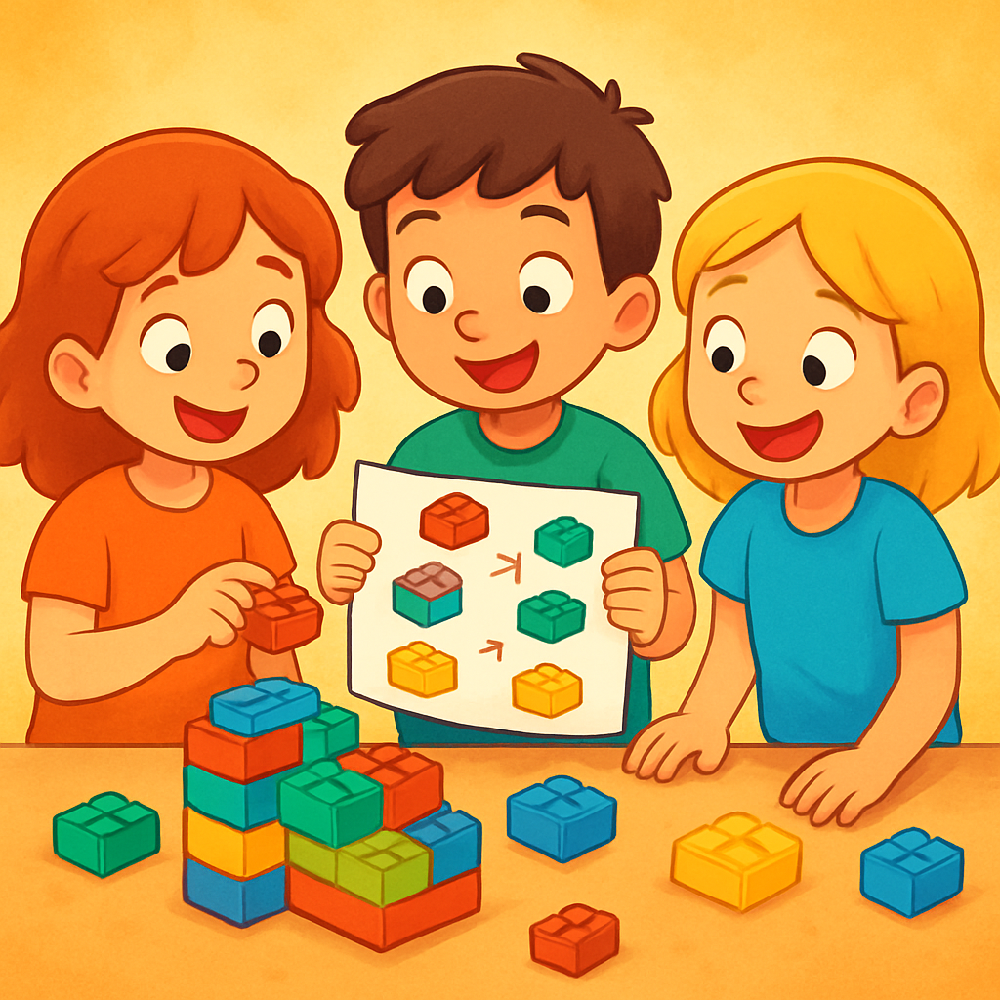
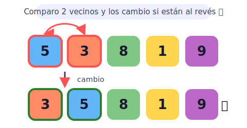
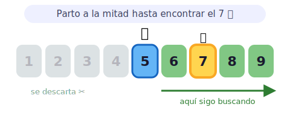
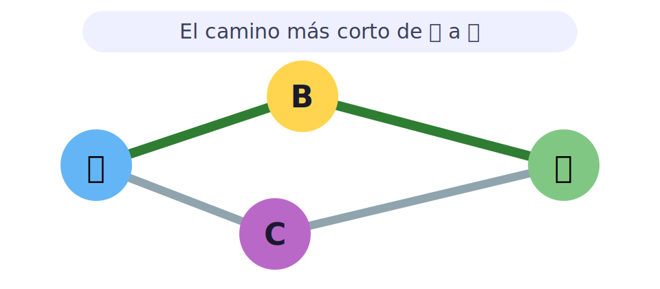
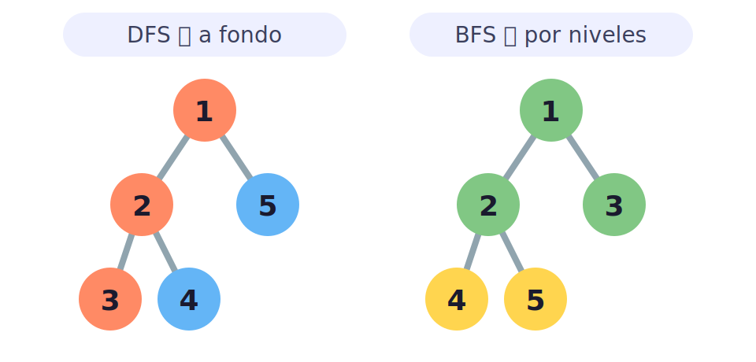
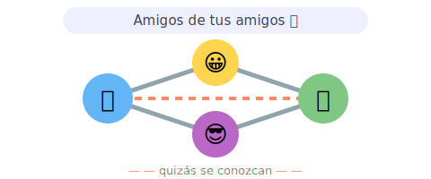
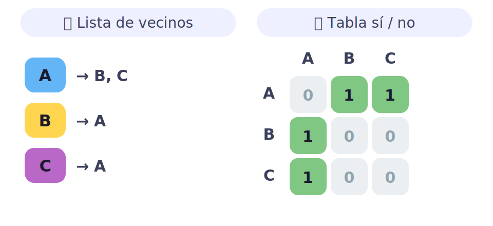

# 🧩 Algoritmos para kids

> [!TIP]
> **En una frase:** un algoritmo es una **receta paso a paso**, como las instrucciones para armar un Lego: haz esto, luego esto, y al final… ¡listo! ⏱️

¿Sabías que tú ya usas algoritmos todos los días? 🦷 Lavarte los dientes es un algoritmo: tomas el cepillo → le pones pasta → cepillas arriba y abajo → enjuagas. Si cambias el orden (¡enjuagar antes de cepillar!), no funciona igual. Los computadores hacen lo mismo, pero con números y palabras. 🧠

---

## 🔀 Ordenamiento

**Ordenar** es poner cosas en orden, de la más chica a la más grande (o de la A a la Z). Imagina ordenar tus cartas de menor a mayor: hay muchas maneras de hacerlo, ¡y unas son más rápidas que otras!

- 🫧 **Bubble sort (burbuja)** — comparas dos vecinos y, si están al revés, los cambias de lugar. Repites hasta que todo quede en orden. Los números grandes "suben" poquito a poco, como burbujas en una bebida. Es fácil de entender, pero lento si hay muchas cosas. 🐢
- ✂️ **Merge sort (mezcla)** — partes el montón en dos mitades, ordenas cada mitad por separado y después las juntas en orden. ¡Dividir para ganar! Es mucho más rápido cuando hay un montón de cosas.
- ⚡ **Quick sort (rápido)** — eliges un número "jefe" (el pivote) y pones a los más chicos a un lado y a los más grandes al otro. Luego repites con cada lado. Suele ser el más veloz de todos. 🏎️

> [!NOTE]
> 🎮 **Pruébalo sin computador:** toma 5 cartas desordenadas y ordénalas tipo burbuja: mira las dos primeras, cámbialas si hace falta, sigue con las siguientes… ¿cuántos cambios necesitaste?

---

## 🔎 Búsqueda

**Buscar** es encontrar una cosa entre muchas. Otra vez: hay formas lentas y formas inteligentes.

- 👀 **Búsqueda lineal** — miras una por una, desde el principio, hasta encontrarla. Funciona siempre, pero si la cosa está al final… ¡revisaste todo!
- ✋ **Búsqueda binaria** — solo sirve si las cosas ya están **en orden**. Es como adivinar un número del 1 al 100: preguntas "¿es más o menos que 50?", y con cada respuesta botas la mitad de las opciones. ¡En muy pocos intentos lo encuentras! 🎯
- 📖 **Búsqueda por interpolación** — adivinas dónde está antes de mirar, como cuando abres el diccionario cerca de la letra correcta en vez de empezar por la A.
- 🪄 **Búsqueda por hash** — vas **directo** a donde está, sin buscar, como una agenda mágica que abre justo en la página de tu amigo.

> [!NOTE]
> 🎮 **Pruébalo:** piensa un número del 1 al 100 y que alguien lo adivine preguntando "¿más o menos?". Verás que ¡con 7 preguntas siempre gana! Eso es búsqueda binaria. 🔢

---

## 🗺️ Grafos · algoritmos

Un **grafo** es un mapa de puntos unidos por caminos, como ciudades conectadas por carreteras 🛣️, o tus amigos conectados por amistades en una red social.

- 🛣️ **Dijkstra** — encuentra el **camino más corto** entre dos lugares, como el GPS cuando te lleva por la ruta más rápida.
- ⭐ **A\*** — hace lo mismo que Dijkstra, pero más listo: **adivina** hacia dónde ir para llegar antes, sin revisar caminos que claramente se alejan.
- 🔗 **Componentes, ciclos y orden** — ver qué cosas están conectadas entre sí, si hay caminos que dan vueltas en círculo, y en qué orden conviene hacer las tareas (primero ponerte calcetines, después zapatos 🧦👟).

> [!NOTE]
> 💡 **Dato curioso:** cuando tu mapa del celular calcula una ruta, ¡está usando algoritmos de grafos como Dijkstra o A\*!

---

## 🧭 Grafos · recorridos

Recorrer un grafo es **visitar todos sus puntos** sin perderte. Hay dos formas clásicas:

- 🕳️ **DFS (en profundidad)** — sigues un camino hasta el final antes de probar otro, como meterte a fondo en un pasillo del laberinto y volver si no hay salida.
- 🌊 **BFS (en anchura)** — exploras de a poco en todas las direcciones a la vez, como una mancha de agua que se va expandiendo. Sirve para encontrar el camino con **menos pasos**.

> [!NOTE]
> 🎮 **Pruébalo:** dibuja un laberinto y resuélvelo de dos maneras: primero metiéndote a fondo en cada pasillo (DFS) y luego avanzando parejo por todos los caminos (BFS). ¿Cuál te gustó más?

---

## 🤝 Grafos · aplicaciones

¿Para qué sirve todo esto en la vida real? ¡Para un montón de cosas!

- 👥 **Recomendar amigos** — "personas que quizás conozcas" mira quién es amigo de tus amigos.
- 🔗 **Qué tan conectados están dos personas** — el famoso juego de "estás a pocos pasos de cualquiera del mundo".
- 🚗 **La ruta más corta o más rápida** — como elige el mejor camino tu app de mapas.

> [!NOTE]
> 💡 **Dato curioso:** cuando una app te dice "personas que quizás conozcas", está mirando quiénes son amigos de tus amigos en el grafo. 🤝

---

## 🏗️ Grafos · implementación

Para que el computador entienda el mapa, hay que **dibujarlo por dentro** de alguna forma:

- 📝 **Lista de vecinos** — cada punto anota con quiénes está conectado (como tu lista de amigos).
- 🔲 **Tabla (matriz)** — una grilla que marca quién toca con quién (como una tabla de "sí/no").

> [!NOTE]
> 💡 **Dato curioso:** cada forma es mejor para algo distinto: la lista ocupa menos espacio; la tabla responde más rápido "¿estos dos están conectados?".
