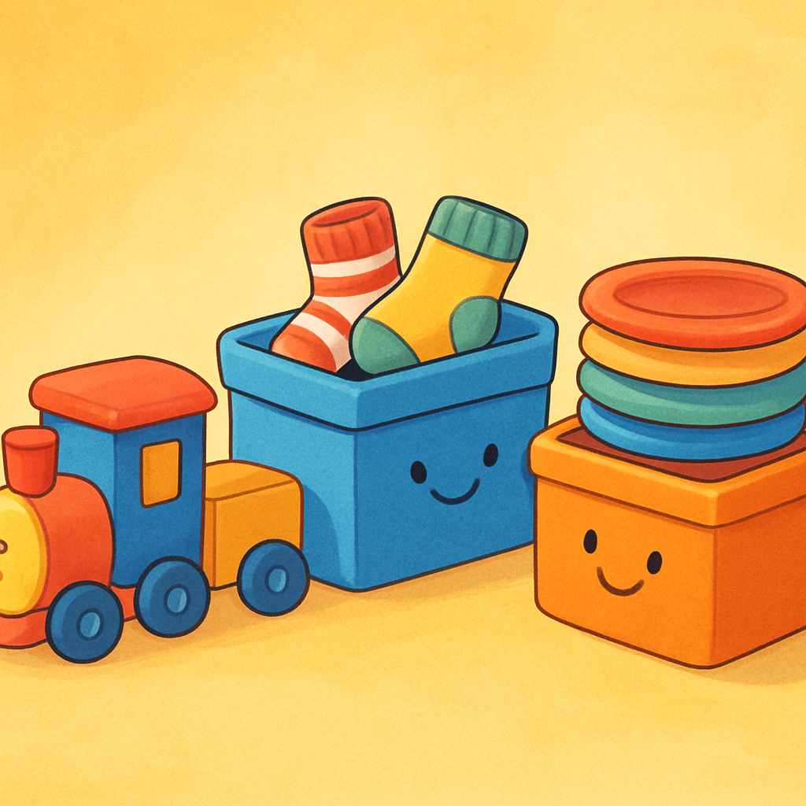
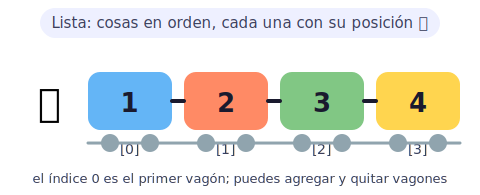
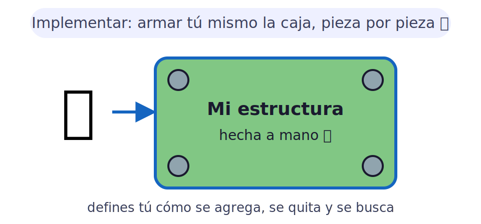
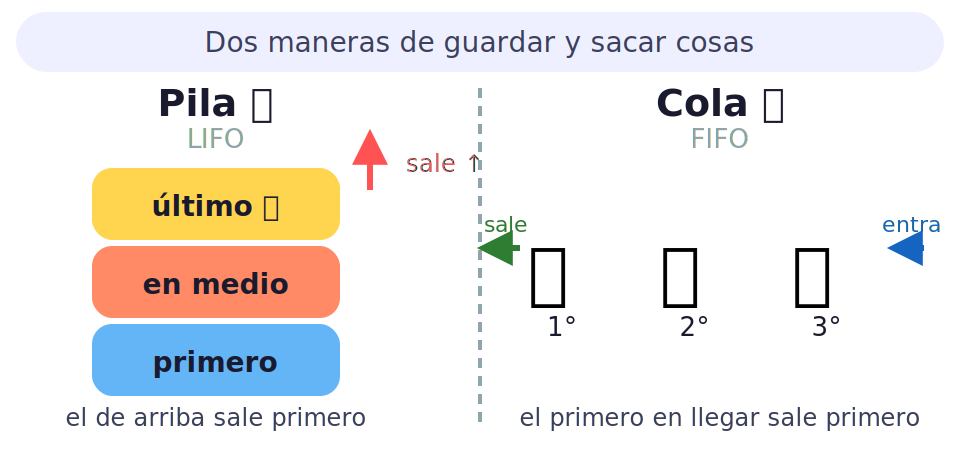
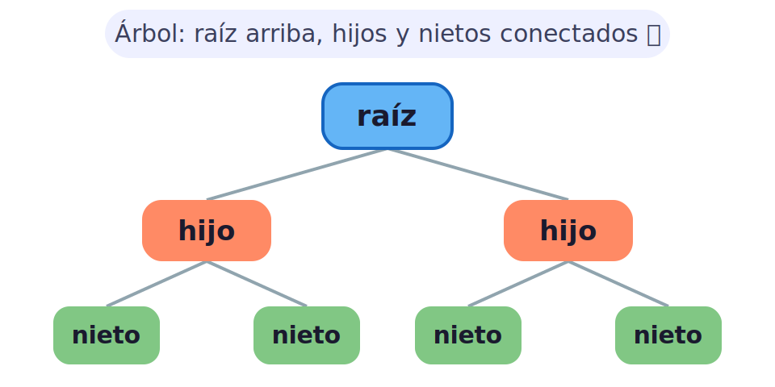
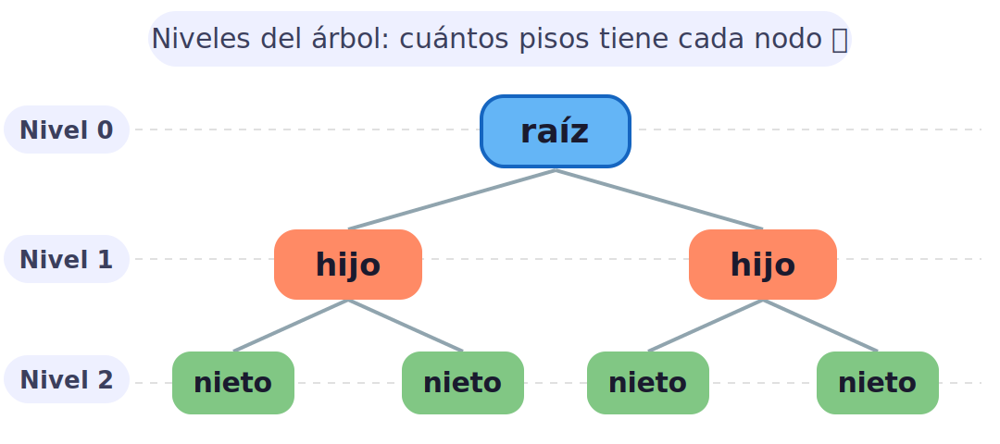
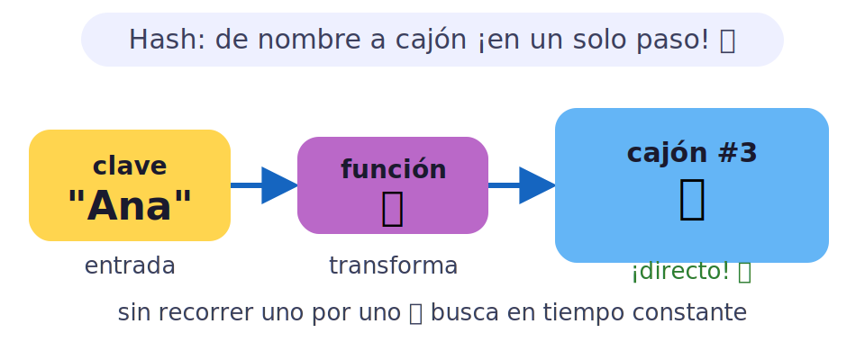
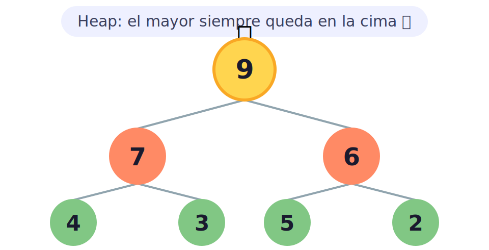
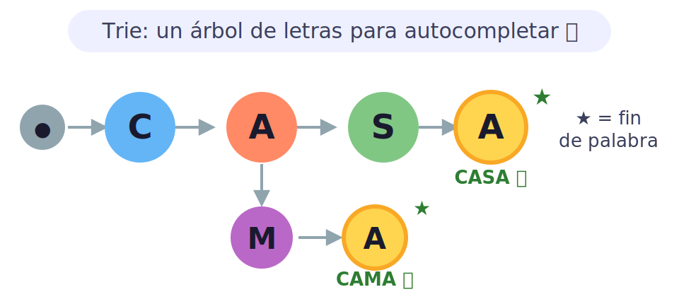

# 🧱 Estructuras de datos para kids

> [!TIP]
> **En una frase:** son cajas para guardar tus cosas. Unas son como la fila del cole, otras como un cajón de calcetines. ¡Lo importante es elegir bien la caja! 🧩

¿Sabías que tu mochila ya es una estructura de datos? Dentro tienes los cuadernos apilados en orden, el estuche siempre en el mismo bolsillo y la colación al alcance de la mano 🎒. Los computadores hacen exactamente lo mismo: guardan información en "cajas" inteligentes para encontrarla y usarla **súper rápido**. Elegir la caja equivocada es como buscar los audífonos en el fondo de la mochila… ¡cuando estaban en el bolsillo de adelante!

---

## 🐍 Estructuras nativas de Python

Python ya trae varias cajas listas para usar, ¡sin tener que construirlas tú! Son las más comunes y las que usarás en casi todos tus programas.

- 🚂 **Listas** — una fila de cosas en orden, como vagones de tren. Puedes agregar, quitar y cambiar elementos cuando quieras. Ejemplo: `[10, 20, 30]` — el primero está en la posición 0, el segundo en la 1.
- 📸 **Tuplas** — como una lista, pero queda fija para siempre, como una foto del álbum familiar: ya no se puede cambiar. Ejemplo: `("lunes", "martes", "miércoles")` — los días de la semana no se mueven.
- 🔢 **Rangos** — una cuenta del 1 al 10 sin escribir todos los números, como una escalera. Ejemplo: `range(1, 11)` te da 1, 2, 3… 10 sin tenerlos todos en memoria.
- 📒 **Diccionarios** — una agenda mágica: buscas por nombre y encuentras el teléfono al instante. Ejemplo: `{"Ana": "9876", "Beto": "1234"}` — sin tener que revisar hoja por hoja.
- 🧦 **Conjuntos (sets)** — una bolsa donde no se repiten cosas, como un álbum de figuritas sin láminas duplicadas. Ejemplo: `{1, 2, 3, 2, 1}` queda automáticamente como `{1, 2, 3}`.
- 🔤 **Cadenas** — texto: palabras, frases y letras. Ejemplo: `"Hola mundo"` — cada letra ocupa su posición, ¡como vagones de un tren de letras!

> [!NOTE]
> 🎮 **Pruébalo:** abre Python y escribe `frutas = ["manzana", "pera", "uva"]`. Luego prueba `frutas[0]`, `frutas[1]` y `len(frutas)`. ¿Qué número te da el largo?

---

## 🔧 Implementación en Python

Las cajas listas de Python son geniales, ¡pero a veces quieres construir la tuya propia para aprender cómo funcionan por dentro! Es como armar un Lego: puedes usar una caja ya hecha, o construirla pieza por pieza para entender cada parte.

- 🛠️ **Construir desde cero** — crear tus propias estructuras usando solo las piezas básicas de Python. ¡Como un mecánico que arma un motor desde cero en vez de comprarlo en tienda!
- 🔩 **Clases y objetos** — en Python puedes crear tu propia "caja personalizada" con una clase. Defines cómo se agrega, cómo se quita y cómo se busca. Ejemplo: una clase `Pila` con métodos `agregar()` y `sacar()`.
- 📐 **Entender el interior** — cuando construyes tú mismo una lista enlazada o un árbol, entiendes *por qué* unas cajas son más rápidas que otras. ¡Ese es el superpoder de los programadores de verdad!

> [!NOTE]
> 💡 **Dato curioso:** las estructuras de datos de Python por dentro están escritas en C, un lenguaje muy rápido. Cuando implementas la tuya en Python, ves exactamente qué hace cada línea de ese código súper veloz.

---

## 🧰 Estructuras simples

Antes de las cajas complicadas, hay tres estructuras básicas que aparecen en **todos** los programas. ¡Son las más importantes de aprender primero!

- ⛓️ **Listas enlazadas** — una cadena de vagones donde cada vagón solo sabe cuál es el siguiente. Para llegar al vagón 5 tienes que pasar por el 1, 2, 3 y 4. Son perfectas para agregar y quitar cosas rápido al inicio o al final.
- 🍽️ **Pilas (stacks)** — platos apilados en la cocina: el último plato que pones encima es el primero que sacas. En computación se llama **LIFO** (Last In, First Out). Ejemplo: el botón "Deshacer" (Ctrl+Z) de tu editor usa una pila — deshace lo último que hiciste.
- 🥖 **Colas (queues)** — la fila de la panadería: el primero que llega, primero se atiende. Se llama **FIFO** (First In, First Out). Ejemplo: la cola de impresión de tu computador imprime los documentos en el orden que los mandaste.

> [!NOTE]
> 🎮 **Pruébalo:** apila 5 libros uno encima del otro. ¿Cuál tienes que sacar primero para llegar al de abajo? Eso es una pila 📚. Ahora imagina la fila del recreo: ¡eso es una cola!

---

## 🌳 Árboles

Los árboles son estructuras donde cada "nodo" puede tener hijos, y cada hijo puede tener más hijos, ¡igual que un árbol genealógico! Son perfectos para organizar cosas que tienen jerarquía.

- 👨‍👩‍👧‍👦 **Árbol genealógico** — la raíz es el abuelo (arriba), sus hijos son los padres (un piso más abajo) y sus nietos son los hijos. En computación es igual: la raíz está arriba y las "hojas" (nodos sin hijos) están al fondo.
- 🌲 **Árbol binario** — cada nodo tiene máximo 2 hijos: izquierdo y derecho. Como un torneo de eliminación directa: de 2 en 2 hasta quedar 1 ganador.
- 🔍 **Árbol de búsqueda binaria (BST)** — un árbol con regla: los menores van a la izquierda y los mayores a la derecha. ¡Buscar un número es rapidísimo, como la búsqueda binaria pero en forma de árbol!
- ⚖️ **Árbol AVL** — un BST que se "equilibra" solo para no quedar torcido. Si un lado pesa demasiado, se rota para quedar parejo, como una balanza que se ajusta sola.

> [!NOTE]
> 💡 **Dato curioso:** el sistema de carpetas de tu computador es un árbol. Hay una carpeta raíz (el disco duro), dentro hay carpetas, y dentro de esas hay más carpetas. ¡Árboles por todos lados!

---

## 🪜 Implementación de árboles

Ahora que sabes qué es un árbol, ¡manos a la obra para construirlo! La clave es entender cómo se conectan los nodos y cómo se recorre nivel por nivel.

- 🧱 **El nodo** — cada cajita del árbol. Guarda un valor y apunta a sus hijos. En Python, un nodo es un objeto con atributos `valor`, `izquierdo` y `derecho`.
- 🔗 **Conectar nodos** — para armar el árbol le dices a cada nodo quiénes son sus hijos, como pegar las piezas del árbol genealógico con flechas.
- 📏 **Niveles** — el nivel 0 es la raíz (el tronco), el nivel 1 son los hijos directos, el nivel 2 los nietos, y así. Saber el nivel te dice qué tan "profundo" está algo dentro del árbol.
- 🚶 **Recorrer el árbol** — puedes visitar todos los nodos en distintos órdenes: de arriba abajo por pisos (anchura / BFS), o siguiendo cada rama hasta el final (profundidad / DFS).

> [!NOTE]
> 🎮 **Pruébalo:** dibuja en papel un árbol con 7 nodos (1 raíz, 2 hijos, 4 nietos). ¿En qué nivel está cada uno? ¿Cuántos niveles tiene en total? ¿Cuántos nodos hay en el último nivel?

---

## 🪄 Tablas hash

Las tablas hash son la magia del acceso instantáneo: le dices un nombre y te entrega el dato ¡al momento!, sin buscar uno por uno. ¡Como una agenda mágica que se abre sola en la página correcta!

- 🔑 **Función hash** — una receta que convierte tu palabra (la clave) en un número. Ese número le dice exactamente en qué cajón guardar o encontrar tu dato.
- 📦 **Buckets (cajones)** — los compartimentos donde se guarda la información. Cada cajón tiene su número y la función hash te dice cuál usar para cada clave.
- ⚡ **Acceso directo** — en vez de revisar uno por uno (como buscar en lista), vas directo al cajón correcto. ¡Como si la agenda supiera tu nombre y se abriera sola en esa página!
- 💥 **Colisiones** — a veces dos nombres distintos caen en el mismo cajón. Se resuelve poniendo una lista pequeña en ese cajón. ¡Como cuando dos amigos tienen el mismo apellido en la agenda!

> [!NOTE]
> 💡 **Dato curioso:** los diccionarios de Python (`dict`) son tablas hash por dentro. Por eso buscar un valor por su clave es rapidísimo — casi mágico — sin importar cuántos elementos tenga el diccionario.

---

## ⛰️ Heaps

Un heap (montículo) es un árbol especial donde el elemento más importante **siempre queda en la cima**, listo para ser atendido primero. ¡Como una fila de urgencias donde el más grave pasa adelante!

- 👑 **Max-heap** — el número más grande siempre en la cima, como el capitán del equipo. Cada padre es siempre mayor o igual que sus hijos. Ejemplo: raíz = 9, hijos = 7 y 6.
- 🔄 **Min-heap** — lo contrario: el número más pequeño (el de mayor urgencia) queda arriba. Útil para hospitales: ¡el paciente más grave pasa primero!
- 📥 **Insertar** — agregas un número al final y "sube" hasta encontrar su lugar correcto (si es más grande que su padre, se intercambian). ¡Como el nuevo alumno que escala puestos en el ranking!
- 📤 **Sacar el top** — sacas la cima, el último elemento sube al trono y luego "baja" hasta su lugar. El orden de montículo siempre se mantiene.

> [!NOTE]
> 🎮 **Pruébalo:** escribe los números 9, 7, 6, 4, 3, 5, 2 en papelitos y ordénalos como una pirámide donde cada papelito siempre sea mayor que los dos que tiene debajo. ¡Eso es un max-heap!

---

## 🚀 Estructuras avanzadas

Cuando los problemas son más difíciles, necesitas cajas más especiales. Estas estructuras hacen cosas impresionantes que las básicas no pueden.

- 🌿 **Trie (árbol de prefijos)** — árbol donde cada letra es un nodo. Perfecto para autocompletar: escribes "CA" y el trie ya sabe que podría ser "CASA", "CAMA" o "CAMIÓN". ¡Así funciona el autocompletado de tu celular!
- 🧮 **Árbol de segmentos** — divide un arreglo en partes y guarda sumas o máximos de cada parte. ¿Cuánto suma del índice 3 al 7? ¡Responde al instante sin sumar uno por uno!
- 🎯 **Bloom filter** — un filtro mágico que te dice "esto quizás está" o "esto definitivamente NO está". Ocupa poquísima memoria. Usado en correos para detectar spam y en navegadores para bloquear URLs peligrosas.
- 🔗 **Tablas hash avanzadas** — versiones mejoradas que resuelven colisiones de manera más inteligente, para ser aún más rápidas incluso cuando hay muchas claves iguales.

> [!NOTE]
> 💡 **Dato curioso:** cuando buscas algo en Google y aparecen sugerencias mientras escribes, ¡Google usa un trie gigantesco con millones de palabras para mostrarte el autocompletado al instante, letra por letra!
