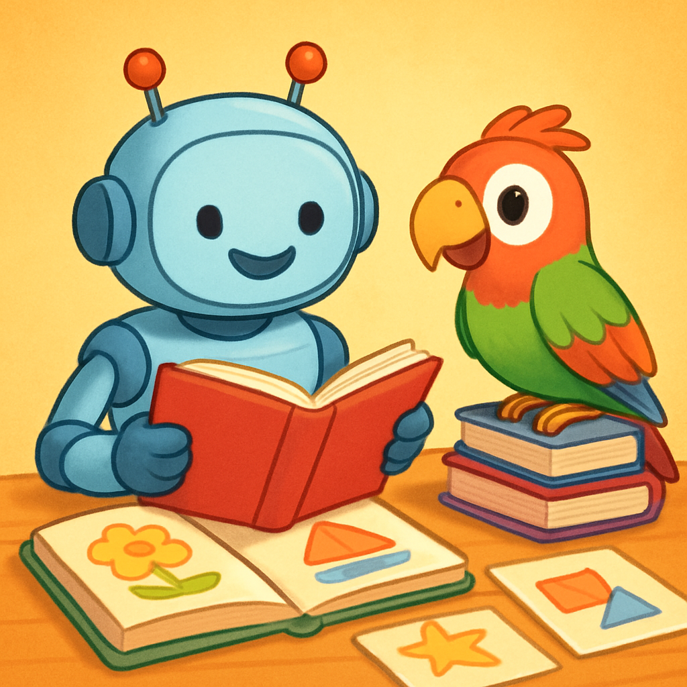
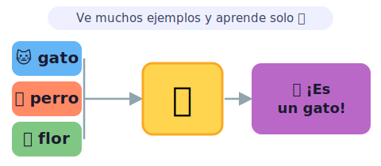
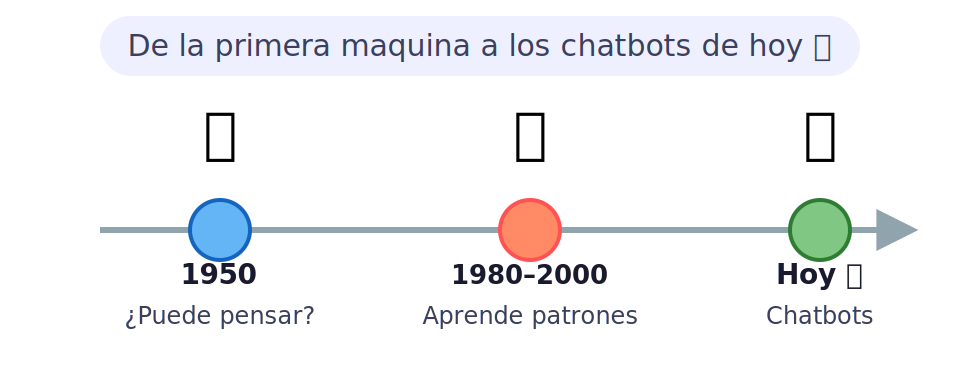
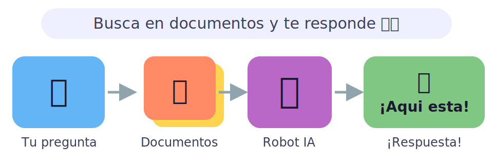
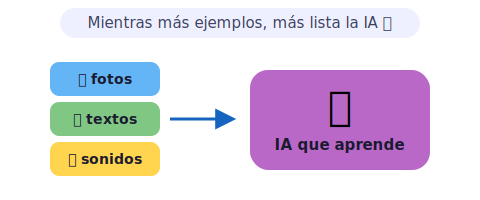
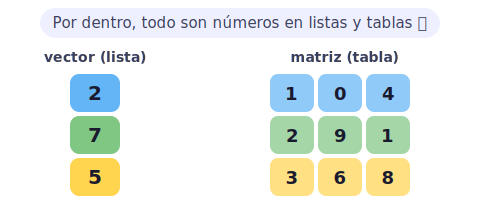
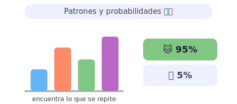
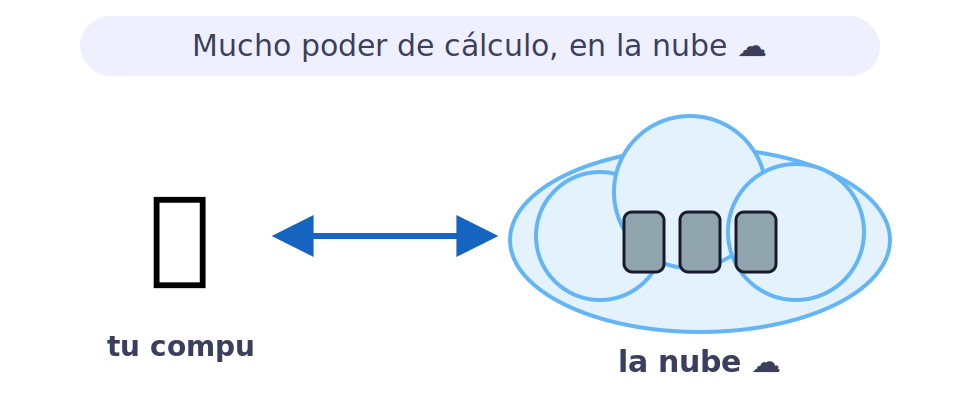

# 🤖 Inteligencia Artificial y PLN para kids

> [!TIP]
> **En una frase:** es enseñarle al computador a entender lo que escribimos y hablamos, como un loro muy listo que aprendió de millones de ejemplos. 🦜

¿Sabías que el teléfono de tu mamá reconoce tu cara y te desbloquea en un segundo? ¿O que cuando le hablas a un asistente de voz él te entiende casi perfectamente? Eso no es magia: es que alguien le enseñó al computador con millones y millones de ejemplos. Y la buena noticia es que tú también puedes aprender cómo funciona. 🚀

---

## 🧠 ¿Qué es la Inteligencia Artificial?

La **Inteligencia Artificial (IA)** es cuando un computador aprende solo a hacer cosas difíciles, sin que le escribamos instrucciones una por una. En vez de decirle "un gato tiene bigotes, cuatro patas y maúlla", le mostramos un millón de fotos de gatos y le decimos "¡así son!". El computador encuentra los patrones por su cuenta. 🐱

- 🤖 **Inteligencia Artificial (IA)** — el computador aprende mirando muchísimos ejemplos: fotos, textos, sonidos. Cuantos más ejemplos le muestres, más listo se vuelve. Por eso los celulares modernos pueden reconocerte la cara o traducirte a otro idioma en tiempo real.
- 💬 **PLN · Procesamiento del Lenguaje Natural** — la rama de la IA que entiende y genera palabras humanas. Es la magia detrás de los chatbots: leer texto, entender qué significa y responder con sentido. Se llama "natural" porque usamos nuestro idioma de siempre, no código raro.
- 📸 **Visión por computador** — la IA que mira imágenes y las entiende. Tu app de fotos sabe que hay un perro en una foto porque la entrenaron con millones de fotos de perros etiquetadas: "esto es perro, esto no es perro".
- 🎮 **IA en videojuegos** — los enemigos que se adaptan a tu nivel, los personajes que toman decisiones, el mapa que cambia según cómo juegas… ¡también son IA! Diseñada especialmente para que el juego sea divertido y retador.

> [!NOTE]
> 💡 **Dato curioso:** los modelos de IA más grandes aprendieron leyendo más texto del que una persona podría leer en mil vidas: miles de millones de páginas. Entrenarlos toma semanas o meses en computadores gigantescos.

---

## 📜 Su historia (de 1950 a hoy)

La IA no apareció de la noche a la mañana. Tardó décadas en pasar de ser una idea loca a convertirse en algo que usas todos los días. Fue como plantar un árbol: hay que esperar y cuidarlo, pero cuando da frutos, ¡vale la pena! 🌳

- 🕰️ **Los inicios (1950)** — el matemático Alan Turing preguntó: "¿puede una máquina pensar?". Los primeros computadores eran tan grandes como una habitación entera y calculaban muy despacio. Pero ya imaginaban máquinas que un día conversaran como personas.
- 📊 **Aprender de los números (1980–2000)** — en vez de programar reglas a mano, los científicos probaron algo nuevo: "¿y si la máquina aprende sola contando patrones en datos?". Así nació el **machine learning**. Los computadores empezaron a detectar spam en el correo o a recomendar canciones que te podrían gustar.
- ✨ **La era de los chatbots (hoy)** — en 2017 se inventaron los **transformers**, una arquitectura que entiende el lenguaje de una manera increíble. Con esa idea nacieron ChatGPT, Gemini, Claude y muchos más. Hoy la IA puede escribir código, componer poemas y ayudarte con la tarea.

> [!NOTE]
> 🎮 **Pruébalo:** busca en internet "prueba de Turing" y lee en qué consiste. ¿Crees que los chatbots de hoy la pasarían? ¡Abre uno y ponlo a prueba tú mismo!

---

## 🛠️ IA en la práctica

Hoy la IA está en todas partes: en Netflix cuando te recomienda series, en el correo que filtra el spam y en las búsquedas de Google. ¿Cuáles son las técnicas más usadas? Aquí van las tres más importantes para entender cómo funciona por dentro. 🌍

- 🔎 **RAG · Buscar y luego responder** — RAG significa "recuperar y generar". La IA primero busca en una pila de documentos la información que necesita, y luego construye una respuesta con lo que encontró. Es como buscar en tus apuntes antes de contestar un examen: sin apuntes, podrías inventarte la respuesta. ¡Con RAG, no inventa!
- 📈 **Machine Learning · aprender de datos** — le das miles de ejemplos con la respuesta correcta (fotos de gatos y perros etiquetadas) y el modelo aprende a distinguirlos. Ante una foto nueva adivina: "eso es un perro". Con más datos y entrenamiento, cada vez se equivoca menos.
- 🎓 **Fine-tuning · la academia especializada** — imagina un asistente muy listo pero generalista. El *fine-tuning* es mandarlo a estudiar un tema específico: medicina, leyes, cocina… Para que sea experto en esa área y responda mejor que cualquier IA genérica. Así nacen los asistentes especializados.

> [!NOTE]
> 🎮 **Pruébalo:** abre un chatbot (ChatGPT o Claude) y pregúntale algo específico de tu ciudad. Luego pégale un párrafo de Wikipedia sobre ese tema y vuelve a preguntar. ¿La respuesta mejoró? ¡Acabas de usar RAG a mano!

---

## 🏗️ Lo que de verdad necesita la IA

Mucha gente cree que la IA es "pura magia" o solo matemáticas difíciles. La verdad es que se apoya en **cuatro ingredientes**, como las patas de una mesa: si falta una, la mesa se cae. 🪑 Son los datos, el álgebra lineal, la estadística y el poder de cómputo.

---

## 📊 Datos (big data)

La IA aprende de ejemplos, así que necesita **muchísimos**. A esas montañas gigantes de información se les llama **big data**. ¡Es el ingrediente más importante de todos!

- 🗂️ **Big data** — millones de fotos, textos, videos y sonidos. Mientras más y mejores ejemplos le des a la IA, más lista se vuelve.
- 🏷️ **Datos etiquetados** — ejemplos con la respuesta puesta: "esto es un gato", "esto es un perro". Así la IA sabe qué tiene que aprender.
- 🗑️ **Basura entra, basura sale** — si los datos están mal o incompletos, la IA aprende mal. ¡Por eso cuidar los datos es clave!

> [!NOTE]
> 💡 **Dato curioso:** los modelos de IA más grandes se entrenan con casi todo el texto público de internet. ¡Es como leerse todas las bibliotecas del mundo juntas!

---

## 🔢 Álgebra lineal

Por dentro, la IA no ve fotos ni palabras: ve **números ordenados** en listas y tablas. El álgebra lineal es la matemática de mover y combinar esos números. ✖️➕

- 📏 **Vectores** — listas de números. Una palabra como "perro" se convierte en una lista de números que la representa.
- ▦ **Matrices** — tablas de números (filas y columnas). Una foto es una cuadrícula de números: ¡cada número es el color de un puntito (píxel)!
- ⚙️ **Operaciones** — sumar y multiplicar esas tablas, millones de veces por segundo. Eso es lo que hace la IA "pensar".

> [!NOTE]
> 🎮 **Pruébalo:** dibuja una carita feliz en una cuadrícula de 5×5, pintando algunos cuadritos. Pon 1 en los pintados y 0 en los vacíos. ¡Acabas de crear una matriz, igual que las que usa la IA para ver imágenes!

---

## 🎲 Estadística

La IA casi nunca está 100% segura: trabaja con **probabilidades**. La estadística le ayuda a encontrar patrones y a decir cosas como "esto es un gato… con 95% de seguridad". 📈

- 📊 **Patrones** — encontrar lo que se repite entre miles de ejemplos.
- 🎲 **Probabilidad** — en vez de "sí" o "no", responde "95% gato, 5% perro". Elige la opción más probable.
- 📉 **Promedios** — resumir un montón de números en uno solo para entender la tendencia.

> [!NOTE]
> 💡 **Dato curioso:** cuando un chatbot escribe, va eligiendo cada palabra según cuál es la **más probable** que siga. ¡Por eso a veces se equivoca: está apostando a la opción más probable, no a la única verdad!

---

## ☁️ Cómputo (cloud computing)

Entrenar una IA necesita **muchísimo** poder de cálculo, mucho más del que tiene tu computador. Por eso se usan miles de computadores potentes trabajando juntos, casi siempre **en la nube**. 💪

- 💪 **Mucho poder** — entrenar una IA grande puede ocupar miles de computadores durante semanas.
- ☁️ **La nube (cloud)** — computadores potentes de otra empresa que usas por internet, sin tenerlos en tu casa. ¡Como alquilar una cancha en vez de construirla!
- 🎮 **GPUs** — chips especiales (¡los mismos que hacen ver geniales los videojuegos!) que hacen muchísimos cálculos a la vez.

> [!NOTE]
> 🎮 **Pruébalo:** cuando ves un video en YouTube o guardas una foto en Google Fotos, no está en tu teléfono… ¡está en la nube! Pregúntales a tus papás qué cosas suyas guardan "en la nube".
