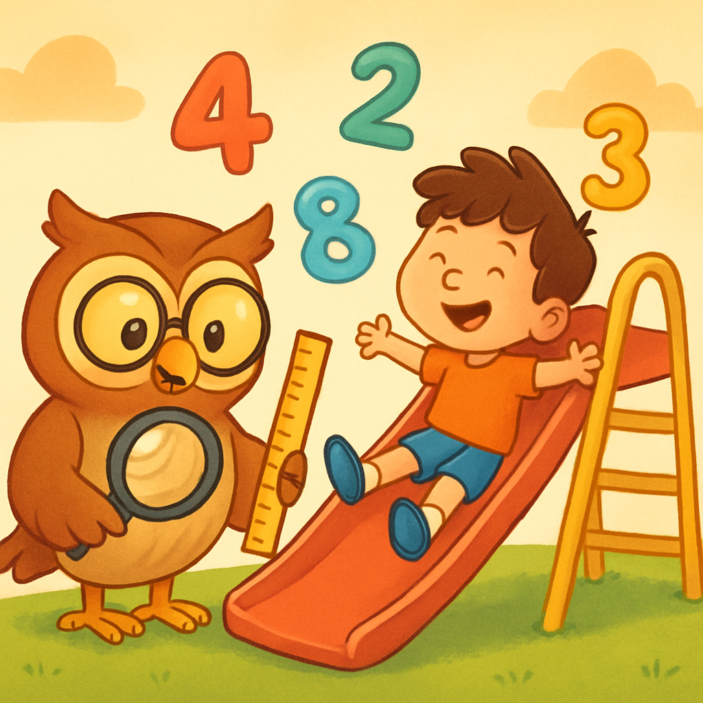
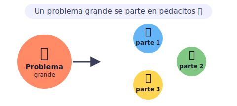
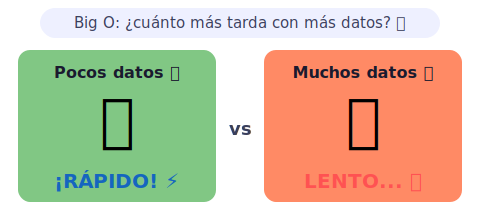
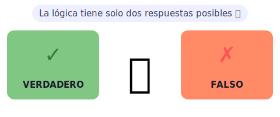
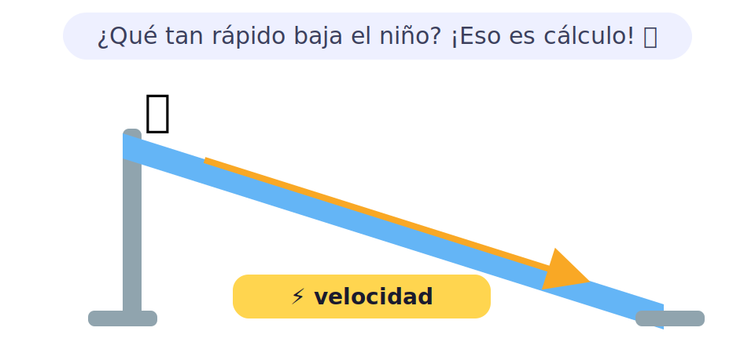

# 🔢 Matemáticas y teoría para kids

> [!TIP]
> **En una frase:** es saber *por qué* una receta es rápida o lenta. ¿Buscas un nombre hojeando todo el libro, o vas directo a la letra? 🦉

¿Alguna vez te preguntaste por qué tu teléfono encuentra una canción en segundos entre millones? 🎵 O por qué el GPS calcula la ruta más corta antes de que parpadees? ⚡ La respuesta está en las matemáticas detrás de los programas. No la matemática aburrida de memorizar tablas, ¡sino la que te dice si tu solución es rapidísima o tarda una eternidad! 🚀

---

## 🧩 Técnicas de análisis de problemas

Antes de resolver cualquier problema, ¡hay que entenderlo bien! Los programadores no se lanzan a escribir código a lo loco: primero piensan, descomponen y planifican. Es como armar un rompecabezas: primero buscas los bordes, luego las esquinas, luego el resto. Con esta estrategia, hasta el problema más enorme se vuelve manejable.

- 🍕 **Descomposición** — partir un problema enorme en pedacitos manejables. ¿Tienes que hacer un juego? Divide: primero el tablero, luego los personajes, luego las reglas. ¡Cada pedacito es más fácil de resolver solo! Como comer una pizza por porciones: nadie se mete toda la pizza de un bocado.
- ✅ **Casos de prueba** — pensar en todos los "¿y si...?" antes de terminar. ¿Y si el usuario escribe letras en vez de números? ¿Y si la lista está vacía? ¿Y si hay dos respuestas iguales? Así evitas sorpresas desagradables cuando alguien usa tu programa de verdad. 😱
- 📝 **Pseudo-código** — escribir el plan con palabras normales antes de programar, como un borrador. Ejemplo: *"Si la nota es mayor que 60, el alumno aprueba; si no, reprueba."* Es más rápido corregir un borrador que corregir código que ya funciona a medias.

> [!NOTE]
> 🎮 **Pruébalo:** piensa en algo que haces todos los días (preparar el desayuno, ir al colegio). Escríbelo como lista de pasos lo más pequeños posible. ¡Eso es descomposición! ¿Cuántos pasos encontraste?

---

## ⏱️ Complejidad algorítmica y optimización

Dos programas pueden hacer lo mismo, pero uno es un cohete 🚀 y el otro una tortuga 🐢. ¿Por qué? Porque la cantidad de pasos que dan cambia todo. La *complejidad algorítmica* es la manera de medir eso sin siquiera encender el computador. Con este conocimiento, puedes elegir el algoritmo correcto antes de escribir una sola línea.

- 🐢 **Big O** — una forma corta de decir "¿cuánto más tarda si hay más cosas?". Por ejemplo: buscar en una lista desordenada = revisar una por una (O(n), lento si hay 1 millón). Buscar en una lista ordenada por la mitad = ¡mucho más rápido! (O(log n), tarda casi lo mismo aunque haya un millón). El símbolo **O(n)** se lee "de orden n": si hay el doble de cosas, tarda el doble. 📊
- 🚀 **Optimización** — encontrar trucos para hacer lo mismo más rápido o usando menos memoria. Como cuando descubres que puedes ir al colegio por un atajo que ahorra 5 minutos cada día. Pequeñas mejoras en el código, ¡gran diferencia cuando hay millones de usuarios! ⏱️
- 🧹 **Refactorización** — limpiar y ordenar el código sin cambiar lo que hace, como ordenar tu habitación sin tirar nada. El código limpio es más fácil de leer, mejorar y compartir con otros programadores. Buen código hoy = menos dolores de cabeza mañana.

> [!NOTE]
> 💡 **Dato curioso:** si un algoritmo O(n²) tarda 1 segundo con 100 datos, ¡tardaría 100 segundos con 1.000 datos y casi 3 horas con 10.000! Por eso elegir el algoritmo correcto importa muchísimo. 🤯

---

## 🦉 Teoría detrás de los algoritmos

Detrás de cada algoritmo hay ideas que vienen de las matemáticas y la filosofía. No necesitas aprenderlas todas ahora, pero conocerlas te ayuda a pensar mejor y a entender por qué los computadores son tan poderosos… ¡y también sus límites!

- ⚖️ **Lógica** — las reglas básicas de lo verdadero y lo falso. En programación, todo se reduce a eso: ¿esta condición es verdadera o falsa? Si está lloviendo → llevo paraguas. Si la nota es ≥ 60 → apruebo. Encadenas miles de estas decisiones y obtienes un programa completo. La lógica es el idioma del computador. 🧠
- ✍️ **Notación matemática** — el idioma corto de las matemáticas. En vez de escribir "la suma de todos los números de la lista", los matemáticos usan un símbolo especial. Los programadores hacen algo parecido al dar nombres cortos y claros a sus funciones y variables.
- 🪆 **Recurrencias** — cuando un problema grande se resuelve aplicando la misma idea a una versión más chica. Como las muñecas rusas: abres la grande y hay una más chica, y una más, y una más… ¡hasta la más pequeña! Esto se llama *recursión*. El merge sort de la sección de algoritmos funciona exactamente así. 🪆
- 🤖 **Computabilidad** — qué cosas el computador *puede* y *no puede* resolver. ¡Sí! Hay problemas que ningún computador del mundo puede resolver, sin importar cuánto tiempo esperes. Un matemático llamado Alan Turing demostró esto en 1936, antes de que existieran los computadores modernos. 🤯
- 🎲 **Probabilidad** — calcular qué tan probable es que algo pase. Si lanzas un dado, tienes 1 oportunidad en 6 de sacar un 3. Los algoritmos usan esto para tomar decisiones cuando no hay una respuesta exacta, como el filtro de spam de tu correo electrónico. 📧

> [!NOTE]
> 🎮 **Pruébalo:** inventa 5 afirmaciones (por ejemplo: "el cielo es azul", "los gatos ladran", "2 + 2 = 5"). Marca cada una como VERDADERO o FALSO. ¡Tu cerebro ya funciona como un procesador lógico! 🧠

---

## 📐 Cálculo

El cálculo es la matemática del *cambio*. No calcula cuánto hay de algo, sino *qué tan rápido cambia*. ¿Va rápido el tobogán al principio o al final? ¿Cuándo acelera un auto? ¿A qué velocidad crece la temperatura? El cálculo responde todas esas preguntas, y por eso aparece cuando se *entrena* la inteligencia artificial. 🤖

- 🛝 **Derivadas** — miden qué tan rápido cambia algo en un instante exacto. Si estás en un tobogán, la derivada dice tu velocidad precisa en cada punto del recorrido: al inicio vas despacito, en la curva vas más rápido. Es como sacarle una foto a tu velocidad en un instante. 📸
- 📈 **Integrales** — calculan el total acumulado de un cambio. Si la derivada es la velocidad, la integral es la distancia total que recorriste. ¡Son operaciones opuestas, como sumar y restar! Dos matemáticos, Newton y Leibniz, las descubrieron por separado hace 350 años. ➕➖
- 💻 **Cálculo en algoritmos** — muchos algoritmos de inteligencia artificial usan cálculo para *aprender*. Cuando entrenas una red neuronal, el computador usa derivadas para encontrar el camino hacia la mejor respuesta, bajando por una colina matemática como por un tobogán, paso a paso, hasta llegar abajo. 🎯

> [!NOTE]
> 💡 **Dato curioso:** cuando tu app de música te recomienda canciones, usa un algoritmo que aprendió de los gustos de millones de personas. Para "afinar" ese algoritmo durante el entrenamiento, los computadores usan derivadas (¡eso es cálculo!). 🎵
