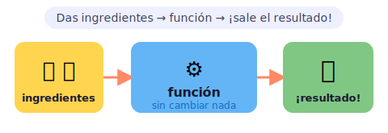
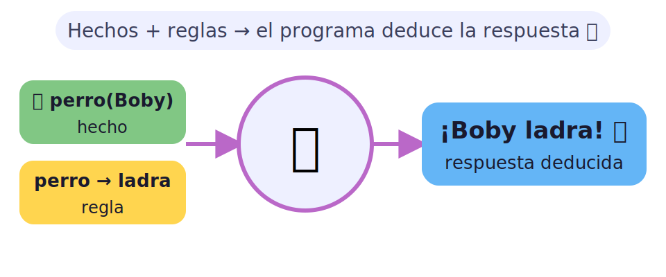
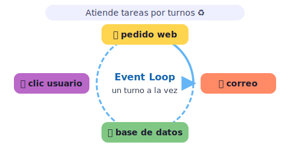
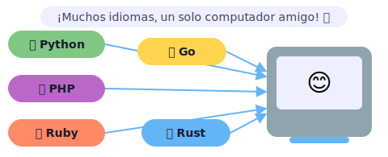

# 🎨 Paradigmas de programación para kids

> [!TIP]
> **En una frase:** hay muchas formas de decirle al computador qué hacer, como hay muchas formas de jugar: con bloques, con recetas o con piezas de rompecabezas. 🧩

¿Sabías que hay varias maneras de contarle al computador qué hacer? Es como hablar idiomas distintos: en inglés dices "run", en español dices "corre"… ¡y los dos significan lo mismo! En programación pasa igual: hay estilos diferentes —llamados **paradigmas**— que resuelven los mismos problemas de formas distintas. Algunos programadores piensan en *recetas*, otros en *reglas de detective*, y otros en *turnos de juego*. 🌍

---

## 🧪 Funcional y concurrente — Elixir

Elixir es un lenguaje moderno que usa el estilo **funcional**: tú le das datos a una función, y ella te devuelve un resultado *nuevo* sin tocar nada de lo que ya existía. Además, es experto en hacer muchas cosas al mismo tiempo sin que nada se trabe. 🔥

- 🍳 **Funcional (como una receta)** — imagina que metes huevos y leche en la máquina de hacer tortas: le das los ingredientes, la máquina hace su magia, y ¡sale la torta! Los huevos y la leche que estaban en la mesa siguen ahí: la máquina no los "gastó". Eso hace una función en Elixir: toma lo que le das y devuelve algo nuevo sin desordenar nada.
- 🤹 **Concurrente (muchos cocineros)** — en un restaurante grande, el cocinero de pizzas, el de postres y el de sopas trabajan todos a la vez sin chocarse ni quitarse los utensilios. Elixir puede hacer lo mismo con millones de procesos pequeñitos trabajando en paralelo.
- 💬 **¿Para qué sirve?** — apps de chat en vivo, plataformas que atienden a millones de usuarios al mismo tiempo (como las de videollamadas), y sistemas que necesitan ser muy confiables incluso cuando algo falla.

> [!NOTE]
> 🎮 **Pruébalo sin computador:** agarra una hoja y escribe una "función": "si me das 🍎 y 🍊, te devuelvo 🍹". Pasa el papel a un amigo con los ingredientes y que te devuelva el resultado sin cambiar lo que le diste. ¡Eso es programación funcional!

---

## 🦉 Lógica — Prolog

Prolog es un lenguaje muy especial: ¡tú no le dices qué pasos seguir, sino qué cosas son verdad y qué reglas existen, y él solo *deduce* la respuesta! Es como programar a un detective robot. 🤖

- 🃏 **Hechos** — le cuentas verdades al sistema: "Boby es un perro", "Luna es un gato". Son los datos que el programa sabe de antemano, como las pistas del detective.
- 📏 **Reglas** — le explicas las leyes del mundo: "todo perro puede ladrar". Es como el reglamento del juego: si pasa X, entonces pasa Y.
- 🔍 **Deducción** — ahora le preguntas: "¿puede Boby ladrar?" y Prolog revisa sus hechos y reglas… y responde solo: "¡sí!" Sin que tú le hayas dicho exactamente cómo buscarlo. El programa razona por su cuenta.
- 🎯 **¿Para qué sirve?** — puzzles de lógica, sistemas expertos (como los que ayudan a los médicos a diagnosticar enfermedades), y ramas de inteligencia artificial clásica.

> [!NOTE]
> 💡 **Dato curioso:** Prolog se inventó en 1972 en Francia. Los científicos lo usaron durante décadas para hacer programas que "razonaban" como humanos. ¡Antes de que existiera ChatGPT, la IA funcionaba así!

---

## ⚙️ Runtime de JavaScript / Node.js

JavaScript nació en los navegadores web (Chrome, Firefox…), pero con **Node.js** salió del navegador y puede hacer cosas en el computador: leer archivos, hablar con bases de datos, crear servidores. Y lo más sorprendente es cómo maneja varias tareas a la vez: con el **event loop**, un sistema de turnos súper veloz. ⚡

- 🔄 **Event loop (el turno justo)** — imagina un árbitro en un parque que va mirando a cada niño que levanta la mano y les da turno de hablar uno por uno, ¡tan rápido que todos sienten que los atendieron al mismo tiempo! El event loop es ese árbitro: revisa qué tareas están listas y las procesa en orden, sin que nadie quede esperando para siempre.
- 🌐 **Node.js en la vida real** — cuando usas una app y pides algo (un perfil, un video, un mensaje), Node.js puede atender a miles de personas simultáneamente sin que nadie espere demasiado.
- 🧩 **Un solo hilo, muchas tareas** — a diferencia de otros lenguajes que abren muchas "ventanas" paralelas, Node.js usa una sola pero es increíblemente rápido. ¡Como un camarero que vuela entre las mesas sin perder ningún pedido!

> [!NOTE]
> 🎮 **Pruébalo:** siéntate con tres amigos. Tú eres el event loop: cada amigo puede hacerte una pregunta, pero de uno en uno. ¿Cuántas rondas necesitas para responder a todos? ¡Eso hace Node.js, solo que millones de veces por segundo!

---

## 🧰 Otros lenguajes

Además de los que ya vimos, hay muchos otros idiomas para hablar con el computador. Cada uno tiene su personalidad y sus puntos fuertes, ¡como los personajes de un equipo de superhéroes! 🦸

- 🐘 **PHP** — el rey de las páginas web desde los años 90. Muchísimos blogs y tiendas en internet están hechos con PHP. ¡WordPress, el sistema de blogs más famoso del mundo, está escrito en PHP!
- 🐍 **Python** — el favorito para aprender a programar, y también para ciencia de datos e inteligencia artificial. Su código se parece mucho al inglés sencillo: muy fácil de leer y entender desde el primer día.
- 💎 **Ruby** — elegante y bonito de leer. Se hizo famoso con Rails, un sistema para hacer páginas web muy rápido. Muchas startups usaron Ruby al principio para lanzarse rápido sin tanto código.
- 🐹 **Go** — creado por Google para ser veloz y simple. Lo usan sistemas que necesitan manejar muchísimas conexiones a la vez, como los servidores de grandes empresas.
- 🦀 **Rust** — superpotente y súper seguro. Es como un coche de Fórmula 1: rapidísimo, pero necesitas aprender a manejarlo bien. Lo usan para navegadores, sistemas y herramientas que necesitan ser muy veloces y seguras.

> [!NOTE]
> 💡 **Dato curioso:** hoy existen más de 700 lenguajes de programación en el mundo. Pero no te preocupes: con aprender uno bien ya puedes entender los demás, ¡son como dialectos del mismo idioma!
