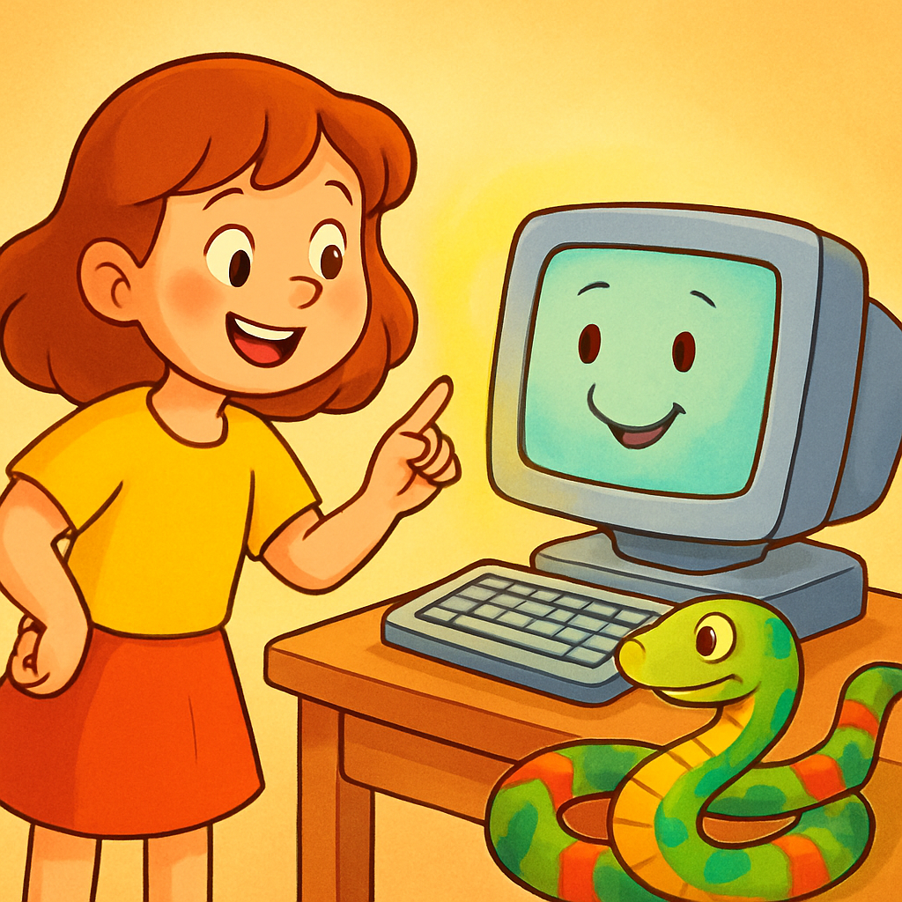
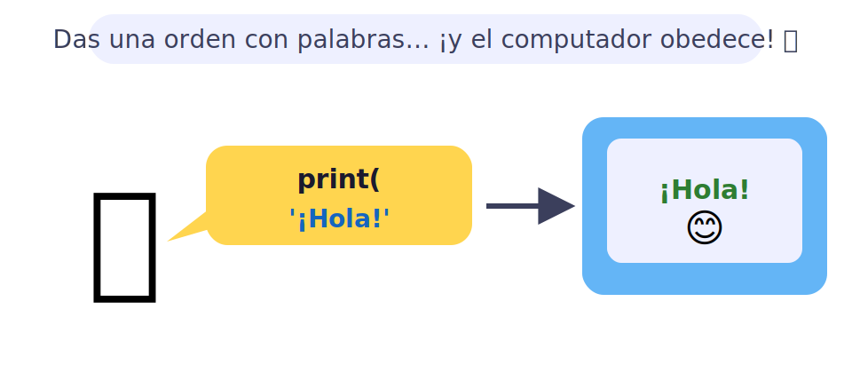
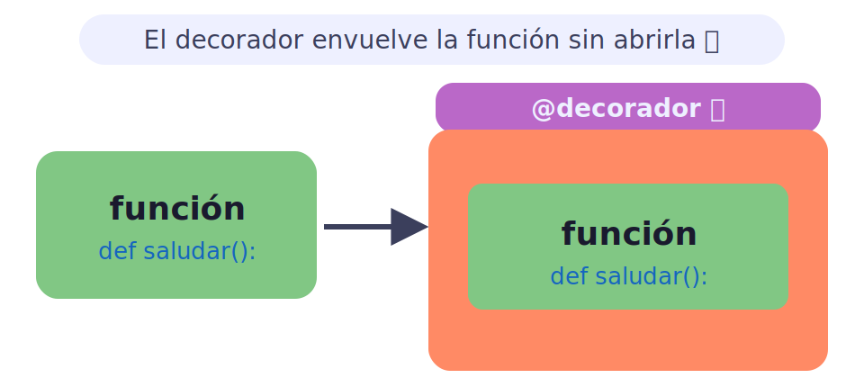
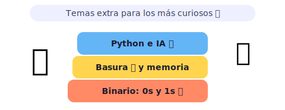

# 🐍 Fundamentos de Python para kids

> [!TIP]
> **En una frase:** Python es aprender a darle órdenes al computador con palabras… ¡y que te obedezca! 🪄

¿Sabías que Instagram, YouTube y hasta la IA que responde tus preguntas están hechos con Python? 🐍 Aprender Python es como aprender el idioma secreto de las máquinas más famosas del mundo. Lo mejor: parece inglés sencillo, nada de jeroglíficos raros. ¡Escribe una línea y el computador hace exactamente lo que le pides!

---

## 🌱 Python · repaso básico

Antes de volar hay que caminar. Estos son los bloques básicos con los que se construye cualquier programa en Python. ¡Con estos siete poderes ya puedes hacer cosas increíbles!

- 🗣️ **Bases de Python** — La primera orden que aprende todo programador es `print("¡Hola, mundo!")`: le dice al computador "¡muestra esto en pantalla!". Las variables guardan información como un post-it: `nombre = "Ana"` pega el nombre de Ana en la memoria del computador. Luego puedes usar `nombre` en cualquier parte del programa y el computador recordará quién es Ana. 📌
- 📦 **Estructuras básicas** — Una variable guarda un solo valor (`edad = 9`), una lista guarda muchos en orden (`frutas = ["manzana", "pera", "kiwi"]`), y un diccionario los guarda con etiqueta (`mascota = {"nombre": "Toby", "tipo": "perro"}`). ¡Como cajitas, fila de cajitas y cajitas con nombre pegado! Con el diccionario puedes preguntar `mascota["nombre"]` y el computador te responde "Toby" al instante.
- 🔁 **El `for`** — `for i in [1, 2, 3]: print(i)` le dice al computador "repite este bloque para cada cosa de la lista". Imagínate pedirle que diga "¡Feliz cumpleaños!" diez veces seguidas, sin que se canse ni se queje. ¡Lo hace en un parpadeo! ⚡ También puedes recorrer palabras letra por letra o una lista de amigos uno por uno.
- 🏷️ **Rebinding** — En Python puedes cambiar lo que guarda una variable cuando quieras: primero `color = "rojo"`, luego `color = "azul"`. El nombre `color` ahora apunta a lo nuevo. Es como mover el post-it de una cajita a otra: la cajita roja queda vacía y la azul tiene el cartel. ¡El valor anterior desaparece si nadie más lo está usando!
- 🍪 **Slicing** — Con `lista[1:4]` sacas los elementos del índice 1 al 3 (¡el 4 no entra!). Es como decirle "dame del segundo al cuarto chicle del paquete". También puedes ir al revés con `lista[::-1]` para voltear la lista entera, o usar pasos: `lista[::2]` agarra uno sí y uno no. 🔃
- 🛟 **Excepciones** — Si el computador intenta dividir entre cero, ¡se rompe! Con `try: ... except: ...` le pones un casco: "intenta esto, y si algo sale mal, haz lo otro en vez de explotar". Como llevar paraguas por si llueve 🌂, o un plan B si se cae el helado. Puedes capturar errores específicos como `except ZeroDivisionError:` para saber exactamente qué salió mal. 🍦
- 🪆 **Recursión** — Una función que se llama a sí misma, como cuando te miras en dos espejos enfrentados y ves infinitas imágenes. `factorial(3)` calcula `3 × factorial(2)`, que calcula `2 × factorial(1)`, hasta llegar al caso base (factorial(0) = 1) y empezar a devolver resultados. Siempre necesitas ese "caso base" o la función se llama para siempre. ¡Muñecas rusas de código! 🪆

> [!NOTE]
> 🎮 **Pruébalo:** abre Python en tu computador (o en [python.org/shell](https://www.python.org/shell)) y escribe `print("Hola, " + "mundo!")`. Luego cambia el texto dentro de las comillas. ¿Qué pasa si pones tu nombre? ¡El computador te saluda a ti!

---

## 🚀 Python · repaso avanzado

Ya dominas los bloques básicos. Ahora vienen los superpoderes que convierten un programa normal en algo elegante y poderoso. ¡Bienvenido al nivel siguiente!

- 🎁 **Decoradores** — Son como el envoltorio de un regalo: la función sigue siendo la misma caja de adentro, pero el decorador le agrega un lazo y brillantina sin tocar el contenido. Se escriben con `@` justo encima de la función: `@cronometro` puede medir cuánto tarda tu función; `@requiere_login` puede bloquear la ejecución si el usuario no ha iniciado sesión. ¡Magia de una sola línea que cambia el comportamiento sin editar el código original! ✨
- 🍰 **Clases** — Una clase es el molde y los objetos son lo que creas con él. `class Gato:` define cómo son todos los gatos (tienen nombre, color y hacen "miau"). Luego `mi_gato = Gato("Michi")` crea a Michi usando ese molde. ¡Como una fábrica de gatos! Cada gato es independiente: si cambias el nombre de Michi, los demás gatos no se enteran. Así funcionan la mayoría de los programas grandes del mundo. 🏭
- 🐶 **Polimorfismo** — `perro.habla()` devuelve "¡Guau!" y `gato.habla()` devuelve "¡Miau!", aunque ambos tienen el mismo método `habla()`. El computador sabe quién es quién y hace lo correcto automáticamente. Es como decir "habla" a diferentes animales: cada uno responde a su manera sin que tú tengas que preguntar primero "¿eres perro o gato?". ¡El código queda más limpio y fácil de ampliar! 🎭
- 📺 **Abstracción** — Cuando usas `lista.sort()` para ordenar, no necesitas saber que por dentro usa un algoritmo complejo con comparaciones y movimientos. Solo llamas al método y funciona. La abstracción esconde la complejidad para que te concentres en lo importante, como usar el control remoto sin conocer el circuito interno de la tele. Tú dices "ordena" y Python se encarga de todo. 📡
- ⚡ **Lambdas** — `doble = lambda x: x * 2` es una mini-función sin nombre largo. Perfectas para algo rápido sin escribir el `def` completo. Se usan mucho junto con `map()` y `filter()`: `list(map(lambda x: x*2, [1,2,3]))` te da `[2, 4, 6]` de un solo golpe. Son como notas adhesivas de código: pequeñas, útiles y de usar y tirar. 💥

> [!NOTE]
> 💡 **Dato curioso:** el símbolo `@` para decoradores se llama "arroba" en español y "at sign" en inglés. Antes solo se usaba en correos electrónicos (`usuario@correo.com`), ¡pero Python lo convirtió en magia de programación! Si ves `@` encima de una función, ya sabes que hay un decorador actuando.

---

## 📚 Anexos

¿Todavía tienes más curiosidad? Estos temas extra son para los más preguntones: los que se preguntan el "¿por qué?" detrás de todo lo que hace Python. ¡Aquí van cuatro misterios del mundo de la programación! 🔬

- 🔢 **Cómo el computador guarda números** — Dentro del computador solo existen 0 y 1 (bits). El número 5 se guarda como `101` en binario, y el 9 como `1001`. ¡Toda la música, las imágenes y los videos son miles de millones de ceros y unos viajando a la velocidad de la luz por cables y chips!
- 🗑️ **Recolección de basura** — Cuando ya no necesitas una variable, Python limpia la memoria solo. Es como tener un robot que ordena tu cuarto después de que terminas de jugar. Se llama *garbage collector* (recolector de basura) y trabaja en silencio sin que lo notes. En otros lenguajes como C++ tienes que limpiar tú mismo, ¡y olvidarse es un error muy grave! 🤖
- 🌐 **Python y la IA** — Bibliotecas como NumPy, Pandas y TensorFlow hacen de Python el idioma favorito para crear inteligencia artificial. Los científicos de datos lo usan para entrenar modelos que reconocen caras en fotos y traducen idiomas en tiempo real. ¡El mismo Python que usas tú! 🤖
- 🐢 **Python vs. otros lenguajes** — Python es más lento que C++, pero mucho más fácil de leer y escribir. Por eso se usa para prototipos, ciencia de datos e IA. Cuando la velocidad importa de verdad, los programadores llaman a C++ como refuerzo, o escriben las partes lentas en C y las llaman desde Python. ¡Trabajo en equipo entre lenguajes! 🤝

> [!NOTE]
> 💡 **Dato curioso:** Python se llama así ¡no por la serpiente 🐍, sino por el grupo de comedia británico *Monty Python*! Su creador Guido van Rossum era fan y quería un nombre corto y misterioso. La serpiente apareció después en los logos porque le quedaba perfecta. ¿Lo sabías?
