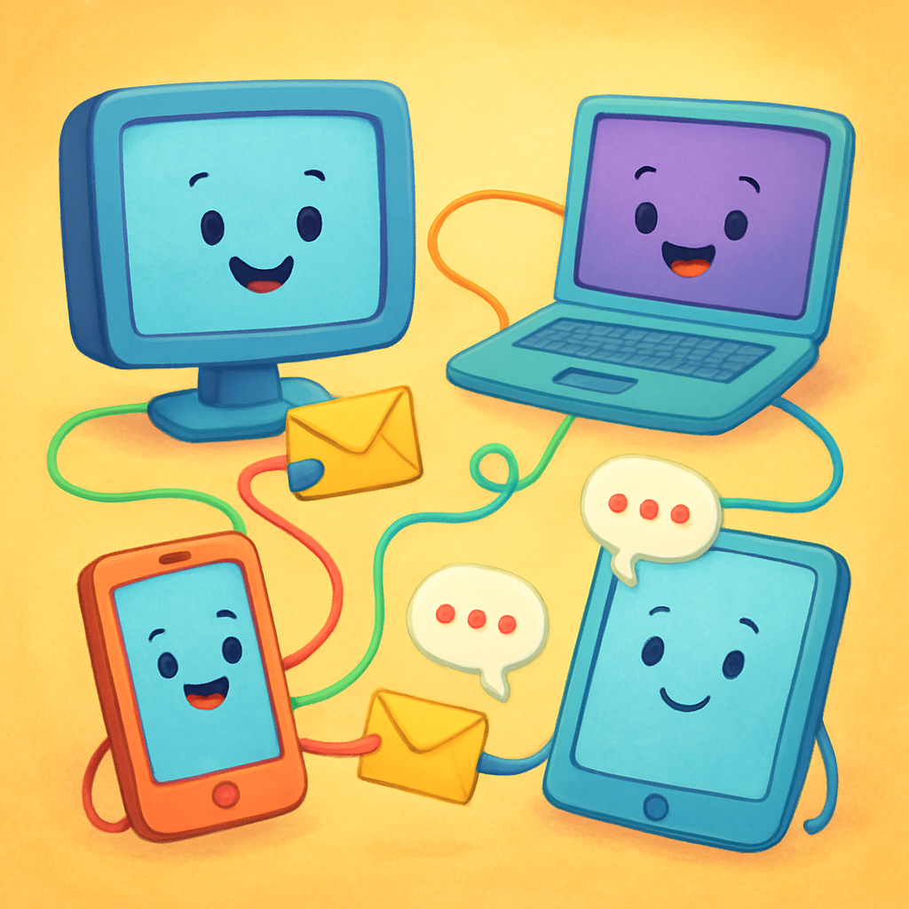
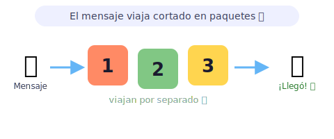
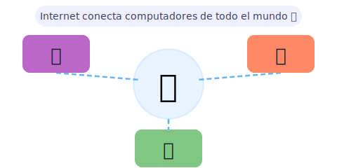
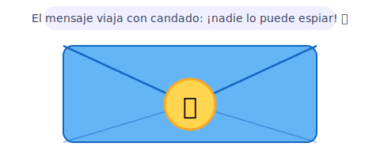

# 🌐 Redes y comunicaciones para kids

> [!TIP]
> **En una frase:** es cómo los computadores se hablan entre ellos y se mandan información, como pasarse notas en la clase… ¡pero a la velocidad de la luz! ⚡

¿Sabías que cuando mandas un mensaje por WhatsApp, ese mensaje no viaja completo de un solo golpe? 📱 Se corta en pedacitos, cada pedacito busca su propio camino, y al llegar al destino se vuelven a juntar ¡en orden! Es como enviar un puzle de 100 piezas en 100 sobres distintos. Los computadores hacen eso millones de veces por segundo. 🤯 Y todo eso pasa antes de que termines de parpadear.

---

## 📨 ¿Cómo viajan los mensajes?

Imagina que quieres mandar una carta gigante por correo, pero no cabe en un solo sobre. Los computadores resuelven eso de una manera muy lista: la cortan en trocitos y mandan cada uno por su cuenta.

- ✉️ **Paquetes** — la información se divide en trocitos llamados **paquetes**. Cada paquete lleva un número de orden, como las páginas de un libro, para que al llegar puedan pegarse en el orden correcto. ¡Aunque lleguen revueltos, siempre quedan bien! 📦
- 🛣️ **Rutas** — los paquetes no tienen que ir todos por el mismo camino. Cada uno elige la ruta más libre en ese momento, igual que coches que evitan el atasco yendo por distintas calles. Al final todos llegan al mismo destino.
- ⚡ **Velocidad** — todo esto pasa en milisegundos (¡menos que un parpadeo!). Por eso puedes ver un video en YouTube sin que se corte: los paquetes de video llegan tan rápido que parece magia.
- 📬 **Dirección en cada paquete** — cada trocito lleva la dirección del que manda y del que recibe, como la etiqueta de un paquete de correo. Así nunca se pierden aunque vayan por caminos distintos.

> [!NOTE]
> 🎮 **Pruébalo:** escribe una frase en un papel y córtala en 3 tiras. Dáselas a tres amigos para que las entreguen por distintos caminos. ¿Se vuelven a juntar? ¡Eso es un paquete de red!

---

## 🏠 Internet

Internet es la red de redes más grande del mundo, como una autopista gigantesca que conecta todos los computadores del planeta, desde tu casa hasta el otro lado del mundo.

- 🌍 **Red de redes** — Internet no es un solo cable ni un solo computador: son **millones de cables, antenas y satélites** conectados entre sí. Es tan enorme que nadie es "el dueño" de todo, ¡es de todos!
- 📇 **Dirección IP** — cada computador conectado tiene una dirección única llamada **IP**, como el número de tu casa. Cuando buscas algo en Google, tu computador dice: "Hola, soy la dirección 192.168.0.5, ¿me mandas esa página?"
- 🌐 **La Web y el Internet no son lo mismo** — Internet es la autopista (cables y antenas), y la Web (las páginas que ves con el navegador) es uno de los muchos "vehículos" que circulan por esa autopista. ¡También hay correo, videollamadas y juegos en línea usando la misma autopista!
- 📡 **El router de tu casa** — ese cajita con luces parpadeantes hace de "puerta de entrada" a Internet. Conecta todos los aparatos de tu casa con el proveedor de Internet, que a su vez está conectado a cables más y más grandes hasta llegar a cualquier servidor del mundo.

> [!NOTE]
> 💡 **Dato curioso:** los cables de Internet cruzan el fondo del mar. ¡Si juntaras todos los cables submarinos del mundo, alcanzarían para ir a la Luna y volver más de una vez! Así es como tu mensaje llega en décimas de segundo al otro lado del planeta. 🌊

---

## 🔒 Seguridad

¿Cómo sabes que nadie lee tus mensajes mientras viajan por Internet? Los computadores los **cifran**: los convierten en un código secreto que solo puede entender quien tiene la llave correcta.

- 🔒 **Cifrado** — tus mensajes se convierten en un código revuelto antes de salir. Es como escribir en un idioma inventado que solo tú y tu amigo entienden. Aunque alguien los intercepte en el camino, ¡ve puro ruido sin sentido!
- 🔑 **Llaves digitales** — el cifrado usa dos llaves matemáticas: una para cerrar el mensaje (llave pública, la da cualquiera) y otra para abrirlo (llave privada, solo la tienes tú). Es como un buzón donde todo el mundo puede meter cartas, pero solo tú puedes sacarlas.
- 🛡️ **El candadito HTTPS** — cuando la dirección web empieza con **https://** y ves un candadito 🔒 en el navegador, la conexión está cifrada. ¡Siempre fíjate en ese candadito antes de poner tu contraseña o el número de tarjeta de tus papás!
- 🦠 **Contraseñas y sentido común** — la seguridad no es solo cifrar mensajes. Tener contraseñas largas y distintas para cada sitio, no hacer clic en enlaces raros y actualizar el computador son las "vacunas" que mantienen alejados a los malos de la red.

> [!NOTE]
> 🎮 **Pruébalo:** inventa con un amigo un código secreto (por ejemplo, cada letra se convierte en el número que le sigue en el abecedario). Mándense mensajes cifrados y descífrelos. ¡Acaban de inventar su propio "cifrado"! 🔐
