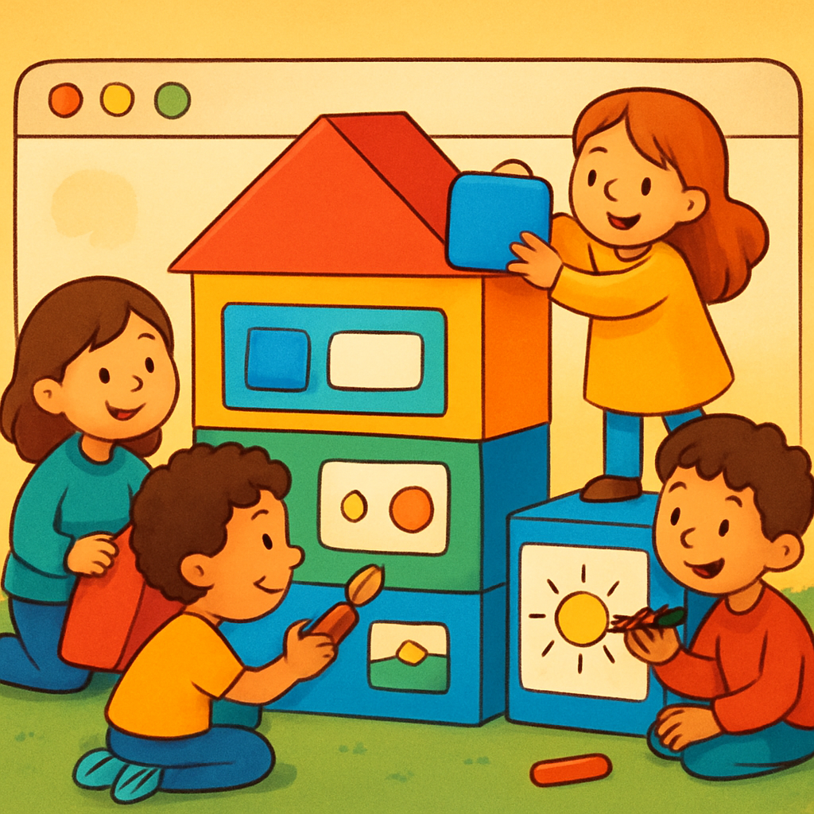
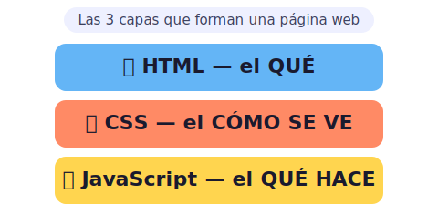
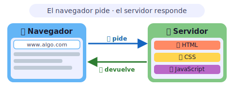

# 🕸️ Desarrollo web para kids

> [!TIP]
> **En una frase:** es construir páginas de internet, como armar una casita de bloques que todo el mundo puede visitar. 🏠

¿Alguna vez te preguntaste cómo se hace YouTube, o por qué cuando buscas algo en Google aparece una página llena de resultados? ¡Alguien tuvo que construir eso! Crear páginas web es como armar con bloques de colores: no necesitas herramientas ni pegamento, solo código. Y lo mejor de todo: ¡puedes empezar hoy mismo, desde tu computador! 💻🎉

---

## 🧱 Las 3 piezas de una página web

Toda página web está hecha de exactamente **tres capas**, como una torta de cumpleaños: cada capa hace algo distinto, y si falta una la torta no queda bien. Juntas forman todo lo que ves cuando abres un sitio. 🎂

- 📄 **HTML — los ladrillos** es el esqueleto de la página. Le dice al navegador *qué* hay: "aquí va un título", "aquí va una foto", "aquí va un botón de *Comprar*". Sin HTML no habría nada que ver. Es como tener los muros y el techo de una casa antes de pintarla o de poner los muebles.
- 🎨 **CSS — la pintura** le da estilo a todo. Decide los colores del fondo, el tamaño de las letras, si los botones son redondos o cuadrados, y si la página se ve diferente en el celular o en el computador. Es el *cómo se ve*. Imagina que con una sola instrucción puedes pintar toda la casa de azul o ponerle ventanas de arco iris. 🌈
- ✨ **JavaScript — la magia** hace que la página *reaccione* cuando la tocas. Cuando abres un menú de hamburguesa 🍔, ves un contador de "me gusta" que sube solo o te aparece un mensaje de error al poner la contraseña mal, todo eso es JavaScript. Es el *qué hace*. Como si los muebles de tu casa se acomodaran solos cuando los señalas con el dedo.

> [!NOTE]
> 💡 **Dato curioso:** puedes ver el "esqueleto" de cualquier página web con un truco. En el navegador, haz clic derecho sobre la página y elige **"Ver código fuente"** (o "Inspeccionar"). ¡Ahí está todo el HTML que la construye!

---

## 🖥️ Cómo funciona

Cuando escribes una dirección en el navegador, pasan muchas cosas en menos de un segundo. Hay una **conversación entre tu computador y otro computador muy lejano**, quizás al otro lado del mundo. 🌍

- 🙋 **El navegador manda el pedido** — cuando escribes `www.algo.com` y presionas Enter, tu navegador (Chrome, Firefox, Safari…) envía un mensaje por internet diciendo: *"¡Oye, dame la página de algo.com, por favor!"* Es como llamar a una pizzería por teléfono y pedir tu pizza favorita. 🍕
- 📦 **El mensaje viaja por cables (¡o satélites!)** — la petición sale de tu casa, viaja por cables bajo el mar o rebota en satélites, y en milisegundos llega al servidor correcto. Todo el planeta está conectado así. 🌐
- 🍳 **El servidor cocina la página** — el servidor es un computador grandote que nunca se apaga y espera pedidos todo el día. Busca los archivos HTML, CSS y JS, los empaqueta y te los manda de vuelta. Es el cocinero que prepara tu pizza y la envía a domicilio. 🏠
- 🎉 **El navegador la dibuja en tu pantalla** — al recibir los archivos, tu navegador los lee, une todas las piezas y pinta la página que ves. ¡Todo eso en un parpadeo!

> [!NOTE]
> 🎮 **Pruébalo:** abre el navegador, escribe `wikipedia.org` en la barra de direcciones y presiona Enter. ¡Acabas de enviar un pedido real a un servidor en algún lugar del mundo y recibir la respuesta en menos de un segundo!

---

> [!NOTE]
> Esta sección del sitio todavía está **en construcción** 🚧 — ¡pronto habrá más!
