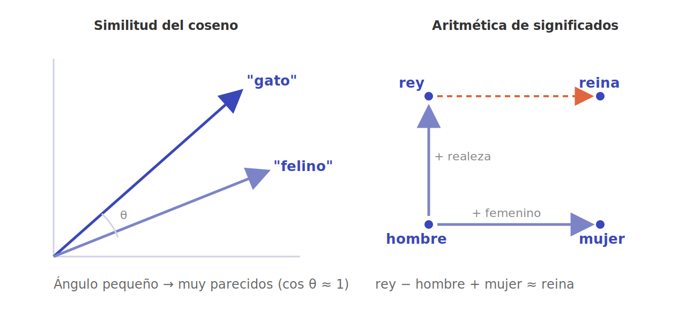
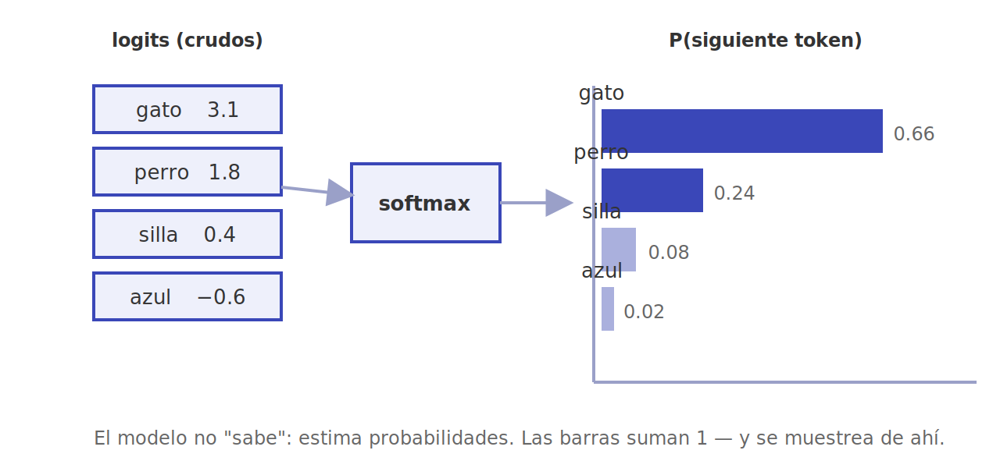
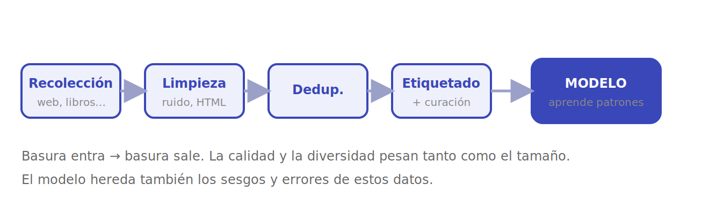
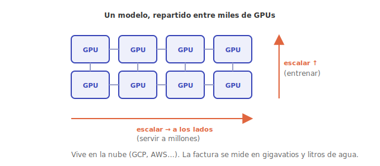
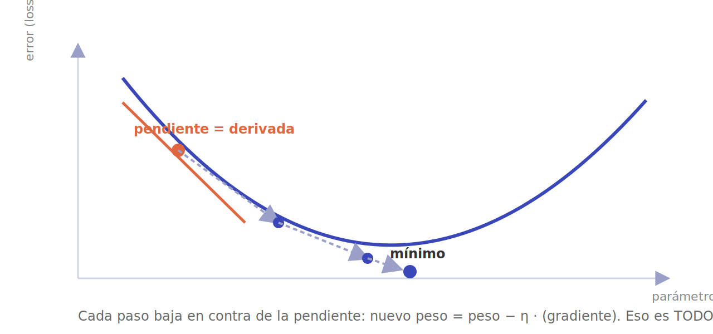

# Lo que de verdad necesita la IA

No hace falta **matemática avanzada** para entender la IA. Se sostiene sobre **cuatro patas**, y si falta una, la mesa se cae: **álgebra lineal, estadística y probabilidad, datos y poder de cómputo**. El cálculo asoma —pero solo como *motor* del entrenamiento, no como cimiento— y se reduce a una sola idea (la pendiente), que además hoy está automatizada; lo dejo para el final. El hilo histórico de cómo se fueron ensamblando estas patas está en la serie [Fundamentos del PLN y la IA](../fundamento-del-pln-y-la-ia.md).

> [!TIP]
> La intuición pesa más que las fórmulas. Si entiendes *qué representa* un vector, *qué decide* una probabilidad, *de qué aprende* un modelo y *con qué fuerza* se entrena, ya tienes el mapa completo. El resto son detalles que las librerías resuelven por ti.

Estas son las cuatro patas, una por una, con un diagrama que muestra **cómo se usan de verdad** por dentro de un modelo.

---

## 1 · Álgebra lineal — la lengua materna

Es **la lengua materna de la IA**. Por dentro, un modelo no manipula palabras ni píxeles: manipula **vectores, matrices y tensores** (tablas de números de una, dos o más dimensiones). Una palabra entra como un *embedding* —un vector de cientos o miles de números— y, a partir de ahí, casi todo lo que hace una red neuronal se reduce a **multiplicar matrices** y aplicar una función no lineal, capa tras capa.

### El significado se vuelve geometría

La idea más bonita del campo es esta: si colocas cada palabra como un punto en un espacio de muchas dimensiones, los conceptos parecidos quedan **cerca** unos de otros. "Gato" y "felino" caen casi en la misma dirección; "gato" y "presupuesto" apuntan a lados distintos. Para medir ese parecido no se usa la distancia, sino la **similitud del coseno**: el ángulo entre dos vectores. Ángulo pequeño → muy parecidos; ángulo recto → nada que ver.

Y como el significado es geometría, se puede hacer **aritmética con él**. El ejemplo clásico: tomar el vector de *rey*, restarle *hombre* y sumarle *mujer* te deja, literalmente, junto a *reina*. La "realeza" y el "género" resultan ser **direcciones** en el espacio.

### Cómo se usa, paso a paso

1. La palabra `"gato"` se convierte en un vector, p. ej. `[0.21, −0.74, 0.90, …]` (su *embedding*).
2. Ese vector se **multiplica por una matriz de pesos** `W` (lo que el modelo aprendió). El resultado es otro vector: la palabra "vista" por esa capa.
3. Se aplica una **función no lineal** (para que el modelo capture relaciones complejas, no solo rectas) y el vector pasa a la capa siguiente.
4. Repite decenas o cientos de veces. Eso es, en esencia, una red neuronal profunda.

Incluso el famoso **mecanismo de atención** de los *Transformers* —el corazón de los LLM— es, por dentro, una secuencia de multiplicaciones de matrices (consultas, claves y valores) seguidas de un *softmax*. La "puntuación" con la que una palabra atiende a otra es, sencillamente, el **producto escalar** de sus vectores: dos vectores alineados dan un número grande (mucha atención), dos perpendiculares dan cero.

### Un cálculo de coseno, con números

No hay magia. Para `a = [1, 0, 1]` y `b = [1, 1, 1]`, el coseno es el producto escalar dividido por las longitudes:

> cos(a, b) = (1·1 + 0·1 + 1·1) / (√2 · √3) = 2 / 2.449 ≈ **0.82**

Un 0.82 sobre un máximo de 1: bastante parecidos. Cambia `b` por `[0, 1, 0]` y el coseno cae a 0 (ortogonales, sin relación). Eso es, a pequeña escala, lo que un buscador semántico hace millones de veces para encontrar el texto más cercano a tu pregunta.

### Tensores: por qué todo viene en lotes

Un **tensor** es solo una tabla de números con más de dos dimensiones, y aparece porque los modelos no procesan un dato a la vez sino **lotes** (*batches*). Una imagen es un tensor `(alto × ancho × canales)`; un lote de imágenes añade una dimensión más: `(lote × alto × ancho × canales)`. Procesar en lotes es lo que permite a la GPU exprimir su paralelismo: mil ejemplos avanzan por la red **a la vez**, no en fila.

Esto explica además **por qué la IA corre en GPUs**: una tarjeta gráfica es, en el fondo, una máquina de multiplicar matrices enormes en paralelo —justo lo que un modelo necesita hacer millones de veces por segundo—. Y técnicas de reducción como **PCA** y **SVD** —descomponer una matriz en sus direcciones principales— son álgebra lineal pura, y fueron clave para los primeros métodos semánticos. El detalle histórico está en [Orígenes (PCA, espacios vectoriales)](../fundamentos-1-origenes.md) y en [Estadística y redes (SVD/LSA)](../fundamentos-2-estadistica-redes.md).

---

## 2 · Estadística y probabilidad — decidir bajo incertidumbre

Si el álgebra lineal es *cómo* se mueven los números, la estadística es *cómo se decide cuando no hay certeza*. Y casi nunca la hay: un modelo de IA rara vez afirma, **estima probabilidades**.

### El modelo no "sabe": apuesta

Un LLM no hace, en el fondo, otra cosa que modelar la distribución *P(siguiente token | contexto)* y **muestrear** de ella. La última capa, el **softmax**, toma los números crudos internos (*logits*) y los convierte en una distribución de probabilidad sobre todo el vocabulario: una lista de candidatos con su probabilidad, que suma 1. Un clasificador de imágenes no dice "es un gato", dice "gato con probabilidad 0,95".

Que la salida sea una *distribución* y no una respuesta única tiene una consecuencia práctica enorme: la **"temperatura"** con la que se muestrea decide si el modelo es predecible y conservador (temperatura baja, elige casi siempre lo más probable) o creativo y arriesgado (temperatura alta, da oportunidad a candidatos menos probables).

### Los conceptos que de verdad importan

- **Verosimilitud** y estimación por **máxima verosimilitud**: el objetivo que se optimiza al entrenar es, esencialmente, "haz que los datos reales sean lo más probables posible bajo el modelo". La función de error que se minimiza (la *cross-entropy*) sale directo de aquí.
- **Sesgo–varianza** y **sobreajuste**: un modelo puede *memorizar* los datos de entrenamiento en vez de *generalizar*. Detectarlo y evitarlo es media batalla.
- **Métricas honestas**: **precisión**, **exhaustividad** (*recall*) y **F1** evitan engañarse con la mera exactitud cuando las clases están desbalanceadas (un detector de fraude que dice "no hay fraude" siempre acierta el 99 %… y no sirve para nada).
- **Pensamiento bayesiano**: actualizar las creencias a medida que llega evidencia. Recorre todo el campo, de los filtros de spam a los modelos de lenguaje.

### Precisión vs. exhaustividad, con un caso

Imagina un detector de tumores que revisa 1 000 radiografías con 10 enfermos reales. Si marca 8 casos y 6 son correctos: la **precisión** es 6/8 = 75 % (de lo que señaló, cuánto acertó) y la **exhaustividad** es 6/10 = 60 % (de los enfermos, cuántos pilló). Subir una suele bajar la otra: si marca *todo* como enfermo, su exhaustividad es 100 %… pero su precisión, ridícula. El **F1** combina ambas en un solo número para no autoengañarse. Qué error es más grave —una falsa alarma o un caso no detectado— depende del problema, y esa decisión es tan importante como el modelo.

### Calibración: que el 0,9 signifique 0,9

Un modelo está **bien calibrado** cuando, de todas las veces que dice "90 % de probabilidad", acierta cerca del 90 %. Muchos modelos modernos son *confiados de más*: dicen 0,99 y fallan más de lo que ese número promete. Por eso, en aplicaciones serias, la probabilidad que devuelve el modelo se revisa y se ajusta antes de tomar decisiones con ella.

Para profundizar: el notebook [Probabilidad y Estadística en Algoritmos](../notebook/transicion-a-experto-matematicas-y-teoria-detras-de-los-algoritmos/probabilidad-y-estadistica-en-algoritmos.ipynb) (en [Teoría detrás de los algoritmos](teoria.md)), y los [modelos probabilísticos y de tópicos (LDA)](../fundamentos-2-estadistica-redes.md) en la serie.

---

## 3 · Datos (big data) — el combustible

Ningún algoritmo brillante compensa unos datos malos: **los datos son el combustible**. Un modelo aprende los patrones que están en sus datos —y también sus **sesgos y errores**—, así que la calidad y la diversidad importan tanto o más que la cantidad. Es la regla más vieja del oficio: *basura entra, basura sale*.

### El pipeline poco glamoroso

Detrás de cada modelo hay una cadena de trabajo nada vistosa pero decisiva: **recolección** (web, libros, código…), **limpieza** (quitar ruido, HTML, duplicados de formato), **deduplicación**, **etiquetado** y **curación**, además de decisiones de **almacenamiento y formato** para mover terabytes o petabytes sin morir en el intento.

### El "muro de los datos"

A escala web, conseguir datos buenos se vuelve un problema de ingeniería en sí mismo, y tiene un límite real: el **"muro de los datos"** —el texto de alta calidad es finito y los mejores modelos ya lo han consumido casi todo—. Eso empuja hacia los **datos sintéticos** (datos generados por otros modelos) y hacia la curación fina; lo trato en [Investigación reciente y futuro](../fundamentos-4-investigacion-futuro.md).

### Antes de entrar al modelo: tokenización y particiones

El texto crudo no entra tal cual: primero se **tokeniza**, es decir, se parte en piezas (palabras, trozos de palabra o caracteres) que se mapean a números. "Internacionalización" puede volverse cuatro o cinco *tokens*. Es la frontera entre el lenguaje y el álgebra de la pata 1.

Y los datos nunca se usan enteros para entrenar: se **parten** en tres montones —**entrenamiento** (para aprender), **validación** (para ajustar y vigilar el sobreajuste) y **prueba** (para medir, una sola vez, lo bien que generaliza)—. Mezclarlos es el pecado clásico: si el modelo "ve" en el examen lo que ya estudió, las métricas mienten.

### Lo legal y lo ético no es un detalle

De dónde salen los datos importa tanto como su calidad: **licencias, derechos de autor, privacidad y consentimiento** son hoy un campo de batalla real. Un modelo entrenado con datos sesgados reproducirá y amplificará esos sesgos; uno entrenado con datos sin permiso puede ser un problema legal. La curación, aquí, también es responsabilidad.

En el lado aplicado, las **bases de datos vectoriales** permiten buscar **por significado** (recuperan los textos cuyos *embeddings* están más cerca de tu pregunta) y son el corazón de los sistemas **RAG** —darle al modelo documentos relevantes antes de que responda— (ver [IA práctica](../ia-practica/index.md)). Una buena puerta de entrada al oficio del dato es [Data Ecosystem (IBM)](../practica/ibm-data-ecosystem.md).

---

## 4 · Cómputo (cloud computing) — el músculo

La cuarta pata es **el músculo**: sin un poder de cálculo enorme, las otras tres no se mueven. Entrenar un modelo grande exige **miles de GPUs o TPUs** trabajando en paralelo durante semanas, coordinadas con técnicas de **entrenamiento distribuido**: repartir los datos entre muchas máquinas (*data parallelism*) y, cuando el modelo no cabe en una sola, repartir también el propio modelo (*model parallelism*).

Eso vive, casi siempre, en la **nube** (GCP, AWS y similares), que ofrece ese hardware bajo demanda y permite dos tipos de escalado: **hacia arriba** (más potencia por nodo, para *entrenar*) y **hacia los lados** (más réplicas, para *servir* el modelo a millones de usuarios). Conviene no confundir las dos fases: **entrenar** un modelo es carísimo y se hace una vez; **servirlo** (la *inferencia*) es más barato por consulta, pero se paga millones de veces al día.

### Cuánto cuesta, en números: FLOPs y leyes de escala

El trabajo de entrenar se mide en **FLOPs** (operaciones de coma flotante). Los modelos punteros se entrenan con cifras del orden de 10²⁵ operaciones —un número tan grande que cuesta imaginarlo—. Las **leyes de escala** (*scaling laws*) describen una regularidad útil: el rendimiento mejora de forma predecible al aumentar **tres** cosas a la vez —parámetros, datos y cómputo—, y desbalancearlas (un modelo enorme con pocos datos) desperdicia recursos. Eso convierte el entrenamiento en un problema de *presupuesto*: dado X de cómputo, ¿cuánto modelo y cuántos datos conviene?

### Trucos que abaratan: precisión mixta y cuantización

No todo es fuerza bruta. La **precisión mixta** entrena usando números de menos bits (16 en vez de 32) donde se puede, casi duplicando la velocidad. Y para *servir* el modelo, la **cuantización** comprime los pesos a 8 o incluso 4 bits, de modo que un modelo que pedía una GPU de centro de datos pueda correr en una tarjeta modesta —o hasta en un portátil—. Son la diferencia entre "esto solo lo entrena un gigante" y "esto lo puedo usar yo".

Y aquí el coste deja de ser una abstracción: la factura ya no se mide solo en dinero, sino en **gigavatios de electricidad y litros de agua** de refrigeración. La cara física de todo esto —megaclusters, energía, agua e incluso datacenters en el espacio— la desarrollo en [Infraestructura y costos](../fundamentos-4-investigacion-futuro.md). Saber repartir el cálculo y elegir bien los servicios en la nube es hoy una competencia tan central como el propio modelo.

---

## 5 · ¿Y el cálculo? — solo el motor de entrenar

Aquí está la pieza que tanta gente cree que es el cimiento y **no lo es**. El cálculo no *representa* nada (eso es el álgebra lineal) ni *decide* nada (eso es la estadística): el cálculo solo aparece en **un momento concreto** —el entrenamiento— y para **una sola tarea**: encontrar los pesos que hacen que el modelo se equivoque lo menos posible.

### El problema, en una frase

Un modelo tiene millones (o miles de millones) de **pesos**: perillas que se pueden girar. Hay una función, el **error** (*loss*), que mide lo mal que lo hace con los pesos actuales. **Entrenar = girar las perillas hasta que el error sea mínimo.** ¿Pero hacia dónde girar cada una?

### La derivada es solo "la pendiente"

Para cada perilla preguntamos: *si la subo un pelín, ¿el error sube o baja, y cuán rápido?* Esa tasa de cambio es la **derivada** —ni más ni menos que **la pendiente** de la curva del error en ese punto—. Si la pendiente es positiva (subir el peso empeora), bajamos el peso; si es negativa, lo subimos. Damos un pasito **en contra de la pendiente** y repetimos.

El **gradiente** no es nada exótico: es simplemente **el conjunto de todas esas pendientes a la vez**, una por peso, apuntando hacia donde el error *más crece*. Por eso vamos en dirección contraria. A eso se le llama **descenso de gradiente**:

> **nuevo peso = peso − η · gradiente**  (donde η, la *tasa de aprendizaje*, es el tamaño del paso).

### Lo que casi nadie te dice: está automatizado

Aquí la buena noticia. **No calculas derivadas a mano.** La técnica que las obtiene capa por capa, la **retropropagación** (*backpropagation*), es solo la **regla de la cadena** aplicada con orden — y las librerías modernas (PyTorch, JAX, TensorFlow) la ejecutan solas mediante **diferenciación automática** (*autograd*). Tú defines el modelo; ellas calculan el gradiente exacto sin que escribas una sola fórmula de cálculo.

La **regla de la cadena**, que es el alma de la retropropagación, también es intuitiva: si el error depende de la capa 3, que depende de la 2, que depende de la 1, entonces el efecto de un peso de la capa 1 sobre el error final se obtiene **multiplicando** los efectos eslabón por eslabón, hacia atrás. Nada más.

### La tasa de aprendizaje: ni tanto ni tan poco

El tamaño del paso (η) es la perilla más delicada. **Demasiado grande** y el descenso rebota de pared a pared sin llegar nunca al fondo (incluso diverge). **Demasiado pequeño** y tarda una eternidad. Buena parte del arte de entrenar consiste en elegir bien ese paso y en ir **reduciéndolo** a medida que nos acercamos al mínimo, para afinar sin pasarse.

### Mínimos locales: por qué no quitan el sueño

En una curva simple hay un solo fondo, pero el error de un modelo real vive en un paisaje de millones de dimensiones, lleno de valles. ¿No nos quedaremos atrapados en un valle malo (un **mínimo local**) en vez del mejor (el **global**)? En la práctica, casi no: en espacios de tantísimas dimensiones, los puntos problemáticos suelen tener alguna salida cuesta abajo, y los muchos buenos mínimos resultan **casi igual de buenos**. Es una de esas sorpresas afortunadas que hacen que todo esto funcione.

Por eso lo correcto es decir: lo que necesitas del cálculo es **la intuición** —pendiente → hacia dónde bajar—, no el aparato analítico. Y nota un detalle: lo que se usa son **derivadas** (pendientes); las **integrales** apenas aparecen, y casi siempre en el plano conceptual de la probabilidad. Así que la idea de que "la IA es cálculo" se queda en esto: una sola idea, automatizada, que enciende el motor del entrenamiento.

---

## Cómo encajan las cuatro patas — un ciclo de entrenamiento

Las cuatro patas no trabajan por separado: se turnan en un mismo bucle que se repite millones de veces.

1. **Datos.** Se toma un *lote* de ejemplos ya tokenizados (pata 3).
2. **Adelante** (*forward*). El lote atraviesa la red: puro **álgebra lineal** —multiplicar matrices y aplicar no linealidades— hasta producir una predicción (pata 1).
3. **Medir el error.** Se compara la predicción con la respuesta correcta usando una función de pérdida **estadística** (pata 2).
4. **Atrás** (*backward*). La **retropropagación** calcula el gradiente: cuánto contribuyó cada peso al error (el **cálculo**, automatizado).
5. **Ajustar.** Cada peso da un pasito en contra de su pendiente (descenso de gradiente).
6. **Repetir**, lote tras lote, durante días o semanas —y todo esto sobre miles de GPUs en la nube (pata 4)—.

Quita una pata y el bucle se detiene: sin datos no hay de qué aprender, sin álgebra no hay predicción, sin estadística no hay error que medir, sin cómputo no hay forma de repetirlo a escala. Esa es la mesa entera.

## Por dónde empezar

Si quieres construir la base en orden, este es un buen camino dentro de estos apuntes:

- **El hilo histórico**, para ver cómo se ensamblaron las piezas: [Fundamentos del PLN y la IA](../fundamento-del-pln-y-la-ia.md).
- **Álgebra y probabilidad con código**: el notebook [Probabilidad y Estadística en Algoritmos](../notebook/transicion-a-experto-matematicas-y-teoria-detras-de-los-algoritmos/probabilidad-y-estadistica-en-algoritmos.ipynb), en [Teoría detrás de los algoritmos](teoria.md).
- **El oficio del dato**: [Data Ecosystem (IBM)](../practica/ibm-data-ecosystem.md).
- **Llevarlo a la práctica** (RAG, ML aplicado): [IA práctica](../ia-practica/index.md).
- **La frontera** (datos sintéticos, infraestructura, costos): [Investigación reciente y futuro](../fundamentos-4-investigacion-futuro.md).

---

> [!NOTE]
> **En resumen.** Las cuatro patas que *sostienen* la IA son **álgebra lineal** (representar y combinar), **estadística** (decidir con incertidumbre), **datos** (de qué aprende) y **cómputo** (con qué fuerza). El **cálculo** no es una pata: es el **motor que la entrena**, y se reduce a una sola idea —seguir la pendiente cuesta abajo— que además las librerías calculan por ti. Lo demás se construye encima.
