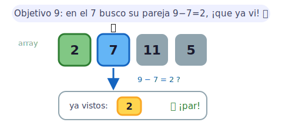
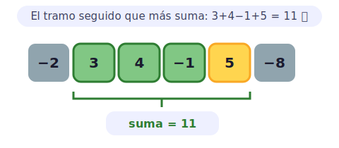
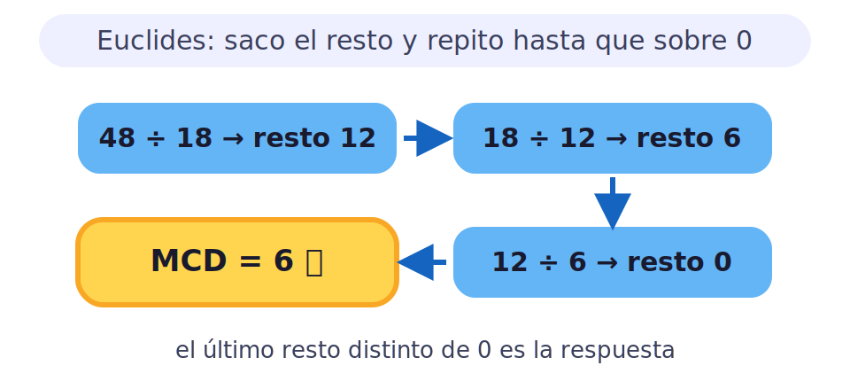
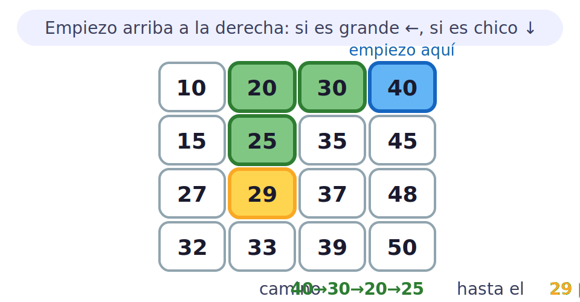
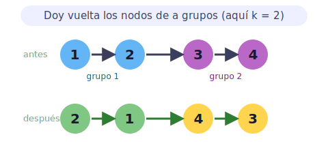
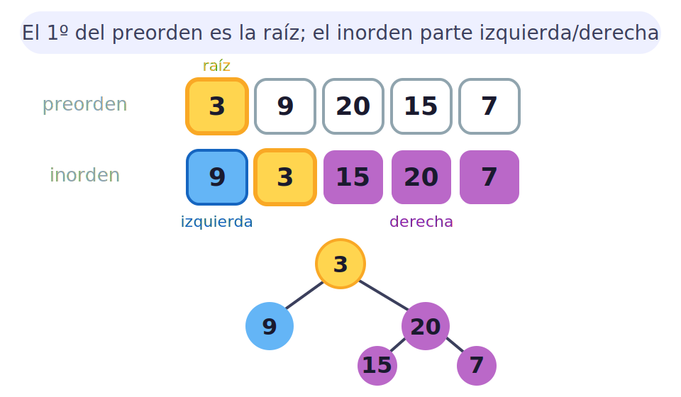
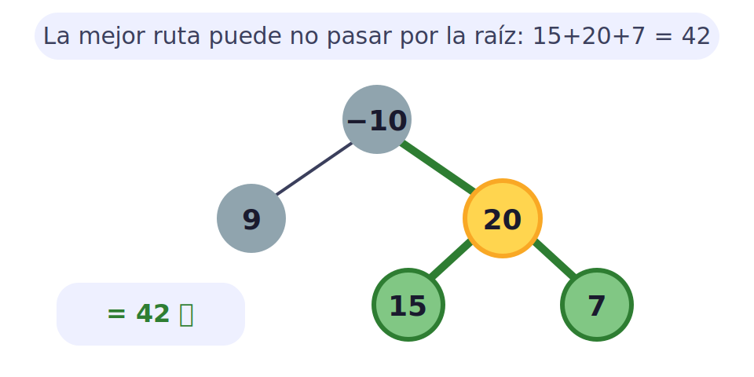

# Problemas de Estructuras de Datos y Algoritmos

Problemas clásicos de entrevista y competición, **resueltos paso a paso en Python**: enunciado, idea del algoritmo, análisis de complejidad y código con ejemplos. Cada enlace abre el notebook renderizado en el sitio (y se puede abrir en Colab).

> [!TIP]
> Aquí se aplica todo lo demás: las [estructuras de datos](../estructuras/index.md) (arrays, listas enlazadas, árboles) y los [algoritmos](../algoritmos/index.md) (hashing, recursión, dos punteros). Si un problema se atasca, suele faltar elegir la estructura adecuada. 🧩

## Arrays y hashing

### [Two Sum — ¿existe el par con la suma dada?](../notebook/problemas-de-estructuras-y-algoritmos/two-sum.ipynb)

Dado un array y un objetivo, encontrar dos números que sumen ese objetivo. Técnica: **hashing** · O(N) tiempo, O(N) espacio.

### [Subconjunto contiguo de suma más grande](../notebook/problemas-de-estructuras-y-algoritmos/largest-sum-contiguous-subarray.ipynb)

El subarreglo contiguo con la suma máxima. Algoritmo de **Kadane** · O(N) tiempo, O(1) espacio.

## Matemáticas

### [Máximo Común Divisor (GCD)](../notebook/problemas-de-estructuras-y-algoritmos/greatest-common-divisor.ipynb)

El mayor número que divide a dos enteros sin residuo. **Algoritmo de Euclides** · O(log(min(a, b))) tiempo, O(1) espacio.

## Búsqueda en matrices

### [Buscar en una matriz ordenada por filas y columnas](../notebook/problemas-de-estructuras-y-algoritmos/search-in-a-row-wise-and-column-wise-sorted-matrix.ipynb)

Localizar un elemento aprovechando el orden por filas **y** columnas. **Búsqueda por eliminación** · O(n + m) tiempo, O(1) espacio.

## Listas enlazadas

### [Invertir una lista enlazada en grupos de tamaño k](../notebook/problemas-de-estructuras-y-algoritmos/reverse-nodes-in-k-group.ipynb)

Invertir los nodos de a grupos de tamaño dado. **Inversión por grupos** · O(n) tiempo, O(1) espacio.

## Árboles binarios

### [Reconstruir el árbol binario desde preorden e inorden](../notebook/problemas-de-estructuras-y-algoritmos/construct-binary-tree-from-preorder-and-inorder-traversal.ipynb)

Dados los recorridos en preorden e inorden, reconstruir el árbol. **Reconstrucción recursiva** · O(n) tiempo, O(n) espacio.

### [Suma máxima de rutas en un árbol binario](../notebook/problemas-de-estructuras-y-algoritmos/maximum-path-sum-in-a-binary-tree.ipynb)

La ruta de suma máxima entre dos nodos cualesquiera. **Recursión con manejo de estados** · O(N) tiempo, O(H) espacio.
